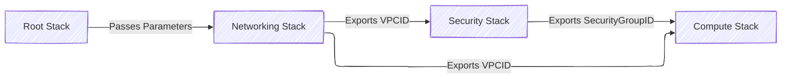

# **📥 Passing Parameters in Nested Stacks with Dependencies**

## **📌 Introduction**

When working with **nested stacks in AWS CloudFormation**, you often need to:  
1️⃣ **Define parameters in the root (parent) stack** for configuration.  
2️⃣ **Pass parameters to multiple child (nested) stacks.**  
3️⃣ **Handle dependencies between nested stacks**, ensuring the correct order of execution.

✅ **Centralized management** – Parameters are defined once in the root stack.  
✅ **Efficient reusability** – Avoids hardcoding values in nested stacks.  
✅ **Ensures correct execution order** – Some nested stacks depend on others.

---

## **🛠️ How to Pass Parameters from the Root Stack to Nested Stacks**

### **🔹 Scenario**

- **Root Stack** – Defines global parameters like `Environment` and `VPC CIDR`.
- **Networking Stack** (Child 1) – Creates a **VPC** and exports `VPCID`.
- **Security Stack** (Child 2) – Creates **security groups** and needs the `VPCID` from Networking Stack.
- **Compute Stack** (Child 3) – Deploys **EC2 instances** inside the VPC and requires both `VPCID` and `SecurityGroupID`.



✅ **Ensures each stack gets the required values dynamically.**

---

## **🏗️ Implementing Parameter Passing with Dependencies**

### **1️⃣ Root Stack – Defining and Passing Parameters**

The **root stack** defines parameters and passes them to child stacks.

```yaml
AWSTemplateFormatVersion: "2010-09-09"
Description: "Root Stack - Defines Global Parameters & Deploys Nested Stacks"

Parameters:
  Environment:
    Type: String
    Default: "Production"
    AllowedValues:
      - "Development"
      - "Staging"
      - "Production"

  VPCCIDR:
    Type: String
    Default: "10.0.0.0/16"
    Description: "CIDR block for the VPC"

Resources:
  NetworkingStack:
    Type: AWS::CloudFormation::Stack
    Properties:
      TemplateURL: https://s3.amazonaws.com/mybucket/networking-template.yaml
      Parameters:
        VPCCIDR: !Ref VPCCIDR

  SecurityStack:
    Type: AWS::CloudFormation::Stack
    Properties:
      TemplateURL: https://s3.amazonaws.com/mybucket/security-template.yaml
      Parameters:
        VPCID: !GetAtt NetworkingStack.Outputs.VPCID # Dependency on NetworkingStack

  ComputeStack:
    Type: AWS::CloudFormation::Stack
    Properties:
      TemplateURL: https://s3.amazonaws.com/mybucket/compute-template.yaml
      Parameters:
        VPCID: !GetAtt NetworkingStack.Outputs.VPCID # Dependency on NetworkingStack
        SecurityGroupID: !GetAtt SecurityStack.Outputs.SecurityGroupID # Dependency on SecurityStack
```

✔ **Passes global parameters (`VPCCIDR`, `Environment`) to all child stacks.**  
✔ **Ensures Security and Compute stacks get values from the Networking stack.**

---

### **2️⃣ Networking Stack – Creating a VPC & Exporting VPCID**

The **networking stack** creates a VPC and makes its ID available to dependent stacks.

```yaml
AWSTemplateFormatVersion: "2010-09-09"
Description: "Networking Stack - Creates VPC"

Parameters:
  VPCCIDR:
    Type: String

Resources:
  MyVPC:
    Type: AWS::EC2::VPC
    Properties:
      CidrBlock: !Ref VPCCIDR

Outputs:
  VPCID:
    Description: "VPC ID for other stacks"
    Value: !Ref MyVPC
```

✔ **Exports `VPCID` for Security & Compute stacks.**

---

### **3️⃣ Security Stack – Creating Security Groups in the VPC**

The **security stack** **requires the `VPCID`** to create security groups.

```yaml
AWSTemplateFormatVersion: "2010-09-09"
Description: "Security Stack - Creates Security Groups"

Parameters:
  VPCID:
    Type: String

Resources:
  MySecurityGroup:
    Type: AWS::EC2::SecurityGroup
    Properties:
      GroupDescription: "Allow SSH"
      VpcId: !Ref VPCID
      SecurityGroupIngress:
        - IpProtocol: tcp
          FromPort: 22
          ToPort: 22
          CidrIp: 0.0.0.0/0

Outputs:
  SecurityGroupID:
    Description: "Security Group ID for EC2 instances"
    Value: !Ref MySecurityGroup
```

✔ **Ensures that EC2 instances get the correct security group.**

---

### **4️⃣ Compute Stack – Deploying EC2 with VPC & Security Group**

The **compute stack** **requires `VPCID` and `SecurityGroupID`** from previous stacks.

```yaml
AWSTemplateFormatVersion: "2010-09-09"
Description: "Compute Stack - Deploys EC2 Instances"

Parameters:
  VPCID:
    Type: String
  SecurityGroupID:
    Type: String

Resources:
  MyInstance:
    Type: AWS::EC2::Instance
    Properties:
      InstanceType: t3.micro
      NetworkInterfaces:
        - AssociatePublicIpAddress: true
          DeviceIndex: 0
          SubnetId: !Select [0, !Ref VPCID]
          GroupSet:
            - !Ref SecurityGroupID
```

✔ **Dynamically receives `VPCID` and `SecurityGroupID`.**

---

## **📌 Key Takeaways**

✅ **Parent Stack Defines Parameters**

- Centralizes global configuration (e.g., `Environment`, `VPCCIDR`).

✅ **Child Stacks Use Parent Parameters**

- Each nested stack gets only the parameters it needs.

✅ **Dependencies Are Managed with `!GetAtt`**

- Child stacks **wait for required outputs** before execution.

✅ **Ensures Correct Execution Order**

- **Networking Stack runs first** (creates VPC).
- **Security Stack runs second** (needs VPC).
- **Compute Stack runs last** (needs both VPC and Security Group).

---

## **⚠️ Common Issues & Troubleshooting**

| **Issue**                                         | **Solution**                                                                 |
| ------------------------------------------------- | ---------------------------------------------------------------------------- |
| **Child stack does not receive parameter values** | Verify that the **parent stack passes correct parameters**.                  |
| **Deployment order issues**                       | Use `!GetAtt` to ensure dependencies are resolved correctly.                 |
| **Security Group or Subnet not found**            | Ensure that child stacks **wait for required outputs from previous stacks**. |

---

## **🛠️ Best Practices for Passing Parameters in Nested Stacks**

✅ **Define Common Parameters in the Root Stack**

- Centralizes environment configuration.

✅ **Use Outputs & GetAtt for Dependencies**

- Ensures that child stacks execute in the right order.

✅ **Avoid Hardcoding Values**

- Instead, use parameters to make stacks reusable.

✅ **Test Each Stack Independently**

```sh
aws cloudformation validate-template --template-body file://security-stack.yaml
```

- Ensures **parameter dependencies are correctly resolved**.

✅ **Use Mappings for Environment-Specific Values**

```yaml
Parameters:
  Environment:
    Type: String
Mappings:
  EnvToInstanceType:
    Development:
      InstanceType: t2.micro
    Production:
      InstanceType: t3.medium
Resources:
  MyInstance:
    Type: AWS::EC2::Instance
    Properties:
      InstanceType: !FindInMap [EnvToInstanceType, !Ref Environment, InstanceType]
```

- Dynamically selects values based on the `Environment`.

---

## **✅ Conclusion**

Passing parameters **from a root stack to nested stacks with dependencies** allows for **dynamic, scalable, and modular CloudFormation deployments**.

✔ **Ensures proper execution order of stacks.**  
✔ **Prevents duplicate configurations using outputs.**  
✔ **Improves reusability by centralizing parameter management.**

💡 **Mastering parameter passing in nested stacks is key to scalable AWS infrastructure!** 🚀
