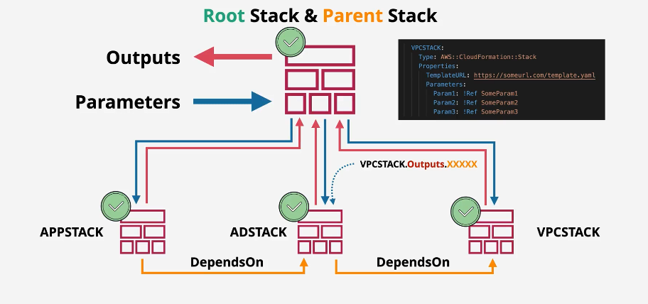
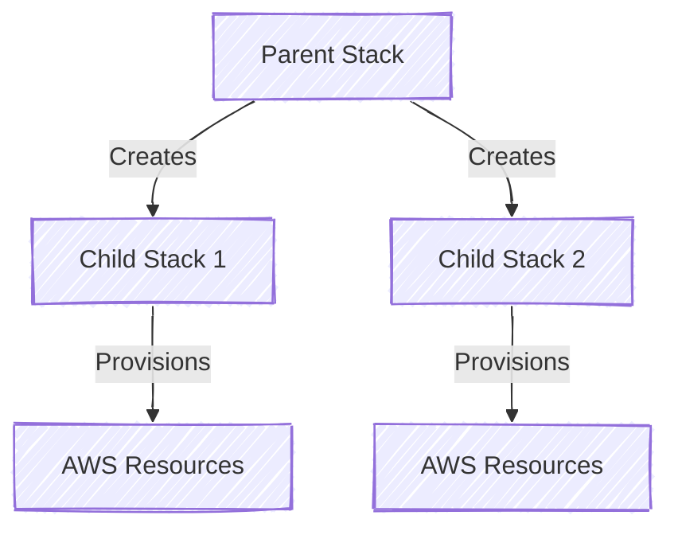
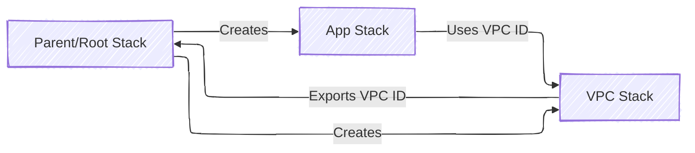

# **🏗️ AWS CloudFormation Nested Stacks**

## **📌 Introduction**

AWS CloudFormation **Nested Stacks** allow you to **break down a large CloudFormation stack into smaller, reusable stacks** that are managed as a single entity.

✔ **Improves modularity** – Splits infrastructure into multiple manageable templates.  
✔ **Reduces redundancy** – Reuses stacks across different environments.  
✔ **Simplifies management** – Updates are applied centrally, reducing errors.

---



---

## **🔑 What Are Nested Stacks?**

A **Nested Stack** is a **CloudFormation stack created within another stack** using the `AWS::CloudFormation::Stack` resource type.

### **How Nested Stacks Work**

- The **parent stack** **defines and manages child stacks**.
- The **child stacks** create resources and return outputs for use in other stacks.
- Changes in the parent stack **propagate to child stacks automatically**.

<div style="display:flex; justify-content:center">



</div>

> **Allows better organization and resource sharing across CloudFormation stacks.**

---

## **🏗️ Implementing Nested Stacks in AWS CloudFormation**



---

### **1️⃣ Creating a Nested Stack (Parent/Root Stack)**

The **parent stack** defines child stacks using `AWS::CloudFormation::Stack`.

```yaml
AWSTemplateFormatVersion: "2010-09-09"
Description: "Parent Stack - Deploys Nested Stacks"

Resources:
  VPCStack:
    Type: AWS::CloudFormation::Stack
    Properties:
      TemplateURL: https://s3.amazonaws.com/mybucket/vpc-template.yaml
      Parameters:
        Environment: "Production"

  AppStack:
    Type: AWS::CloudFormation::Stack
    Properties:
      TemplateURL: https://s3.amazonaws.com/mybucket/app-template.yaml
      Parameters:
        VPCID: !GetAtt VPCStack.Outputs.VPCID
```

✔ **References a child stack stored in S3.**  
✔ **Passes the `VPCID` output from the VPC stack into the App stack.**

---

### **2️⃣ Creating a Child Stack (Networking Stack)**

The **child stack** provisions networking resources **used by other stacks**.

```yaml
AWSTemplateFormatVersion: "2010-09-09"
Description: "VPC Stack - Creates VPC and Subnets"

Resources:
  MyVPC:
    Type: AWS::EC2::VPC
    Properties:
      CidrBlock: 10.0.0.0/16

  PublicSubnet:
    Type: AWS::EC2::Subnet
    Properties:
      VpcId: !Ref MyVPC
      CidrBlock: 10.0.1.0/24

Outputs:
  VPCID:
    Value: !Ref MyVPC
```

✔ **Exports the `VPCID` for other stacks to use.**

---

### **3️⃣ Creating a Child Stack (Application Stack)**

The **application stack** references values exported by the networking stack.

```yaml
AWSTemplateFormatVersion: "2010-09-09"
Description: "App Stack - Deploys EC2 in an existing VPC"

Parameters:
  VPCID:
    Type: String
    Description: "VPC ID from Parent Stack"

Resources:
  AppInstance:
    Type: AWS::EC2::Instance
    Properties:
      InstanceType: t3.micro
      SubnetId: !Ref VPCID
```

✔ **Uses the `VPCID` from the parent stack.**

---

## **📌 Why Use Nested Stacks?**

| **Feature**                  | **Benefits**                                                      |
| ---------------------------- | ----------------------------------------------------------------- |
| **Modular Design**           | Divide infrastructure into logical components.                    |
| **Code Reusability**         | Use the same nested stack across multiple environments.           |
| **Simplified Management**    | Update the parent stack to apply changes across all child stacks. |
| **Improved Maintainability** | Makes large stacks easier to debug and manage.                    |

---

## **📦 Packaging Nested Stack Templates in S3**

Since **nested stack templates must be stored externally**, AWS provides the `aws cloudformation package` command to upload them to **Amazon S3**.

### **1️⃣ Package Nested Stack Templates**

```sh
aws cloudformation package \
  --template-file parent-template.yaml \
  --s3-bucket my-cloudformation-bucket \
  --output-template-file packaged-template.yaml
```

✔ **Uploads templates to S3 and replaces `TemplateURL` placeholders.**

---

### **2️⃣ Deploy Packaged Nested Stack**

```sh
aws cloudformation deploy \
  --template-file packaged-template.yaml \
  --stack-name MyNestedStack \
  --capabilities CAPABILITY_NAMED_IAM
```

✔ **Ensures all referenced templates are available before deployment.**

---

## **🚀 Best Practices for Updating and Deleting Nested Stacks**

### **1️⃣ Best Practices for Updating Nested Stacks**

✅ **Update parent stack first**

- **Update parent stack first** to avoid inconsistencies.
- Use `StackPolicy` to **protect critical stacks** from accidental updates.

✅ **Test Updates in a Staging Environment First**

- Deploy changes in a test environment before applying them to production.

✅ **Use Change Sets to Preview Updates**

```sh
aws cloudformation create-change-set \
  --stack-name MyNestedStack \
  --change-set-name UpdateTest \
  --template-body file://updated-template.yaml
```

---

### **2️⃣ Best Practices for Deleting Nested Stacks**

✅ **Delete the Parent Stack to Remove All Nested Stacks**

```sh
aws cloudformation delete-stack --stack-name MyNestedStack
```

✔ **Deletes all child stacks automatically.**

✅ **Avoid Orphaned Resources**

- If a child stack **fails deletion**, manually remove dependent resources.

✅ **Use Retain Policy for Critical Resources**

- Prevent deletion of essential resources:

```yaml
DeletionPolicy: Retain
```

✔ **Ensures critical AWS resources are not accidentally deleted.**

---

## **⚠️ Limitations of Nested Stacks**

| **Limitation**                              | **Description**                                      |
| ------------------------------------------- | ---------------------------------------------------- |
| **Nested Stacks are limited to 200 levels** | AWS allows up to 200 nested stacks per stack.        |
| **Circular Dependencies Not Allowed**       | Parent and child stacks cannot reference each other. |
| **Increased Complexity**                    | Too many nested stacks can make debugging harder.    |
| **Requires External Storage**               | Nested templates must be stored in **Amazon S3**.    |

---

## **🛠️ Best Practices for Using Nested Stacks**

✅ **Use Nested Stacks for reusability** – Define networking, security, and compute in separate templates.  
✅ **Pass Parameters efficiently** – Use `Outputs` and `!GetAtt` to link stacks dynamically.  
✅ **Store templates in S3** – Use `TemplateURL` to reference templates stored in Amazon S3.  
✅ **Avoid deep nesting** – Keep stack depth manageable for easier troubleshooting.  
✅ **Implement rollback protection** – Use `RollbackConfiguration` to prevent partial deployments.

---

## **📍 Conclusion**

AWS CloudFormation **Nested Stacks** simplify infrastructure deployment by **breaking down complex stacks into modular, reusable components**.

✔ **Improves infrastructure manageability.**  
✔ **Enhances code reuse across environments.**  
✔ **Allows for centralized updates of multiple stacks.**

💡 **Mastering Nested Stacks helps in deploying scalable and maintainable AWS infrastructures!** 🚀
