# **🛠️ AWS CloudFormation Helper Scripts: Automating EC2 Configuration**

## **📌 Introduction**

AWS CloudFormation **Helper Scripts** provide automation for **EC2 instance initialization, software installation, service management, and configuration updates** in CloudFormation stacks.

✅ **`cfn-init`** – Reads metadata and applies configurations (software, files, services).  
✅ **`cfn-hup`** – Detects CloudFormation metadata updates and applies changes.  
✅ **`cfn-signal`** – Notifies CloudFormation when an instance is ready.  
✅ **`cfn-get-metadata`** – Fetches metadata dynamically for custom scripts.

These scripts ensure **reliable instance configuration, prevent misconfigurations, and handle stack updates dynamically**.

---

## **1️⃣ `cfn-init` – Configuring an EC2 Instance Dynamically**


### **🔹 Use Case**

- **Installs software** (e.g., Apache, Nginx, MySQL).
- **Creates and configures files dynamically** (e.g., website content, configuration files).
- **Manages services** (starts services, enables them at boot).

---

### **🛠️ Example: Using `cfn-init` to Install Apache & Configure EC2**

```yaml
Resources:
  MyEC2Instance:
    Type: AWS::EC2::Instance
    Metadata:
      AWS::CloudFormation::Init:
        config:
          packages:
            yum:
              httpd: [] # Installs Apache web server
          files:
            /var/www/html/index.html:
              content: "Hello from CloudFormation!"
              mode: "000644"
              owner: "root"
              group: "root"
          services:
            sysvinit:
              httpd:
                enabled: true
                ensureRunning: true
    Properties:
      ImageId: ami-12345678
      InstanceType: t3.micro
      UserData:
        Fn::Base64: |
          #!/bin/bash
          /opt/aws/bin/cfn-init -v --stack ${AWS::StackName} --resource MyEC2Instance --region ${AWS::Region}
```

### **📝 Explanation**

1️⃣ **Defines metadata under `AWS::CloudFormation::Init`**

- **`packages`** installs Apache (`httpd`).
- **`files`** creates an HTML file (`/var/www/html/index.html`).
- **`services`** ensures Apache starts and is enabled at boot.

2️⃣ **User Data executes `cfn-init`**

- **Reads metadata**, installs software, and configures files/services.

✅ **This ensures Apache is installed, running, and automatically starts on boot.**

---

## **2️⃣ `cfn-hup` – Detecting CloudFormation Updates & Applying Changes**

```mermaid
sequenceDiagram
    actor User as 👤 User (Admin/DevOps)
    participant CFNService as ☁️ AWS CloudFormation Service
    participant EC2 as 🖥️ EC2 Instance
    participant CFNHubAgent as 🤖 CFN-HUP Deamon
    participant CFNInit as 🛠️ CFN-INIT

    User->>CFNService: ✏️ Change Template (Update Metadata)
    CFNService->>EC2: 🔄 Update Metadata
    EC2 --> CFNHubAgent: 🔁 Two-way Connection (Metadata Listening)

    CFNHubAgent->>CFNHubAgent: ⏲️ Periodically Check Metadata
    CFNHubAgent->>CFNInit: 🔔 Trigger CFN-INIT
    CFNInit->>EC2: 🛠️ Apply New Configuration
```



---


---

**❓ What is `cfn-hup`?**

- A daemon that listens for metadata changes in a CloudFormation stack.
- Automatically applies updates to the EC2 instance using `cfn-init`.

---

**🤔 Why is the `content` block mandatory?**

- Without it, `cfn-hup` cannot know what to monitor or how to act on changes.
- It defines:
  1. **Triggers**: When the hook runs (`post.update`).
  2. **Path**: The metadata to monitor (e.g., `AWS::CloudFormation::Init`).
  3. **Action**: The command to execute on change (`cfn-init`).

---

**🪜 Steps for Automatic Change Tracking:**

1. Add `AWS::CloudFormation::Init` metadata for resource configuration.
2. Define a `cfn-auto-reloader.conf` file with hook details (triggers, path, action).
3. Ensure `cfn-init` and `cfn-hup` are started in the instance `UserData`.

---

**🔹 Use Case:**

- **Detects stack updates and re-applies configurations dynamically.**
- **Automatically restarts services when configurations change.**
- **Ensures long-running instances remain correctly configured.**

---

**🛠️ Example:**

```yaml
Resources:
  MyEC2Instance:
    Type: AWS::EC2::Instance
    Metadata:
      AWS::CloudFormation::Init:
        config:
          packages:
            yum:
              httpd: []
          files:
            /etc/cfn/hooks.d/cfn-auto-reloader.conf:
              content: |
                [cfn-auto-reloader-hook]
                triggers=post.update
                path=Resources.MyEC2Instance.Metadata.AWS::CloudFormation::Init
                action=/opt/aws/bin/cfn-init -v --stack ${AWS::StackName} --resource MyEC2Instance --region ${AWS::Region}
    Properties:
      UserData:
        Fn::Base64: |
          #!/bin/bash
          /opt/aws/bin/cfn-init -v --stack ${AWS::StackName} --resource MyEC2Instance --region ${AWS::Region}
          /opt/aws/bin/cfn-hup || error_exit "Failed to start cfn-hup"
```

---

**📝 Explanation:**

1. **Purpose of `cfn-hup`**:

   - The `cfn-hup` tool monitors metadata changes in the CloudFormation stack and **automatically applies updates** when changes are detected.
   - It triggers `cfn-init` to reapply configurations when metadata is updated.

2. **How It Works**:

   - The configuration sets up a **hook** (`cfn-auto-reloader-hook`) that listens for updates in the metadata path:
     `Resources.MyEC2Instance.Metadata.AWS::CloudFormation::Init`.
   - When changes occur, the specified **action** runs `/opt/aws/bin/cfn-init` to apply the new configuration.

3. **Key Sections**:

   - **`Metadata.AWS::CloudFormation::Init`**:
     - Defines the configuration to be applied to the resource (`MyEC2Instance`), such as installing packages or managing files.
   - **`/etc/cfn/hooks.d/cfn-auto-reloader.conf`**:
     - This is the configuration file for `cfn-hup` that specifies:
       - **Triggers**: `post.update`, meaning the hook will run after a metadata update.
       - **Path**: The specific metadata path to monitor.
       - **Action**: The command to execute (`cfn-init`) when changes are detected.
   - **`UserData`**:
     - Ensures that both `cfn-init` and `cfn-hup` are started when the EC2 instance is created.

4. **Mandatory Configuration for Automatic Tracking**:
   - The `cfn-auto-reloader.conf` file and the hook configuration are **mandatory** for `cfn-hup` to track and apply metadata changes automatically.

---

## **3️⃣ `cfn-signal` – Notifying CloudFormation When an Instance is Ready**

```mermaid
%%{init: {'sequence': {'actorMargin': 400}}}%%
sequenceDiagram
    autonumber
    participant CloudFormation as 🏗 AWS CloudFormation
    participant EC2Instance as 🖥️ EC2 Instance

    Note over CloudFormation: 🔹 Start Stack Creation

    CloudFormation->>EC2Instance: 1️⃣ Launch EC2 Instance (UserData script starts)
    EC2Instance->>CloudFormation: ✅ EC2 Instance Created

    Note over EC2Instance: 🖥️ Running startup script...
    EC2Instance->>EC2Instance: 📦 Installing software, running setup...
    EC2Instance->>EC2Instance: ⏳ Waiting for process to complete...

    Note over CloudFormation: ⏳ Waiting for success signal (Timeout: 5 min)

    EC2Instance->>CloudFormation: 2️⃣ Send success signal (HTTP PUT request)
    CloudFormation->>CloudFormation: ✅ Success Signal Received

    Note over CloudFormation: ✅ Stack Creation Continues
```



---

### **🔹 Use Case**

- **Prevents CloudFormation from marking an instance as "ready" before it's fully configured.**
- **Ensures dependent resources only deploy when the instance setup completes.**
- **Prevents CloudFormation timeouts.**

---

### **🛠️ Example: Using `cfn-signal` to Confirm EC2 Readiness**

```yaml
Resources:
  MyWaitHandle:
    Type: AWS::CloudFormation::WaitConditionHandle

  MyWaitCondition:
    Type: AWS::CloudFormation::WaitCondition
    DependsOn: MyEC2Instance
    Properties:
      Handle: !Ref MyWaitHandle
      Timeout: "300"

  MyEC2Instance:
    Type: AWS::EC2::Instance
    Properties:
      ImageId: ami-12345678
      InstanceType: t3.micro
      UserData:
        Fn::Base64: |
          #!/bin/bash
          /opt/aws/bin/cfn-init -v --stack ${AWS::StackName} --resource MyEC2Instance --region ${AWS::Region}
          /opt/aws/bin/cfn-signal -e $? --stack ${AWS::StackName} --resource MyEC2Instance --region ${AWS::Region} --success "true"
```

### **📝 Explanation**

1️⃣ **CloudFormation waits for the instance to signal readiness.**

- `WaitConditionHandle` & `WaitCondition` **hold stack creation** until EC2 sends a success signal.

2️⃣ **User Data executes `cfn-signal`**

- If `cfn-init` succeeds (`-e $?`), **CloudFormation is notified that EC2 is ready**.

✅ **Prevents the stack from proceeding until the instance is fully configured.**

---

## **4️⃣ `cfn-get-metadata` – Fetching CloudFormation Metadata for Custom Scripts**

### **🔹 Use Case**

- **Retrieve metadata values dynamically for use in scripts.**
- **Fetch configuration changes without modifying instance scripts.**
- **Provides metadata-driven automation for EC2 instances.**

---

### **🛠️ Example: Using `cfn-get-metadata` to Retrieve Metadata in a Bash Script**

```yaml
Resources:
  MyEC2Instance:
    Type: AWS::EC2::Instance
    Metadata:
      AWS::CloudFormation::Init:
        config:
          properties:
            WelcomeMessage: "Hello from CloudFormation!"
    Properties:
      UserData:
        Fn::Base64: |
          #!/bin/bash
          WELCOME_MSG=$(/opt/aws/bin/cfn-get-metadata --stack ${AWS::StackName} --resource MyEC2Instance --region ${AWS::Region} --key AWS::CloudFormation::Init.config.properties.WelcomeMessage)
          echo $WELCOME_MSG > /var/www/html/index.html
```

### **📝 Explanation**

1️⃣ **CloudFormation stores `WelcomeMessage` metadata** under `AWS::CloudFormation::Init`.  
2️⃣ **`cfn-get-metadata` fetches this value dynamically in the User Data script.**  
3️⃣ **The message is written to `/var/www/html/index.html`.**

✅ **This approach avoids hardcoding values inside User Data scripts.**

---

## **📌 Summary of CloudFormation Helper Scripts**

| **Script**         | **Purpose**                                        | **Common Use Cases**                                |
| ------------------ | -------------------------------------------------- | --------------------------------------------------- |
| `cfn-init`         | Reads metadata and applies configurations          | Install software, configure files, start services   |
| `cfn-signal`       | Signals CloudFormation when an instance is ready   | Ensure stack waits until instance setup is complete |
| `cfn-hup`          | Detects CloudFormation updates and applies changes | Automatically update EC2 configurations             |
| `cfn-get-metadata` | Fetches CloudFormation metadata dynamically        | Retrieve values for use in custom scripts           |

---

## **✅ Conclusion**

CloudFormation Helper Scripts **enhance automation, reliability, and maintainability** in AWS CloudFormation stacks.

💡 **Mastering these helper scripts ensures seamless EC2 configuration and infrastructure automation!** 🚀
