# **⏳ Mastering AWS CloudFormation Wait Conditions & Alternatives**

In AWS CloudFormation, sometimes you need to **pause** stack creation until an **external process completes**, such as:

- **An EC2 instance running a setup script**
- **A database migration finishing**
- **An approval step before proceeding**

🔹 AWS CloudFormation **Wait Conditions** help handle these dependencies by pausing stack creation until a **signal is received**.

However, **Wait Conditions are not always the best choice**—there are alternative approaches like:

- AWS **Systems Manager (SSM)**
- AWS **Step Functions**
- AWS **Lambda-backed Custom Resources**

---

## 🧩 **Components**

A Wait Condition consists of **two components**:

| Component                                      | Purpose                                                                                                              |
| ---------------------------------------------- | -------------------------------------------------------------------------------------------------------------------- |
| **`AWS::CloudFormation::WaitConditionHandle`** | Creates a unique **pre-signed URL** that listens for success/failure signals.                                        |
| **`AWS::CloudFormation::WaitCondition`**       | Defines **timeout, signal count, and dependencies**. The stack pauses until signals are received or timeout expires. |

---

## 🏗 **Workflow**

```mermaid
%%{init: {'sequence': {'actorMargin': 400}}}%%
sequenceDiagram
    autonumber
    participant CloudFormation as 🏗 AWS CloudFormation
    participant EC2Instance as 🖥️ EC2 Instance

    Note over CloudFormation: 🔹 Start Stack Creation

    CloudFormation->>EC2Instance: 1️⃣ Launch EC2 Instance (UserData script starts)
    EC2Instance->>CloudFormation: ✅ EC2 Instance Created

    Note over EC2Instance: 🖥️ Running startup script...
    EC2Instance->>EC2Instance: 📦 Installing software, running setup...
    EC2Instance->>EC2Instance: ⏳ Waiting for process to complete...

    Note over CloudFormation: ⏳ Waiting for success signal (Timeout: 5 min)

    EC2Instance->>CloudFormation: 2️⃣ Send success signal (HTTP PUT request)
    CloudFormation->>CloudFormation: ✅ Success Signal Received

    Note over CloudFormation: ✅ Stack Creation Continues
```



---

### 🔍 Breakdown of the Diagram

1. **CloudFormation creates a `WaitConditionHandle`**, which generates a **pre-signed URL**.
2. **CloudFormation launches an EC2 instance**, which starts running its **UserData script**.
3. **EC2 Instance executes setup tasks** (e.g., installing software, database setup).
4. Once setup **completes successfully**, the **EC2 instance sends a success signal** (HTTP `PUT` request) to the **WaitConditionHandle URL**.
5. **CloudFormation receives the success signal** and checks if the required count of signals is met.
6. If the signal is received **before the timeout expires**, the **stack creation continues**.
7. If no signal is received **within 5 minutes**, CloudFormation **fails the stack** due to a timeout.

---

## 📝 **Example: Using Wait Conditions in CloudFormation**

Let’s assume we are launching an **EC2 instance** that runs a setup script, and we want to ensure the script **completes successfully** before moving forward.

```yaml
Resources:
  # 1️⃣ Creates a WaitConditionHandle (generates a pre-signed URL)
  MyWaitHandle:
    Type: AWS::CloudFormation::WaitConditionHandle

  # 2️⃣ Creates the EC2 Instance
  MyEC2Instance:
    Type: AWS::EC2::Instance
    Properties:
      InstanceType: t2.micro
      ImageId: ami-12345678
      UserData:
        Fn::Base64: !Sub |
          #!/bin/bash
          echo "Starting setup..."
          # Simulating a setup process (e.g., installing software)
          sleep 120  # Simulates a long-running process
          # Send success signal to CloudFormation
          /usr/bin/curl -s -X PUT -H "Content-Type:" --data-binary '{"Status": "SUCCESS", "UniqueId": "MyEC2Setup", "Data": "Setup Complete"}' "${MyWaitHandle}"

  # 3️⃣ Creates a Wait Condition that waits for a signal
  MyWaitCondition:
    Type: AWS::CloudFormation::WaitCondition
    DependsOn: MyEC2Instance
    Properties:
      Handle: !Ref MyWaitHandle # Uses the pre-signed URL
      Timeout: "300" # Waits for 5 minutes
      Count: 1 # Expects 1 success signal
```

---

### 🔍 **Breaking Down the Example**

- The **EC2 instance starts** and runs a setup script using `UserData`.
- The script **pauses execution for 2 minutes** (`sleep 120`), simulating an installation process.
- Once the setup is complete, the script **sends a success signal** (`curl` request) to the `WaitConditionHandle` URL.
- The **Wait Condition** is waiting for **one success signal** within **5 minutes** (`Timeout: 300`).
- If the script **fails** or the signal is not received within the timeout, **CloudFormation will fail the stack creation**.

---

## ❌ **What Happens If No Signal is Sent?**

If the **EC2 instance fails to send a success signal** (e.g., setup script crashes), the `WaitCondition` times out and **CloudFormation marks the stack as failed**.

---

## 📜 **Best Practices for Using Wait Conditions**

✅ **Use Wait Conditions only when needed** – unnecessary waits slow down deployments.  
✅ **Ensure scripts handling signals execute correctly** – use logging to debug issues.  
✅ **Set a reasonable timeout** – too short might cause failures, too long slows deployments.  
✅ **Use AWS Systems Manager (SSM) instead** if possible – a more managed approach than Wait Conditions.  
✅ **For multiple signals, set `Count` appropriately** – e.g., if waiting for multiple servers to finish setup.

## **🔴 Issues & Limitations of Wait Conditions**

While `WaitCondition` is useful, it has some **limitations**:

❌ **Complex to manage:** Requires external scripts to send success signals.  
❌ **Debugging failures is hard:** If the script fails, CloudFormation doesn’t provide much visibility.  
❌ **Timeout risks:** If the script takes longer than expected, the stack **fails unnecessarily**.  
❌ **Not ideal for large-scale automation:** Managing multiple `WaitConditionHandle` URLs can be cumbersome.

💡 **Because of these issues, AWS provides better alternatives!**

---

## **✅ Best Alternatives to Wait Conditions**

If Wait Conditions are not ideal for your use case, here are **three alternatives** that provide better control and reliability.

---

### **1️⃣ AWS Systems Manager (SSM)**

AWS Systems Manager (SSM) is a **better alternative to Wait Conditions** when managing EC2 instances. It allows:

- Remote execution of **setup scripts**.
- Monitoring instance **readiness** before proceeding.
- **Logging and debugging** setup failures.

#### **🚀 How It Works**

1️⃣ Use SSM **Run Command** or **State Manager** to configure the instance.  
2️⃣ Use **SSM Parameter Store** to signal completion.  
3️⃣ CloudFormation queries **SSM Parameter Store** to check if the setup is done.

#### **📝 Example: Using SSM Instead of Wait Conditions**

```yaml
Resources:
  MyEC2Instance:
    Type: AWS::EC2::Instance
    Properties:
      InstanceType: t2.micro
      ImageId: ami-12345678
      IamInstanceProfile: !Ref MySSMRole
      UserData:
        Fn::Base64: !Sub |
          #!/bin/bash
          echo "Starting setup..."
          sleep 120
          echo "Setup complete" | tee /var/log/setup.log
          # Save status in SSM Parameter Store
          /usr/bin/aws ssm put-parameter --name "/setup/status" --value "Success" --type String --overwrite

  MySSMRole:
    Type: AWS::IAM::Role
    Properties:
      AssumeRolePolicyDocument:
        Statement:
          - Effect: Allow
            Principal:
              Service: [ec2.amazonaws.com]
            Action: sts:AssumeRole
      Policies:
        - PolicyName: SSMParameterAccess
          PolicyDocument:
            Statement:
              - Effect: Allow
                Action:
                  - ssm:PutParameter
                  - ssm:GetParameter
                Resource: "*"
```

✅ **No need for a pre-signed URL**  
✅ **Easy monitoring using AWS Systems Manager Console**  
✅ **More reliable than Wait Conditions**

---

### **2️⃣ AWS Step Functions**

AWS **Step Functions** allow you to **orchestrate workflows** with built-in wait steps and error handling.

#### **🚀 How It Works**

1️⃣ Create a Step Function that **triggers the setup script**.  
2️⃣ The Step Function **waits until setup is completed** before proceeding.  
3️⃣ If the script fails, the Step Function can **retry or trigger alerts**.

✅ **Great for complex workflows**  
✅ **Error handling & retries built-in**  
✅ **No CloudFormation timeouts needed**

---

### **3️⃣ Lambda-backed Custom Resources**

AWS Lambda-backed custom resources **replace Wait Conditions** by letting a Lambda function **control when CloudFormation continues**.

#### **🚀 How It Works**

1️⃣ CloudFormation triggers a **Lambda function**.  
2️⃣ The Lambda function **performs setup tasks** (e.g., configuring an instance).  
3️⃣ The Lambda function **sends a success signal** back to CloudFormation.

✅ **More flexibility than Wait Conditions**  
✅ **Can integrate with external services**  
✅ **Useful for complex tasks that require API calls**

---

### **🔄 Comparing Wait Conditions vs. Alternatives**

| Method                     | Best For                   | Pros                             | Cons                           |
| -------------------------- | -------------------------- | -------------------------------- | ------------------------------ |
| **Wait Conditions**        | Simple setup waits         | ✅ Easy to use                   | ❌ Hard to debug, timeout risk |
| **AWS SSM**                | EC2 instance configuration | ✅ No timeout issues, ✅ Logging | ❌ Requires IAM role           |
| **Step Functions**         | Complex workflows          | ✅ Error handling, ✅ Retries    | ❌ More expensive              |
| **Lambda Custom Resource** | Dynamic workflows          | ✅ Integrates with APIs          | ❌ Requires coding             |

---

## **✅ Conclusion**

While **Wait Conditions** are useful, they are often **not the best choice** due to debugging challenges and timeouts.

**The best alternatives:**

- **AWS Systems Manager (SSM)** → Best for EC2 setup.
- **AWS Step Functions** → Best for complex workflows.
- **AWS Lambda-backed Custom Resources** → Best for API-driven processes.

💡 **Use Wait Conditions only when necessary, and prefer modern AWS automation tools for reliability!** 🚀
