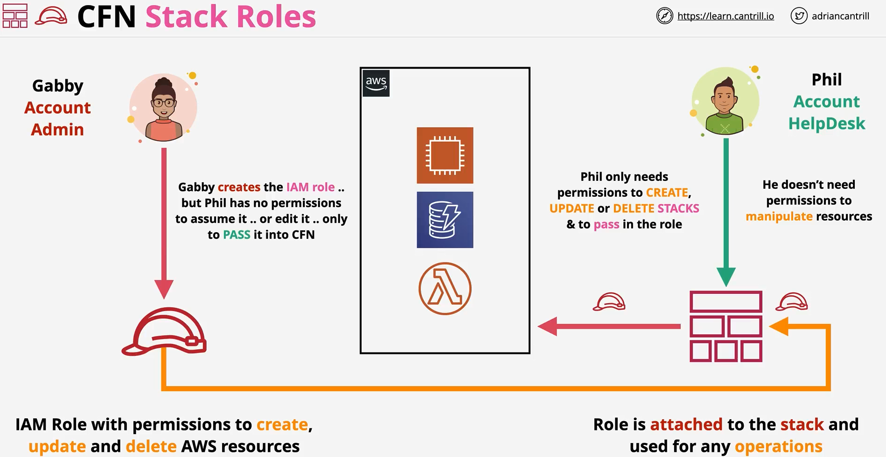

# **🛡️ AWS CloudFormation Stack Role**

## **📌 Introduction**

By default, when a user creates or updates a CloudFormation stack, **the stack operates with the IAM permissions of the user who initiated the request**. This means that if a user lacks the necessary IAM permissions, CloudFormation **fails to deploy resources**.

To solve this, **AWS CloudFormation Stack Roles** allow CloudFormation to assume an IAM role with **predefined permissions**, ensuring:

✅ **Users can deploy stacks without requiring extensive IAM permissions.**  
✅ **CloudFormation has only the permissions it needs to manage stack resources.**  
✅ **Enhanced security and compliance by limiting direct user privileges.**

---



---

## **🔖 Why Do We Need a Stack Role?**

| **Scenario**                        | **Why a Stack Role is Needed?**                                     |
| ----------------------------------- | ------------------------------------------------------------------- |
| **User has limited permissions**    | Allows stack deployment using an IAM role with broader permissions. |
| **Multiple teams deploying stacks** | Ensures consistency in permissions across environments.             |
| **Compliance and governance**       | Restricts unauthorized changes to sensitive resources.              |
| **Separation of duties**            | Developers can deploy stacks without having direct IAM permissions. |

---

## **🔖 How Stack Role Works in AWS CloudFormation**

1️⃣ **User initiates a CloudFormation stack operation** (create, update, delete).  
2️⃣ **CloudFormation assumes the IAM Role specified as the Stack Role.**  
3️⃣ **CloudFormation uses the role’s permissions** to provision or modify AWS resources.

```mermaid
sequenceDiagram
autonumber
participant Admin as Administrator
participant Developer as Developer
participant CloudFormation as AWS CloudFormation
participant IAMRole as Stack Role (IAM)
Admin->>IAMRole: 1️⃣ Create Stack Role with Required Permissions
Developer->>CloudFormation: 2️⃣ Create/Update/Delete Stack
CloudFormation->>IAMRole: 3️⃣ Assume Role for Execution
IAMRole->>CloudFormation: ✅ Temporary Permissions Granted
CloudFormation->>AWSResources: 4️⃣ Deploy Resources Using Role
```



✅ **Ensures CloudFormation operates with controlled permissions, reducing security risks.**

---

## **🔖 Setting Up a Stack Role for Developers**

### **🛠️ Step 1: Administrator Creates the Stack Role**

#### **Create an IAM Role for CloudFormation Execution**

```json
{
  "Version": "2012-10-17",
  "Statement": [
    {
      "Effect": "Allow",
      "Principal": {
        "Service": "cloudformation.amazonaws.com"
      },
      "Action": "sts:AssumeRole"
    }
  ]
}
```

✔ **Allows CloudFormation to assume this role.**

#### **Attach Permissions for CloudFormation Execution**

```json
{
  "Version": "2012-10-17",
  "Statement": [
    {
      "Effect": "Allow",
      "Action": ["ec2:CreateInstance", "s3:CreateBucket", "iam:PassRole"],
      "Resource": "*"
    }
  ]
}
```

✔ **Grants permissions to CloudFormation to create AWS resources.**

---

### **🛠️ Step 2: Developer Uses the Stack Role for Deployment**

#### **Developer’s IAM Policy** (Minimal Permissions)

```json
{
  "Version": "2012-10-17",
  "Statement": [
    {
      "Effect": "Allow",
      "Action": ["cloudformation:CreateStack", "cloudformation:UpdateStack", "cloudformation:DeleteStack"],
      "Resource": "*"
    }
  ]
}
```

✔ **Developer can manage CloudFormation stacks but not directly access AWS resources.**

---

## **🔖 How a Developer Uses a Stack Role in AWS CLI**

### **🛠️ Create a Stack with a Specific Role**

```sh
aws cloudformation create-stack --stack-name MySecureStack \
  --template-body file://template.yaml \
  --role-arn arn:aws:iam::123456789012:role/MyCloudFormationRole
```

✔ **Ensures CloudFormation assumes the correct IAM Role for stack execution.**

---

### **🛠️ Updating a Stack with a Specific Role**

```sh
aws cloudformation update-stack --stack-name MySecureStack \
  --template-body file://template.yaml \
  --role-arn arn:aws:iam::123456789012:role/MyCloudFormationRole
```

✔ **Ensures updates are performed with controlled permissions.**

---

## **🔖 Using a Stack Role in Nested Stacks**

When deploying **nested stacks**, the **parent stack role must have permissions to pass roles** to child stacks. Use the `RoleARN` property in the nested stack definition:

### **🛠️ Example: Assigning a Role to a Nested Stack**

```yaml
Resources:
  ParentStack:
    Type: AWS::CloudFormation::Stack
    Properties:
      StackName: "ParentStack"
      TemplateURL: "https://s3.amazonaws.com/mybucket/parent-template.yaml"
      RoleARN: "arn:aws:iam::123456789012:role/MyCloudFormationRole"

  NestedStack:
    Type: AWS::CloudFormation::Stack
    Properties:
      StackName: "NestedStack"
      TemplateURL: "https://s3.amazonaws.com/mybucket/nested-template.yaml"
      RoleARN: "arn:aws:iam::123456789012:role/MyCloudFormationRole"
```

✔ **Ensures both parent and nested stacks use the same IAM Role for execution.**

---

## **🔖 Best Practices for Using Stack Roles**

✅ **Use IAM Least Privilege Model**

- Grant CloudFormation only the permissions it needs.  
  ✅ **Restrict Role Usage to CloudFormation Service**
- Prevent unintended use of the role by other AWS services.  
  ✅ **Monitor Role Assumption with AWS CloudTrail**
- Track who and when CloudFormation assumes the role.  
  ✅ **Use Service Control Policies (SCPs) in AWS Organizations**
- Prevent users from overriding stack roles manually.

---

## **✅ Conclusion**

AWS CloudFormation **Stack Roles** provide a secure, controlled way to deploy AWS resources by **delegating permissions to an IAM role** rather than relying on user credentials.

✔ **Ensures security by limiting direct user access.**  
✔ **Facilitates compliance and governance.**  
✔ **Prevents privilege escalation and misconfigurations.**

💡 **Using Stack Roles effectively enhances security and control over AWS deployments!** 🚀
