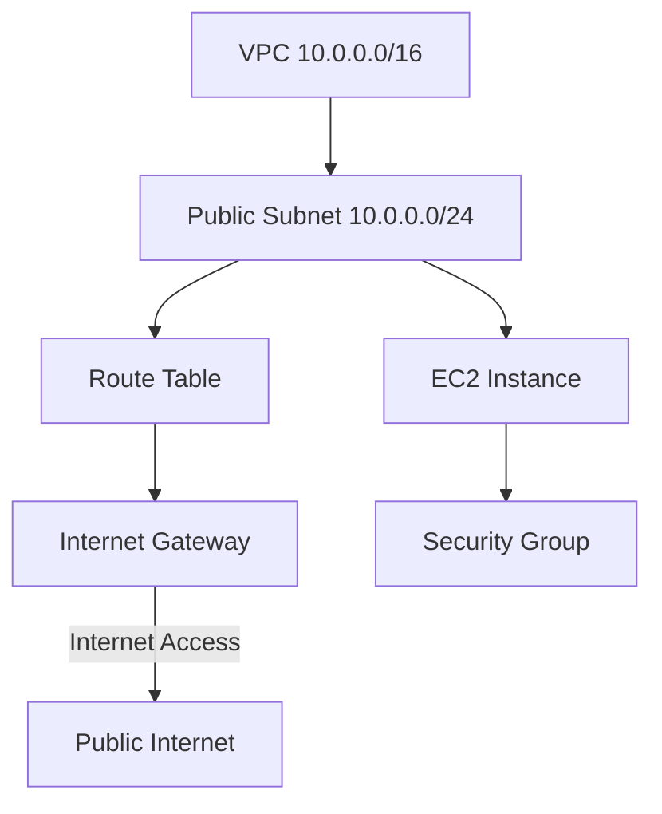

# **🏗️ AWS CloudFormation Demo - Full Infrastructure Deployment**

## 📌 Demo 1

This AWS CloudFormation template **automates the deployment of a basic AWS infrastructure**, which includes:

✅ **A VPC** (Virtual Private Cloud) → Defines the network.  
✅ **A Public Subnet** → Enables internet access for resources.  
✅ **An Internet Gateway** → Allows public internet connectivity.  
✅ **A Route Table & Route** → Directs traffic from the subnet to the internet.  
✅ **A Security Group** → Controls inbound and outbound traffic.  
✅ **An EC2 Instance** → A virtual machine running in the cloud.

---

<div style="display: flex; justify-content: center;">



</div>

---

### **📜 Full CloudFormation Template**

```yaml
AWSTemplateFormatVersion: 2010-09-09
Description: CloudFormation Template to create a VPC, Subnet, Internet Gateway, Route Table, Security Group, and an EC2 instance.

Resources:
  # 1️⃣ Create a VPC
  ActivityVpc:
    Type: AWS::EC2::VPC
    Properties:
      CidrBlock: 10.0.0.0/16
      Tags:
        - Key: Name
          Value: Section2ActivityVPC

  # 2️⃣ Create a Public Subnet
  ActivitySubnet:
    Type: AWS::EC2::Subnet
    Properties:
      CidrBlock: 10.0.0.0/24
      MapPublicIpOnLaunch: true
      VpcId: !Ref ActivityVpc

  # 3️⃣ Create a Route Table
  ActivityRouteTable:
    Type: AWS::EC2::RouteTable
    Properties:
      VpcId: !Ref ActivityVpc

  # 4️⃣ Create an Internet Gateway
  ActivityInternetGateway:
    Type: AWS::EC2::InternetGateway

  # 5️⃣ Attach the Internet Gateway to the VPC
  ActivityGatewayAttachment:
    Type: AWS::EC2::VPCGatewayAttachment
    Properties:
      VpcId: !Ref ActivityVpc
      InternetGatewayId: !Ref ActivityInternetGateway

  # 6️⃣ Create a Route to the Internet
  InternetRoute:
    Type: AWS::EC2::Route
    DependsOn:
      - ActivityGatewayAttachment
    Properties:
      RouteTableId: !Ref ActivityRouteTable
      GatewayId: !Ref ActivityInternetGateway
      DestinationCidrBlock: 0.0.0.0/0

  # 7️⃣ Associate the Route Table with the Subnet
  ActivitySubnetRouteTableAssoc:
    Type: AWS::EC2::SubnetRouteTableAssociation
    Properties:
      RouteTableId: !Ref ActivityRouteTable
      SubnetId: !Ref ActivitySubnet

  # 8️⃣ Create a Security Group
  ActivitySecurityGroup:
    Type: AWS::EC2::SecurityGroup
    Properties:
      GroupDescription: Allow ICMP traffic (ping)
      VpcId: !Ref ActivityVpc
      SecurityGroupIngress:
        - CidrIp: 0.0.0.0/0
          IpProtocol: icmp
          FromPort: -1
          ToPort: -1

  # 9️⃣ Create an EC2 Instance
  ActivityInstance:
    Type: AWS::EC2::Instance
    DependsOn:
      - InternetRoute
      - ActivitySubnetRouteTableAssoc
    Properties:
      InstanceType: t2.micro
      SubnetId: !Ref ActivitySubnet
      ImageId: ami-0fad7378adf284ce0 # Replace with a valid AMI ID for your region
      SecurityGroupIds:
        - !Ref ActivitySecurityGroup
```

---
