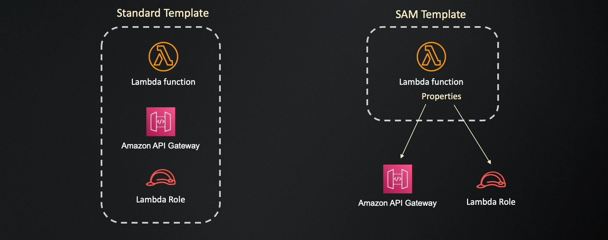
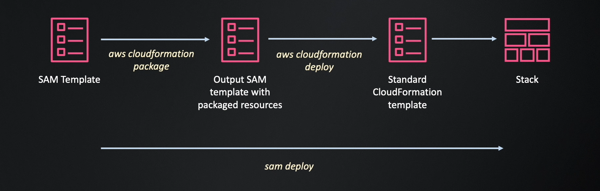

# SAM

- open source framework to build and deploy serverless applications on aws.
- an alternative to serverless framework, but maintained by a team in aws.
- a subset of aws cloudformation.
- you use cfn templates with some extensions to define serverless resources with simple and clean syntax.
- you can define all resource types supported by cfn in a sam template.
- you can use standard template sections, such as parameters, conditions, or mapping in a sam template.

---

## SAM CLI

- use to initialize, package and deploy sam projects.
- has more additional features to build and test aws lambda functions locally using docker containers.

## References

1. [SAM CLI Installation Reference](https://docs.aws.amazon.com/serverless-application-model/latest/developerguide/install-sam-cli.html)
1. [SAM Generated Resources FROM api Event Definition](https://github.com/aws/serverless-application-model/blob/master/docs/internals/generated_resources.rst#api)
1. [AWS SAM resources and properties](https://docs.aws.amazon.com/serverless-application-model/latest/developerguide/sam-specification-resources-and-properties.html)
1. [Globals section of the AWS SAM template](https://docs.aws.amazon.com/serverless-application-model/latest/developerguide/sam-specification-template-anatomy-globals.html)
1. [AWS SAM policy templates](https://docs.aws.amazon.com/serverless-application-model/latest/developerguide/serverless-policy-templates.html)
1. [AWS SAM CLI configuration file](https://docs.aws.amazon.com/serverless-application-model/latest/developerguide/serverless-sam-cli-config.html)
