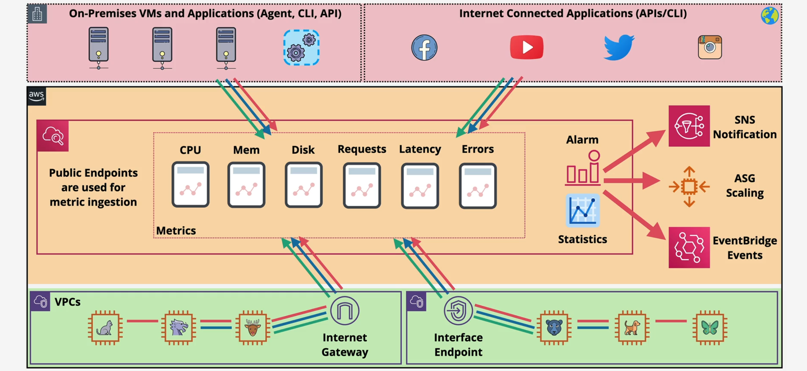
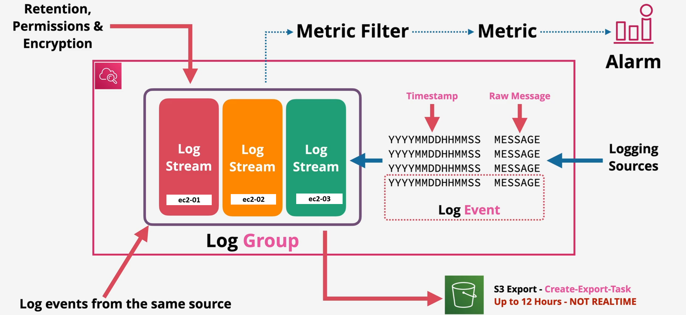

# AWS Cloud Watch

- Amazon CloudWatch Provides system-wide visibility into resource utilization, application performance, and operational health.
- It monitors AWS resources and any applications that run on AWS in `real time`.
- It can be used to collect and track metrics.

**Amazon CloudWatch monitors metrics and is a metric repository:**

- A metric (variable) is a time-ordered set of data points (or values the variable takes over a time period).
- Metrics are either out of the box or custom metrics.
- We can create dashboards for metrics we need to look at most of the time.
- Metrics exist only in the region where they are created.
- CloudWatch can be accessed through an interface VPC interface endpoint.

---

- `Ingestion`, Storage and Management of Metrics
- Public Service - public space endpoints
- AWS Service integration - management plane
- `Agent integration` .. e.g. EC2 - richer metrics
- `On-premises integration` via Agent/APl (custom metrics)
- `Application integration` via API/Agent (custom metric)
- View data via console UI, CLI, API, dashboards & anomaly detection
- Alarms ... react to metrics, can be used to notify or perform actions

**Examples: CloudWatch can be used to:**

- Report on an AWS Account’s root user sign-in events.
- Setup Billing Alarms.
- Collect and track metrics to monitor the health of an entire system’s resources.

* `Namespace` = container for metrics e.g. AWS/EC2 & AWS/Lambda
* `Datapoint` = Timestamp, Value, (optional) unit Of measure
* `Metric` .. time ordered set of data points
  - CPUUtilization, Networkln, DiskWriteBytes (EC2)
* Every metric has a MetricName (CPUUtilization) and a Namespace (AWS/EC2)
* `Dimension` .. name/value pair
  - CPUUtilization Name-Instanceld, Value = i-222222222 (dog)
  - AutoScalingGroupName, Imageld, Instanceld, InstanceType

## CloudWatch Metrics

---

- Metrics are either out of the box or custom metrics.
- We can build custom metrics from sources within AWS, from sources on-premises or anywhere else.
- An example could be building a custom metric for the number of rejected TCP/IP packet in a specific VPC, Subnet or ENI

## CloudWatch Logs

CloudWatch logs is a logging service from CloudWatch that can be used to monitor, store, and access log files from AWS and non-AWS sources.

- It facilitates `centralizing logs` from all systems, applications, and AWS services that are in use, into a single,`highly scalable logging service`.
- Storage for the logs in chargeable

- Provides the ability to view logs as a single, consistent flow of time-ordered events.
- Can be used to sort, query, and filter logs for specific error codes or patterns.
- It archives logs securely for future use.
- Can be used to create custom/powerful queries (using CloudWatch Insights) and visualize the log data in dashboards.

### Logs Components

#### Log Events

These are individual records of activity that are captured by CloudWatch Logs. They are typically generated by AWS resources or applications to provide more detailed, textual information (e.g., system logs, application logs, or access logs)

#### Log Streams

In Amazon CloudWatch, a **log stream** is a sequence of log events that share the same source. Each log stream belongs to a **log group**, which is a collection of log streams that share the same properties, such as retention, monitoring, and access control settings.

Let's break down your example:

- You have three EC2 instances, each running an application that produces log files.
- For each application instance, you can create separate log streams within the same log group.
- Each log stream will receive log events from its corresponding application instance.

Here's how it would look:

- **Log Group: ApplicationLogs**
  - Log Stream: EC2_Instance_1
  - Log Stream: EC2_Instance_2
  - Log Stream: EC2_Instance_3

Each log stream will contain the log events generated by the respective EC2 instance, and all three log streams will be organized under the "ApplicationLogs" log group.

#### Log Groups

Log groups define groups of log streams that share
the same retention, monitoring, and access control
settings.

#### Log Group Retention Period

The retention period in AWS CloudWatch refers to the amount of time that log events are stored before they are automatically deleted. This setting helps you manage the storage costs by controlling how long your log data is retained. Here's a bit more detail:

- _Setting Retention Period_: You can configure the retention period for each log group individually. AWS CloudWatch allows you to set retention periods ranging from one day to ten years.
- _Automatic Deletion_: Once the specified retention period expires, the log events are automatically deleted. This ensures that your log data doesn't take up unnecessary storage space or incur additional costs over time.

For example, if you set a retention period of 30 days for a log group, any log events older than 30 days will be automatically deleted.

- By default, logs in CW Logs are stored indefinitely.
- We can customize it from 1 day to 10 years.
- The retention policy is configured at the log group level.
- Expired logs are deleted automatically.

### Logs - Custom Metrics – Metric Filters

- Can be configured at the log group level.
- They are used to create custom CloudWatch metrics.
- When the searched term is found, CW Logs reports the data to the specified metric.
- CloudWatch Logs sends metric data to CloudWatch every minute by default (standard resolution).
- `We can configure the custom metric resolution to be high (1, 5, 10 or 30 seconds) at an additional cost`

With custom metrics, we can feed CloudWatch metric data values up to 2 weeks in the past and up to 2 hours in the future.

### Notes

- CloudWatch Logs encrypts data in-transit.
- CloudWatch encrypts and at-rest, `at the log group level`, using KMS keys

**CloudWatch Logs Insights:**

- It facilitates the interactive search and analysis of the log data in Amazon CloudWatch Logs.
- It includes a purpose-built query language with a few simple, yet powerful commands.
- Can help in efficiently and effectively responding to operational issues.

**CloudWatch Logs Agent:**

- It is required (needs to be installed) to collect logs from Amazon EC2 instances and on-premises servers into CloudWatch Logs.

## CloudWatch Dashboards

Is a way to visualize or present specific metrics that you need monitored all the time.

- There are automatic dashboards for AWS services.
- We can also create custom dashboards where we decide which metrics are presented.
- The metrics can be from different AWS regions and different AWS accounts.
- CloudWatch dashboards are global resources.
- They can be shared publicly, SSO users, with an email list where the users will be provided a username/password for access.
- 3 Dashboards are free (Free tier) then you pay a monthly charge per dashboard

## CloudWatch Alarms

CloudWatch Alarms can be created to watch a single CloudWatch metric (or a custom metric) or a regular expression based on a number of metrics.

- The alarm can perform one or more actions based on the watched metric value over several data points.
- Possible alarm states are OK, ALARM, INSUFFICIENT_DATA

**CloudWatch Alarms can perform actions using:**

- Auto-scaling,
- EC2 (recover, start, reboot, terminate) or
- Send notifications to an SNS topic.
  > Note ⚠️: `CloudWatch alarms cannot invoke a Lambda function directly.`
