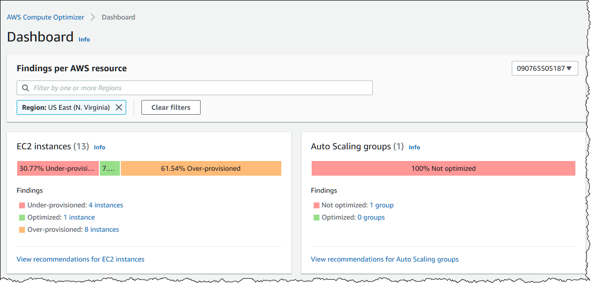

# 🚀 AWS Compute Optimizer

**AWS Compute Optimizer** is a service that analyzes the configuration and utilization data of your AWS compute resources and provides optimization recommendations to help reduce costs and enhance performance.

  

## **Key Features:**

### 🛠️ Resource Recommendations

Generates recommendations for:

- `EC2`
- `EC2 Auto Scaling Groups`
- `EBS Volumes attached to EC2 instances`
- `AWS Lambda`

### 📊 Utilization Metrics

Offers graphs of recent utilization metrics and projected recommendations for better price-performance evaluation.

### 🌐 Accessibility

Available through both a console dashboard and a set of APIs.

### 🤝 Multi-Account Support

Can be used across AWS organizations to find recommendations for management and member accounts.

### 📋 Opt-In Requirement

Customers must opt into the service to use it.
