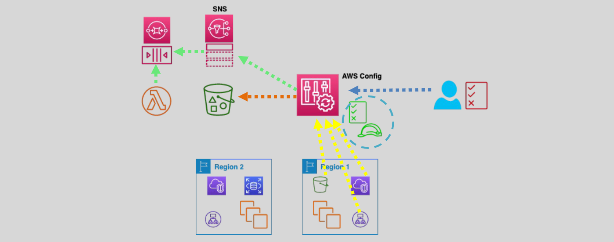

# AWS Config: Track and Manage Your Cloud Configuration 🛠️

AWS Config is a **fully managed service** that enables you to track, audit, and evaluate the configuration of AWS resources. It provides a detailed inventory, monitors configuration changes, and helps ensure compliance with desired settings.

---

## 🌟 **What is AWS Config?**

AWS Config helps organizations achieve governance, security, and operational efficiency by:

- **Tracking Configuration Changes**: Provides detailed information about resource configuration changes.
- **Compliance Monitoring**: Continuously evaluates resources against predefined rules.
- **Resource Relationships**: Maps relationships between AWS resources to ensure dependencies are well understood.

---

## 🔄 **How AWS Config Works**

  

1. **Discovery and Tracking**

   - AWS Config automatically discovers supported AWS resources in your account/region and generates **configuration items** for each.
   - Tracks **periodic** and **change-triggered updates** to configurations.

2. **Data Storage and Notifications**

   - Stores configuration history in an **S3 bucket** (default retention: 7 years).
   - Sends notifications to **SNS topics** to alert you of changes or compliance issues.

3. **Multi-Account Monitoring**
   - Supports **multi-account, multi-region** monitoring through **AWS Organizations**.
   - Aggregates data across accounts and regions for centralized visibility.

---

## 🔑 **Key Components**

### 1️⃣ **Rules**

AWS Config uses **rules** to define desired configurations and assess compliance:

- **AWS Managed Rules**: Predefined rules for common compliance needs (e.g., S3 bucket encryption).
- **Custom Rules**: User-defined rules created with **AWS Lambda** for custom compliance evaluations.

Features of Rules:

- Can be **change-triggered** or **periodic**.
- Flag **non-compliant resources** for remediation.
- Support **automatic remediation** using AWS Systems Manager (SSM).

### 2️⃣ **Configuration State Queries**

AWS Config allows you to query the current and historical state of resources:

- Uses a SQL-like **SELECT** syntax for property-based queries.
- Helps with **inventory management**, **security analysis**, and **cost optimization**.

### 3️⃣ **Integration with AWS Services**

AWS Config integrates with:

- **CloudTrail**: Monitors API calls related to resource changes.
- **EventBridge**: Automates responses to configuration changes.
- **Lambda**: Evaluates custom rules or triggers remediation actions.

---

## 🚀 **Use Cases**

1. **Compliance and Auditing**

   - Identify resources violating compliance policies (e.g., S3 buckets with public access).
   - Ensure security groups do not allow unrestricted access.

2. **Configuration Management**

   - Troubleshoot resource configuration changes.
   - Maintain an up-to-date inventory of resources.

3. **Security Analysis**

   - Detect misconfigurations that could lead to vulnerabilities.

4. **Operational Efficiency**
   - Track EBS volume types or EC2 instance sizes for cost optimization.

---

## 💰 **Pricing**

AWS Config is **not part of the free tier**, and its costs depend on usage:

| **Item**                  | **Cost**                                             |
| ------------------------- | ---------------------------------------------------- |
| **Configuration Items**   | \$0.003 per item per region.                         |
| **Rule Evaluations**      | \$0.001 per rule evaluation per region.              |
| **Storage Costs (S3)**    | Based on S3 usage for storing configuration history. |
| **Notifications (SNS)**   | Based on SNS usage for notifications.                |
| **Custom Rules (Lambda)** | Based on AWS Lambda invocation costs.                |

---

## 🔍 **Key Benefits**

- **Continuous Resource Evaluation**: Ensures compliance by continuously monitoring configuration changes.
- **Historical Snapshots**: View past configurations to troubleshoot issues or audit changes.
- **Relationship Mapping**: Understand how AWS resources interact for better planning and management.
- **Customizable Monitoring**: Tailor compliance rules to specific organizational needs.

---

## 📋 **Example Use Cases**

1. **Security**:

   - Check if S3 buckets are publicly accessible.
   - Ensure all security groups restrict public traffic.

2. **Compliance**:

   - Confirm all EC2 instances are of a specific size or family.
   - Validate that EBS volumes use encryption.

3. **Operational Efficiency**:
   - Monitor unused resources for potential cost savings.
   - Track the versioning state of S3 buckets.

---

## ✅ **Conclusion**

AWS Config is an indispensable tool for organizations looking to enforce compliance, maintain operational excellence, and secure their cloud environments. By providing detailed resource tracking, configuration snapshots, and compliance checks, AWS Config ensures you have the visibility and control needed to manage your infrastructure effectively.
