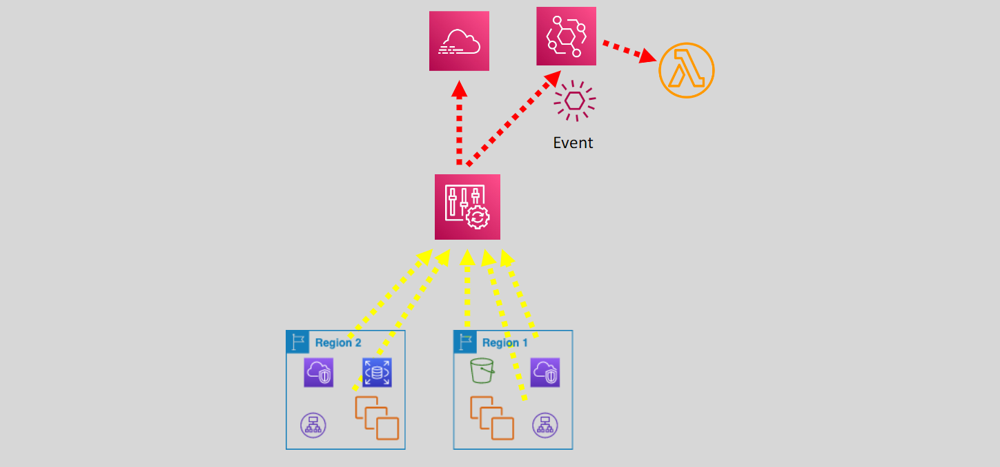

# AWS Config

As applications and associated infrastructure grow, a mechanism to track the configuration, inventory, and changes of involved AWS resources becomes a must.

AWS Config is a fully managed service that provides AWS resource inventory, configuration history, and configuration change notifications which enables governance and security

- This includes how the resources are related to one another.
- It also covers the configuration history.
- Supported resources include EC2 instances, EBS Volumes, Security Groups, VPCs, RDS, SNS, SQS, S3 Buckets, API Gateway, among others.
- AWS Config supports interface VPC endpoints

---

- Once enabled, AWS Config discovers the supported AWS resources that in exist in the account/region and generate a configuration item for each.
- AWS Config examines the resource configurations periodically and tracks changes.
- Each time a change is detected, AWS Config generates a configuration item for the resource.
- We can confine what AWS Config tracks to certain resources if needed

---

- AWS Config requires an IAM role with permissions on the tracked resources.
- It sends a configuration history file for each resource type every 6 hours to an S3 bucket.
- It can publish messages to an SNS topic to send SNS notifications.
  - This can be emailed or dropped in an SQS queue.
- Default data retention is 7 years

---

- We can have resources in other accounts (AWS Organizations) monitored by AWS Config.
- Using the multi-account, multi-region feature, we can aggregate AWS Config data across accounts (AWS Organizations) or AWS regions in a single AWS account.
- Monitoring happens through CloudTrail and EventBridge.
- We can also trigger actions through Lambda functions

## Rules

- They represent the desired or ideal configuration settings.
  - They are used to assess the overall compliance and risk status of the configurations.
  - Rules can be AWS managed, or we can create custom rules (requires an AWS Lambda function for the configuration evaluation).
  - AWS Config flags non-compliant resources.
  - Rules can be periodic or change-triggered.
- AWS Config continuously tracks the configuration changes to ensure compliance

---

- Each rule is associated with a Lambda function which contains the evaluation logic for the rule.
- AWS Config can be used to trigger a Lambda function to evaluate whether a resource’s configuration complies with AWS Config rules.
- Rules are not meant to block or deny access to resources.
- You can use remediation actions (using SSM).

## Configuration State

**We can use AWS Config to query the current configuration state of the account’s AWS resources:**

- AWS Config uses a subset of structured query language (SQL) SELECT.
- We can use property-based queries against AWS resources metadata (tags, versioning state of bucket are examples).

**This can help in:**

- Inventory management.
- Security and operational intelligence.
- Cost optimization.

## Benefits

- Evaluate AWS resource configuration.
- Snapshot the current resources’ configuration.
- Retrieve resource configurations.
- Retrieve historical configurations.
- View resource relationships.
- Receive a notification whenever configuration changes happen.

## Use Cases

- Resource administration, auditing, and compliance.
- Managing and troubleshooting configuration changes.
- Security Analysis

**So we can achieve:**

- Whether any S3 bucket is configured to allow public access.
- Any security groups allowing unrestricted access.
- Ensure whether EC2 instances are of a certain family/size.
- Check the type of EBS volumes used in an account.

## Pricing

- AWS Config is not part of the free tier.
- \$0.003 per configuration item recorded in your AWS account per AWS Region.
  - A configuration item is recorded whenever a resource undergoes a configuration change or a relationship change.
- The number of AWS Config rules evaluations recorded.
  - A rule evaluation is recorded every time a resource is evaluated for compliance against an AWS Config rule. (\$0.001 per rule evaluation/region).
- S3 costs when used for storage.
- SNS costs when notification is used.
- AWS Lamba costs when used in custom rules.
