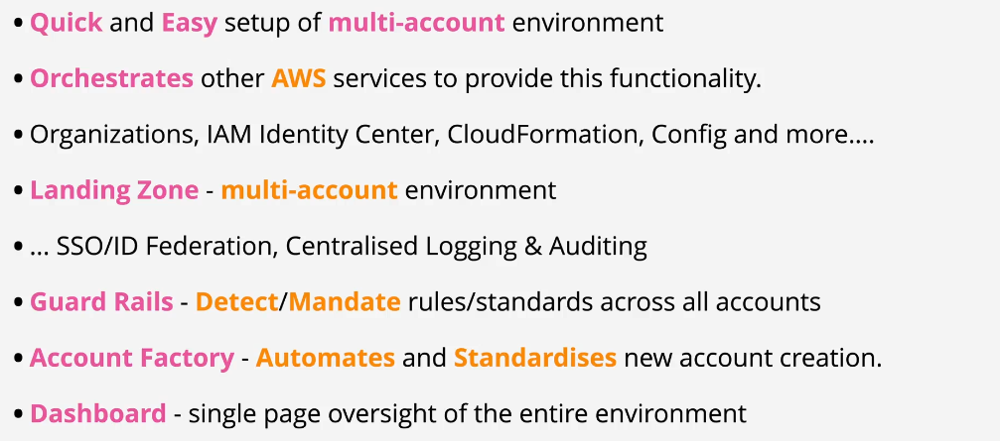
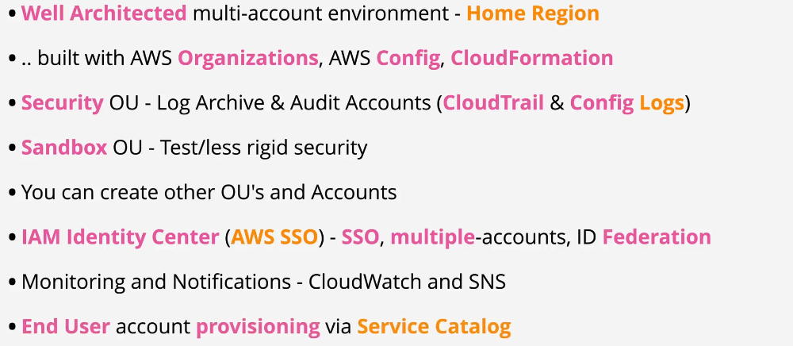
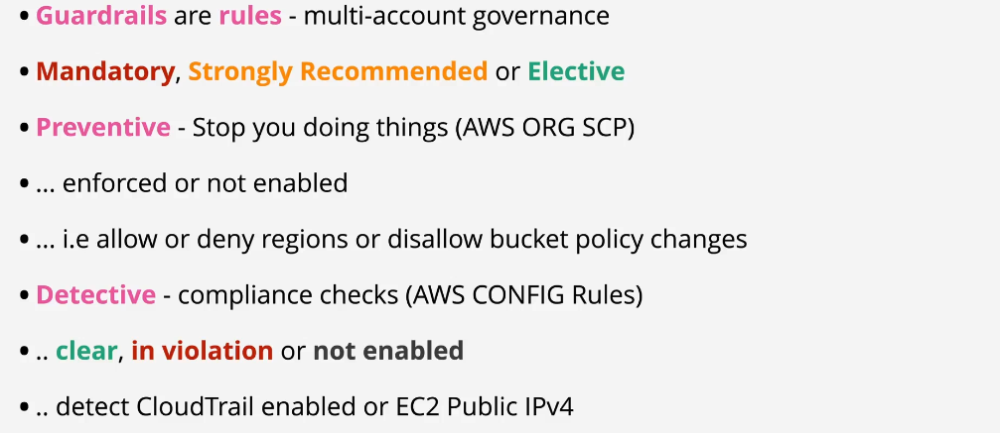
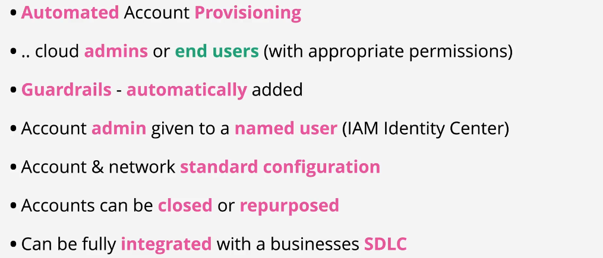

# **AWS Control Tower** 🏰

**AWS Control Tower** is a service that helps you set up and manage a secure, multi-account AWS environment based on best practices. Think of it as a **control panel** that organizes and governs all your AWS accounts while making it easier to follow security and compliance standards.

---

  

  

---

## **Why Use AWS Control Tower?**

Managing multiple AWS accounts can get complicated. With AWS Control Tower, you can:

- Automatically set up a **secure multi-account environment**.
- Apply **pre-configured guardrails** for security and compliance.
- **Centralize management** of accounts under a single organization.

---

## **Main Components of AWS Control Tower**

Let’s break down the main components step by step, so it’s easy to understand:

---

## **1. Landing Zone 🛬**

The **Landing Zone** is the foundation of AWS Control Tower. It’s a pre-configured environment designed for managing multiple AWS accounts securely.

- **What’s Included in the Landing Zone?**

  1. **Management Account**: The central account used to manage the AWS environment.
  2. **Shared Accounts**: Pre-created accounts for specific purposes:
     - **Log Archive Account**: Stores logs from all accounts for auditing.
     - **Audit Account**: Used by security teams to monitor and audit activities.
  3. **Organizational Units (OUs)**: Groups of accounts for applying specific rules (e.g., production vs. development).

- **Example**:
  Imagine a company with two teams: Development and Production. AWS Control Tower creates OUs to apply different rules to these teams automatically.

---

## **2. Guardrails 🛡️**

Guardrails are pre-defined rules that help enforce security and compliance in your accounts. They’re like **traffic lights** that guide your AWS usage.

- **Types of Guardrails**:

  1. **Preventive Guardrails**: Stop certain actions from happening. For example:
     - Prevent public access to S3 buckets.
  2. **Detective Guardrails**: Monitor for non-compliant actions and alert you. For example:
     - Detect unencrypted EBS volumes.

- **How Guardrails Work**:

  - Guardrails use AWS services like AWS Organizations and AWS Config to enforce and monitor compliance.

- **Example**:
  If a developer tries to make an S3 bucket public, a preventive guardrail will block the action.

---

## **3. Account Factory 🏭**

The **Account Factory** is like a **production line** for creating AWS accounts. It simplifies the process by automating the setup of new accounts with pre-configured settings.

- **What It Does**:

  - Creates accounts with default settings, such as network configurations, logging, and security rules.
  - Integrates new accounts into your Landing Zone and applies guardrails automatically.

- **Example**:
  If your company hires a new team, you can quickly create an account for them using the Account Factory.

---

## **4. Dashboard 📊**

The AWS Control Tower **Dashboard** is your central hub for monitoring and managing the environment.

- **What You Can Do**:

  - View the compliance status of your accounts.
  - See which guardrails are enabled.
  - Track non-compliant activities and take corrective actions.

- **Example**:
  If the dashboard shows a non-compliant resource (e.g., an unencrypted database), you can quickly investigate and resolve the issue.

---

## **How AWS Control Tower Works**

**Step-by-Step Workflow:**

1. **Set Up the Landing Zone**:
   - AWS Control Tower automatically creates accounts, OUs, and guardrails.
2. **Define Organizational Units (OUs)**:
   - Group accounts based on their purpose (e.g., Production, Development).
3. **Enable Guardrails**:
   - Choose preventive and detective guardrails to enforce compliance.
4. **Create Accounts with Account Factory**:
   - Quickly onboard new teams or workloads into your environment.
5. **Monitor the Dashboard**:
   - Use the dashboard to track compliance and resolve issues.

---

## **Benefits of AWS Control Tower**

1. **Simplified Multi-Account Management**:

   - Centralize governance and reduce the complexity of managing multiple accounts.

2. **Automated Best Practices**:

   - Automatically apply AWS security and compliance best practices to your accounts.

3. **Quick Onboarding**:

   - Easily add new accounts with pre-configured settings.

4. **Improved Security and Compliance**:
   - Use guardrails to ensure all accounts meet organizational policies.

---

## **Limitations of AWS Control Tower**

1. **Region Limitation**:

   - AWS Control Tower is only available in certain AWS regions.

2. **Predefined Guardrails**:

   - You can’t customize guardrails; you must use the predefined options.

3. **Not Suitable for Single Accounts**:
   - AWS Control Tower is designed for multi-account environments and might not add value for single-account setups.

---

## **Example: Setting Up a Landing Zone**

Let’s say you’re an IT manager setting up AWS Control Tower for a company with two teams: **Developers** and **Production Ops**.

### **Step 1: Launch AWS Control Tower**

- In the AWS Management Console, start AWS Control Tower.
- Follow the guided setup to configure your Landing Zone.

### **Step 2: Organizational Units**

- Create two OUs:
  1. **Development OU**: For developer accounts with relaxed guardrails.
  2. **Production OU**: For production accounts with strict guardrails.

### **Step 3: Enable Guardrails**

- Development OU:
  - Enable guardrails to detect unencrypted resources.
- Production OU:
  - Enable guardrails to prevent public S3 buckets and require encryption for all resources.

### **Step 4: Use Account Factory**

- Create a new account for the **Developer Team** using the Account Factory.
- Apply the Development OU guardrails automatically.

### **Step 5: Monitor with the Dashboard**

- Check the dashboard to ensure all accounts comply with the enabled guardrails.

---

## **Summary**

AWS Control Tower simplifies the management of multi-account AWS environments by:

- Setting up a secure **Landing Zone**.
- Using **Guardrails** to enforce security and compliance.
- Automating account creation with the **Account Factory**.
- Providing centralized monitoring through the **Dashboard**.

By using AWS Control Tower, you can manage your organization with ease, follow AWS best practices, and ensure your environment is secure and compliant. 😊

## 💼 **Use Cases**

**AWS Control Tower** is ideal for various organizational needs, including:

### 🏢 **Enterprise Account Management**

- **Simplify Multi-Account Setup:** Easily manage multiple AWS accounts for different departments or projects.
- **Centralized Governance:** Maintain consistent policies and security across all accounts.

### 🔒 **Compliance and Security**

- **Regulatory Compliance:** Ensure your AWS environment meets industry regulations like GDPR, HIPAA, and PCI-DSS.
- **Enhanced Security Posture:** Implement and enforce security best practices across your organization.

### 📈 **Scalable Deployments**

- **Business Growth:** Quickly add new AWS accounts as your organization expands.
- **Resource Isolation:** Isolate different business units or projects within separate accounts for better resource management and security.

### 🛠️ **Resource Isolation**

- **Development and Testing:** Separate environments for development, testing, and production to minimize risks.
- **Project-Based Accounts:** Allocate dedicated accounts for specific projects or teams to streamline management and billing.

---

## ⚖️ **Control Tower vs. AWS Organizations**

Understanding when to use **AWS Control Tower** versus **AWS Organizations** helps in selecting the right tool for your needs.

### **AWS Control Tower:**

- **Purpose:** Automates the setup and governance of a multi-account AWS environment.
- **Features:** Pre-built Landing Zones, guardrails, centralized dashboard, best practices enforcement.
- **Use When:** Building or migrating to a new multi-account environment to save time and ensure compliance with best practices.

### **AWS Organizations:**

- **Purpose:** Provides account management and consolidated billing features.
- **Features:** Manual account creation, policy management via Service Control Policies (SCPs), consolidated billing.
- **Use When:** You prefer manual setup and customization of your multi-account environment without the additional governance layers provided by Control Tower.

### **Integration:**

- **Interoperability:** AWS Control Tower and AWS Organizations work together seamlessly. You can invite existing AWS Organizations into an AWS Control Tower environment and manage account-level settings alongside Control Tower’s governance features.

**🔑 Key Takeaway:**

- Use **AWS Control Tower** for automated, best-practice-based multi-account setup and governance.
- Use **AWS Organizations** for manual, flexible account management and consolidated billing.

---

## 💰 **Pricing Overview**

**AWS Control Tower** itself is **free to use**, but customers are billed for the AWS resources and services it provisions within their environment.
