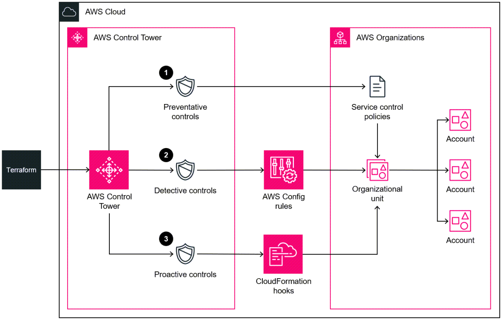

# 🏰 **AWS Control Tower**

**AWS Control Tower** simplifies the setup and governance of a secure, multi-account AWS environment based on AWS best practices. It provides an orchestration layer that automates account provisioning, enforces governance rules, and offers a centralized dashboard for management and visibility.

  
  

---

## 🔍 **What is AWS Control Tower?**

**AWS Control Tower** is a **fully managed service** that provides an automated way to set up and govern a secure, compliant, multi-account AWS environment. It leverages AWS best practices to ensure your AWS infrastructure is well-architected from the start.

**Key Benefits:**

- **Automated Setup:** Quickly establish a multi-account environment with minimal effort.
- **Governance at Scale:** Enforce policies and best practices across all AWS accounts.
- **Centralized Management:** Manage your AWS environment from a single dashboard.

---

## ⚙️ **Key Features**

### 🌐 **Landing Zone**

A **Landing Zone** is the foundational, secure, and scalable multi-account AWS environment set up by Control Tower.

**Components:**

- **Account Structure:** Organized into Organizational Units (OUs) like Security, Log Archive, and Sandbox.
- **Network Configuration:** Pre-configured Virtual Private Clouds (VPCs), subnets, and networking components.
- **Security Baselines:** Standardized security settings and compliance controls applied across all accounts.
- **Logging and Monitoring:** Centralized logging via AWS CloudTrail and AWS Config for governance and auditing.

**Benefits:**

- **Consistency:** Uniform setup across all accounts.
- **Security:** Built-in protections and compliance measures.

### 🛡️ **Guardrails**

**Guardrails** are high-level policies that provide ongoing governance to ensure your AWS environment remains secure and compliant.

**Types:**

- **Preventive Guardrails:** Automatically enforce policies that prevent actions leading to non-compliance or security vulnerabilities.
  - _Example:_ Preventing the creation of public S3 buckets.
- **Detective Guardrails:** Continuously monitor and alert on configurations or actions that deviate from best practices.
  - _Example:_ Monitoring for unencrypted data storage.

### 📊 **Centralized Dashboard**

A **Centralized Dashboard** offers a single view to monitor and manage your entire AWS environment.

**Features:**

- **Visibility:** See the status of all accounts, OUs, and guardrails in one place.
- **Management:** Easily adjust settings, add new accounts, and enforce policies across the organization.
- **Alerts and Notifications:** Receive real-time alerts on compliance and security issues.

### 🔗 **Integration with AWS Services**

**AWS Control Tower** seamlessly integrates with other AWS services to enhance functionality and governance.

**Key Integrations:**

- **AWS Organizations:** Extends AWS Organizations for enhanced account management.
- **IAM Identity Center (Successor of AWS Single Sign-On):** Simplifies user access management across multiple AWS accounts.
- **AWS Service Catalog:** Manages and deploys approved services and applications within your organization.

---

## 🚀 **Deployment and Setup**

Setting up **AWS Control Tower** involves a few straightforward steps:

1. **Sign In to AWS Management Console:**

   - Navigate to the AWS Control Tower service.

2. **Set Up Landing Zone:**

   - Follow the guided setup to create your Landing Zone, which includes setting up OUs, VPCs, and security baselines.

3. **Configure Guardrails:**

   - Select and apply both preventive and detective guardrails based on your organization’s policies.

4. **Provision Accounts:**

   - Automatically create and configure new AWS accounts within the defined OUs.

5. **Monitor and Manage:**
   - Use the centralized dashboard to oversee and manage your AWS environment.

**Automation Benefits:**

- **Time-Saving:** Reduces manual setup tasks.
- **Error Reduction:** Minimizes configuration mistakes.
- **Consistency:** Ensures all accounts follow the same setup and policies.

---

## 🛡️ **Governance and Security**

**AWS Control Tower** ensures that your AWS environment adheres to security and compliance standards through robust governance mechanisms.

### 🔐 **Security Features:**

- **Data Encryption:** Ensures data is encrypted both at rest and in transit.
- **Access Control:** Utilizes IAM roles and policies to manage user permissions.
- **Compliance:** Helps meet industry standards and regulatory requirements.

### 📜 **Compliance Management:**

- **Automated Compliance Checks:** Continuously monitors your environment against compliance frameworks.
- **Audit Trails:** Maintains detailed logs for auditing and compliance verification.

**Best Practices:**

- **Least Privilege Principle:** Grant users the minimum permissions necessary.
- **Regular Audits:** Conduct periodic reviews of security policies and access controls.
- **Update Guardrails:** Regularly update guardrails to adapt to evolving security threats and compliance requirements.

---

## 💼 **Use Cases**

**AWS Control Tower** is ideal for various organizational needs, including:

### 🏢 **Enterprise Account Management**

- **Simplify Multi-Account Setup:** Easily manage multiple AWS accounts for different departments or projects.
- **Centralized Governance:** Maintain consistent policies and security across all accounts.

### 🔒 **Compliance and Security**

- **Regulatory Compliance:** Ensure your AWS environment meets industry regulations like GDPR, HIPAA, and PCI-DSS.
- **Enhanced Security Posture:** Implement and enforce security best practices across your organization.

### 📈 **Scalable Deployments**

- **Business Growth:** Quickly add new AWS accounts as your organization expands.
- **Resource Isolation:** Isolate different business units or projects within separate accounts for better resource management and security.

### 🛠️ **Resource Isolation**

- **Development and Testing:** Separate environments for development, testing, and production to minimize risks.
- **Project-Based Accounts:** Allocate dedicated accounts for specific projects or teams to streamline management and billing.

---

## ⚖️ **Control Tower vs. AWS Organizations**

Understanding when to use **AWS Control Tower** versus **AWS Organizations** helps in selecting the right tool for your needs.

### **AWS Control Tower:**

- **Purpose:** Automates the setup and governance of a multi-account AWS environment.
- **Features:** Pre-built Landing Zones, guardrails, centralized dashboard, best practices enforcement.
- **Use When:** Building or migrating to a new multi-account environment to save time and ensure compliance with best practices.

### **AWS Organizations:**

- **Purpose:** Provides account management and consolidated billing features.
- **Features:** Manual account creation, policy management via Service Control Policies (SCPs), consolidated billing.
- **Use When:** You prefer manual setup and customization of your multi-account environment without the additional governance layers provided by Control Tower.

### **Integration:**

- **Interoperability:** AWS Control Tower and AWS Organizations work together seamlessly. You can invite existing AWS Organizations into an AWS Control Tower environment and manage account-level settings alongside Control Tower’s governance features.

**🔑 Key Takeaway:**

- Use **AWS Control Tower** for automated, best-practice-based multi-account setup and governance.
- Use **AWS Organizations** for manual, flexible account management and consolidated billing.

---

## 🔧 **Management and Monitoring**

Efficient management and monitoring are crucial for maintaining a secure and compliant AWS environment.

### 📈 **Management Tools:**

- **Centralized Dashboard:**

  - **Overview:** Provides a unified view of all accounts, OUs, and guardrails.
  - **Actions:** Easily add new accounts, enforce policies, and manage configurations.

- **AWS Management Console:**
  - **Access:** Use the console to navigate and manage Control Tower settings and resources.
  - **Visibility:** Gain insights into the health and compliance status of your AWS environment.

### 🛠️ **Monitoring Tools:**

- **Amazon CloudWatch:**

  - **Metrics:** Track performance metrics and resource utilization across all accounts.
  - **Alarms:** Set up alarms to notify you of any anomalies or breaches in guardrails.

- **AWS CloudTrail:**
  - **Logging:** Record API calls and user activities for auditing and compliance purposes.
  - **Insights:** Analyze logs to identify potential security threats or compliance issues.

### 🔍 **Best Practices:**

- **Regular Audits:** Conduct periodic reviews of your AWS environment using Control Tower’s dashboard and monitoring tools.
- **Automate Remediation:** Use AWS Lambda functions or other automation tools to remediate compliance issues detected by guardrails.
- **Stay Informed:** Keep up with AWS updates and best practices to continuously enhance your governance model.

---

## 💰 **Pricing Overview**

**AWS Control Tower** itself is **free to use**, but customers are billed for the AWS resources and services it provisions within their environment.

## 🏁 **Conclusion**

**AWS Control Tower** is an essential tool for organizations aiming to establish and manage a secure, compliant, and scalable multi-account AWS environment with ease. By automating the setup, enforcing governance through guardrails, and providing centralized management, Control Tower ensures that your AWS infrastructure adheres to best practices while allowing your organization to grow and scale efficiently.

### **Benefits of Using AWS Control Tower:**

- **Simplified Setup:** Quickly establish a structured and secure AWS environment.
- **Enhanced Security:** Built-in guardrails enforce security and compliance across all accounts.
- **Centralized Management:** Manage all your AWS accounts from a single dashboard, improving visibility and control.
- **Scalability:** Easily add new accounts as your organization expands without compromising governance.
- **Integration with AWS Services:** Seamlessly integrates with other AWS services like AWS Organizations, IAM Identity Center, and AWS Service Catalog to enhance functionality and governance.
