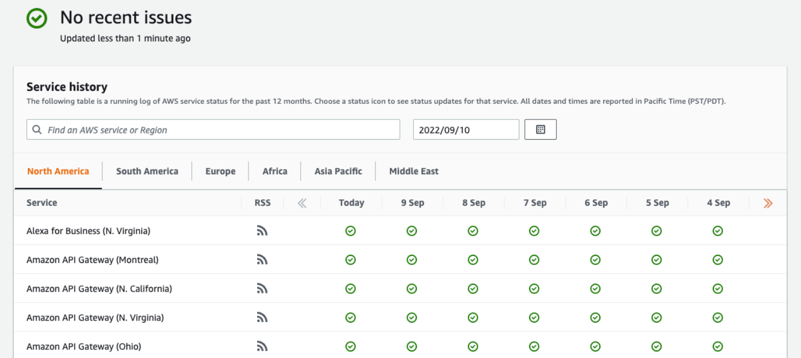

# 🩺 AWS Health Dashboard

**AWS Health Dashboard** offers customers a personalized view into the performance and availability of AWS services that underpin their AWS resources.

  

## **Key Features:**

### 🔔 **Real-Time Alerts and Notifications**

- Provides alerts and remediation guidance during AWS events that may impact customers' accounts.
- Notifies about ongoing and upcoming events, such as scheduled infrastructure changes.

### 🕒 **Timely Information**

- Displays relevant information to help users manage events in progress.
- Offers proactive notifications to aid in planning for scheduled activities.

### 🌟 **Comprehensive Service Status**

- The AWS Service Health Dashboard displays the general status of AWS services in a timely manner, ensuring users are always informed about the health of their resources.
