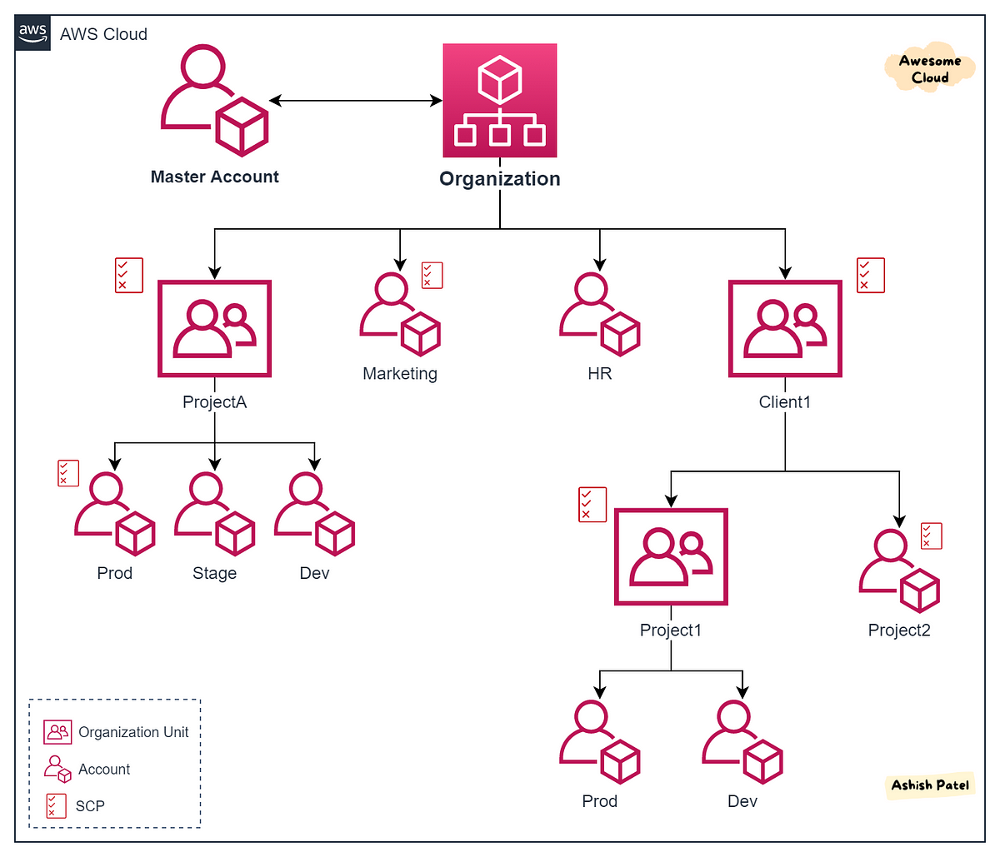

# 🌐 **AWS Organizations**

Amazon **AWS Organizations** is a powerful service designed to help you centrally manage and govern multiple AWS accounts. Whether you're scaling your business, managing diverse projects, or ensuring compliance across departments, AWS Organizations provides the tools necessary to streamline account management, optimize costs, and enforce policies effectively.

  

---

## 🚫 **Challenges Without AWS Organizations**

Managing numerous AWS accounts individually can be cumbersome and inefficient. Here's why AWS Organizations is essential:

- **Manual Management Complexity:**

  - Handling **tens or hundreds of AWS accounts** manually is error-prone and time-consuming.

- **Separate Billing Issues:**

  - Each account generates its **own bill**, preventing you from leveraging **volume discounts** and complicating cost management.

- **Policy Enforcement Difficulties:**

  - **Consistent policy application** across multiple accounts becomes a significant hassle without centralized management.

- **Critical Need for Centralization:**
  - To effectively manage numerous accounts, centralizing control is **imperative** for scalability, security, and efficiency.

---

## 🌟 **Benefits of AWS Organizations**

**AWS Organizations** simplifies the management of multiple AWS accounts by providing a centralized framework for administration, billing, and policy enforcement.

### 💼 **Centralized Management**

- **Unified Control:** Manage all AWS accounts from a single interface, reducing administrative overhead.
- **Hierarchical Grouping:** Organize accounts into **Organizational Units (OUs)** for streamlined policy application and management.

### 💰 **Consolidated Billing**

- **Volume Discounts:** Aggregate usage across accounts to take advantage of **economies of scale**.
- **Simplified Invoicing:** Receive a **single bill** for all accounts, making financial tracking and budgeting easier.

### 🔒 **Enhanced Security and Compliance**

- **Service Control Policies (SCPs):** Define and enforce policies across your organization to **restrict access** to specific AWS services and actions.
- **Centralized Backup Plans:** Implement **centralized backup strategies** across all accounts, ensuring data protection and compliance.

### 📊 **Optimized Resource Management**

- **Tag Policies:** Standardize tagging across accounts to improve **resource management** and **cost allocation**.
- **Central AWS Backup:** Apply consistent backup policies and manage backups for resources across the entire organization.

### **🌍 Global Service:**

- **Global Availability** AWS Organizations operates globally, ensuring consistent management and policy enforcement across all regions.
- **Highly Available and Durable:** Data replicated across multiple servers within an AWS Region for resilience.
- **Eventual Consistency:** Read operations are eventually consistent, ensuring up-to-date information over time.
- **Scalability:** Easily scale your AWS account management as your organization grows.

---

## ⚙️ **Modes of Operation**

AWS Organizations can operate in one of two modes:

1. **All Features Mode**

   - **Comprehensive Management:** Access to all features, including policy types like SCPs.
   - **Best for Large Enterprises:** Ideal for organizations needing detailed control and governance over multiple accounts.

2. **Consolidated Billing Mode**
   - **Basic Management:** Focuses primarily on centralized billing without advanced policy controls.
   - **Suitable for Smaller Organizations:** Perfect for businesses primarily seeking cost optimization through consolidated billing.

---

## 🧩 **Components of AWS Organizations**

### 🏛️ **1. Root**

- **Parent Container:** The **root** is the top-level container that holds all accounts and Organizational Units (OUs).
- **Single Instance:** Each organization has only **one root**.
- **Policy Inheritance:** Policies applied at the root level **propagate** to all OUs and member accounts.

### 🗂️ **2. Organizational Units (OUs)**

- **Hierarchical Grouping:** Organize accounts into **OUs** based on departments, projects, or any logical grouping.
- **Single Parent:** Each OU has only **one parent**, ensuring a clear hierarchy.
- **Policy Application:** Apply policies at the OU level to **automate** governance across grouped accounts.

### 👥 **3. Accounts**

- **Management (Master) Account:** The primary account that **controls** the organization and manages billing.
- **Member Accounts:** Additional accounts that are part of the organization, inheriting policies and billing structures.
- **Account Removal:** To remove a member account, ensure it has the necessary **standalone configurations**, including support plans, contact information, and payment methods.

---

## 😓 **Limitations**

1. **Single Organization per Account**: An AWS account can belong to only one organization at a time.
2. **Management Account Limitations**:
   - Only the management account can create and manage the organization.
   - The management account cannot be removed from the organization.
3. **Member Account Limitations**:
   - Member accounts can't create their own organizations while part of another.
   - Member accounts are subject to Service Control Policies (SCPs) enforced by the management account.
4. **Service Control Policies (SCPs)**:
   - SCPs can restrict or allow specific services/actions for accounts or Organizational Units (OUs).
   - SCPs do not grant permissions by themselves; they only restrict actions granted by IAM policies.
5. **Account Creation and Management**:
   - New accounts created in an organization are billed to the management account.
   - Removing an account from an organization involves a few steps and reconfigurations.
6. **Consolidated Billing**:
   - All accounts in an organization share a single billing method.
   - The management account is responsible for paying all charges.
7. **Cross-Account Access**:
   - Managing cross-account roles and permissions requires careful configuration to ensure security and proper access.
8. **OU has only one parent:** Each OU has only **one parent**, ensuring a clear hierarchy.

9. **Billing When Inviting an Account with Existing Resources:** When you invite an account that already has existing resources and billing arrangements into your AWS Organization, the billing for that account will transition to the management account of the organization.

## 📒 **Notes**

When you create an account in your AWS Organization or invite an account to join your organization, AWS automatically handles some roles for you, but there are additional steps you might need to take:

### When Creating a New Account in Your Organization:

1. **Automatic Roles**:
   - **OrganizationAccountAccessRole**: This role is automatically created and allows users and roles in the management account to have full administrative control over the new member account.
   - **AWSServiceRoleForOrganizations**: This service-linked role is also automatically created to enable integration with select AWS services.

### When Inviting an Existing Account to Join Your Organization:

1. **Manual Role Creation**:
   - Unlike newly created accounts, invited accounts do not automatically get the OrganizationAccountAccessRole. You need to manually create this role in the invited account.
   - **Steps to Create the Role**:
     1. Sign in to the IAM console in the invited account.
     2. Navigate to Roles and choose Create role.
     3. Select AWS account and then Another AWS account.
     4. Enter the 12-digit account ID of your management account.
     5. Choose AdministratorAccess as the policy and create the role.
     6. Name the role OrganizationAccountAccessRole for consistency.
