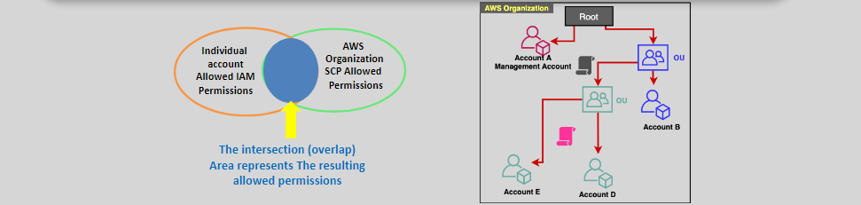

# 🛡️ **Service Control Policies (SCPs)**

<div align="center">
  
</div>

**Service Control Policies (SCPs)** are a key feature of AWS Organizations, enabling administrators to set guardrails for what IAM users and roles within an organization can and cannot do.

---

## 🔑 **Key Features**

1. **Policy Definition**:

   - SCPs specify the AWS services and actions that are **allowed** or **denied** for users, groups, and roles.

2. **Policy Scope**:

   - SCPs can be applied at different levels:
     - **Root**: Organization-wide.
     - **Organizational Units (OUs)**: Target groups of accounts.
     - **Individual Accounts**: Apply policies to specific accounts.

3. **Non-Granting Nature**:
   - SCPs **do not grant permissions**. Instead, they set the **maximum allowed permissions**.
   - For an action to succeed, it must be allowed by both the SCP **and** the identity's permissions policy.

---

## 📌 **Important Considerations**

### **1. Exclusions**

SCPs **do not affect** the following:

- The **management account** of the organization.
- **Resource-based policies**, such as S3 bucket policies.
- **Service-linked roles** required for AWS services.
- Users, groups, and roles **outside the organization**.

### **2. Whitelisting vs. Blacklisting**

- **Whitelisting**:
  - Define a list of **allowed actions**, denying everything else by default.
- **Blacklisting**:
  - Define a list of **denied actions**, allowing everything else by default.

### **3. Default Policy**

- By default, AWS applies a `FullAWSAccess` SCP to all accounts, allowing all actions unless explicitly denied.

---

## **Example: Creating and Assigning an SCP**

### Scenario

You want to ensure that developers in a specific OU can only use S3 and EC2 services, and all other services should be denied.

### **Step 1: Create the SCP**

Use the AWS Management Console or CLI to create the SCP.

#### SCP Policy Document

```json
{
  "Version": "2012-10-17",
  "Statement": [
    {
      "Effect": "Allow",
      "Action": ["s3:*", "ec2:*"],
      "Resource": "*"
    }
  ]
}
```

- **Effect**: `Allow` specifies the permitted actions.
- **Action**: Allows all actions (`*`) within the `s3` and `ec2` services.
- **Resource**: Applies to all resources (`*`).

#### Create the SCP via AWS CLI

```sh
aws organizations create-policy \
  --name "AllowS3AndEC2" \
  --type "SERVICE_CONTROL_POLICY" \
  --content file://scp-policy.json
```

---

### **Step 2: Attach the SCP to an OU**

#### Find the OU ID

Use the AWS CLI to list your OUs and find the target OU ID:

```sh
aws organizations list-organizational-units-for-parent \
  --parent-id <RootID>
```

#### Attach the SCP

```sh
aws organizations attach-policy \
  --policy-id <PolicyID> \
  --target-id <OU_ID>
```

- **`PolicyID`**: The ID of the `AllowS3AndEC2` SCP.
- **`OU_ID`**: The ID of the target organizational unit.

---

### **Step 3: Validate SCP Application**

1. Go to the **AWS Management Console**:

   - Navigate to **Organizations** > **Policies** > **Service Control Policies**.
   - Verify that the SCP is attached to the target OU or account.

2. Test user permissions:
   - Try accessing a service outside the allowed actions (e.g., RDS). The request should be denied.
   - Access S3 or EC2 services. The request should succeed.

---

## **Best Practices for SCPs**

1. **Start with Defaults**:

   - Use the default `FullAWSAccess` SCP to prevent unintended restrictions during initial setup.

2. **Least Privilege**:

   - Gradually apply restrictive SCPs to ensure minimal access is granted.

3. **Test Policies**:

   - Always test new SCPs in a non-production environment before applying them broadly.

4. **Monitor SCP Changes**:
   - Use AWS CloudTrail to log changes to SCPs and track who modified policies.

---

## **Summary**

Service Control Policies (SCPs) are a powerful way to manage permissions across AWS accounts in an organization. By defining maximum allowed permissions, SCPs act as guardrails, ensuring compliance and security at scale. In the example, we demonstrated how to restrict developers to only use S3 and EC2 services, applying the SCP to an Organizational Unit (OU).
