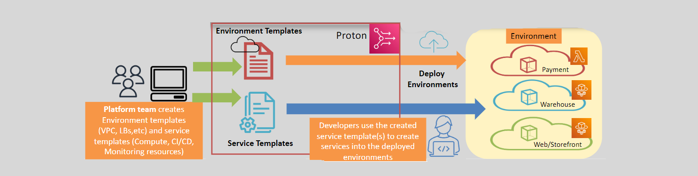

# 🚀 AWS Proton: Simplifying Application Delivery

**AWS Proton** is a tool designed to make it easier for companies to set up and manage applications, especially when those applications use containers and serverless technologies. Think of it as a helpful assistant that ensures everything is set up correctly and runs smoothly.

## The Problem Statement

We need to deploy a microservices application on AWS and ensure:

- **Infrastructure Standardization:** Admin/Platform teams want everything to be set up in a consistent and standard way.
- **Agility:** Developers and product teams need to move quickly and efficiently.

Deploying each part of the application involves many services, as well as Continuous Integration/Continuous Deployment (CI/CD) and monitoring tools. It can be challenging to maintain standardization while also ensuring speed.

## Why AWS Proton Was Created

1. **Consistency:** To make sure everything is set up the same way every time, reducing mistakes.
2. **Speed:** To automate the setup process, making it faster and less error-prone.
3. **Efficiency:** To simplify managing complex infrastructure, freeing up developers to focus on building their applications.

## Problems AWS Proton Solves

1. **Complexity:** Setting up and managing infrastructure for applications can be complicated. AWS Proton provides templates, making it easier.
2. **Inconsistency:** Without a standardized approach, different teams might set up infrastructure differently. AWS Proton ensures a consistent setup.
3. **Time-Consuming:** Manual setup of infrastructure takes time and can slow down development. AWS Proton automates this process, allowing faster deployment.

## How AWS Proton Works

1. **Creating the Catalog:**

   - **Admins Create Portfolios:** IT administrators create collections of approved services (portfolios) for use.
   - **Adding Products:** Admins add specific services (products) to these portfolios, each with configurations and policies.
   - **Setting Constraints:** Admins set rules for using these products to ensure compliance with organizational policies.

2. **Templates:**

   - **Infrastructure and Deployment Tooling:** Uses versioned templates for infrastructure and deployment processes.
   - **Environment Templates:** Defines shared infrastructure used by multiple applications.
   - **Service Templates:** Specifies the infrastructure needed for a single application or microservice.

3. **Automated Deployments:**

   - **Self-Service Interface:** Developers can choose from available service templates to automate their deployments.
   - **CI/CD Integration:** Automatically provisions resources, configures CI/CD pipelines, and deploys code.

4. **Using the Catalog:**
   - **End Users Access:** Developers access the self-service portal to find and provision the services they need.
   - **Provisioning Resources:** Users select the desired products from the catalog and set them up with pre-configured settings.
