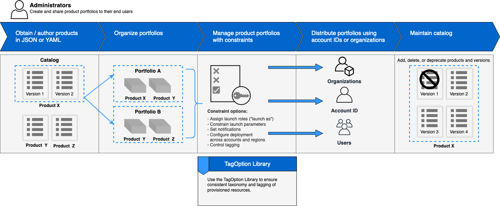
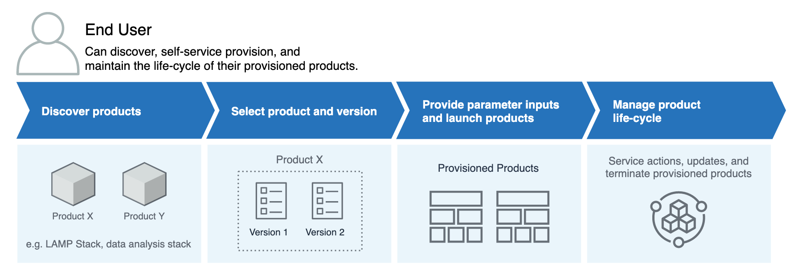

# 📚 AWS Service Catalog

**AWS Service Catalog** helps organizations manage and distribute IT services. Think of it like a menu at a restaurant, but instead of food, it's a list of approved IT resources and services you can use. Here’s a breakdown:

  

## **Key Features:**

### 🛠️ **Catalog Management**

- **Centralized Management:** Imagine a single place where you can keep a list of all the IT services your organization can use. This includes things like virtual machines, servers, software, and databases.
- **Pre-approved Services:** Only services that have been checked and approved are on the list. This means you can be sure that everything you use is safe and meets your organization's rules.

### 👨‍🍳 **Creating the Catalog**

  

- **Admins Create Portfolios:** IT administrators create portfolios, which are collections of products (services) that they approve for use. They can include specific configurations and policies for each product.
- **Adding Products:** Admins add products to these portfolios. Products can be defined using AWS CloudFormation templates or other means. Each product includes templates, configurations, and the necessary permissions.
- **Setting Constraints:** Admins can set constraints on products to ensure compliance with organizational policies. This includes things like setting limits on the size of resources or specifying regions where resources can be deployed.

### 🚀 **Efficient Provisioning**

- **Self-Service Portal:** Think of this as an online store where you can find and set up the IT services you need, without waiting for someone else to do it for you.
- **Automated Workflows:** This is like having a preset recipe for setting up IT services. It ensures that everything is configured correctly and saves you time.

### 📈 **Enhanced Governance and Compliance**

- **Policy Enforcement:** This feature makes sure that only the approved services (from our menu) are used, keeping everything in line with your organization's policies.
- **Audit and Monitoring:** This helps track which services are being used and ensures they comply with the rules. It's like having a security camera that monitors IT usage.

### 🌐 **Flexible Integration**

- **Seamless Integration:** AWS Service Catalog works well with other AWS services and third-party tools, making your IT service delivery process smoother.
- **Customizable Solutions:** You can tailor the services to meet your specific needs, just like customizing a dish in a restaurant to suit your taste.

### 👥 **Using the Catalog**

  

- **End Users Access:** Once the catalog is created, end users (like developers or other team members) can access the self-service portal to find and provision the services they need from the approved catalog.
- **Provisioning Resources:** Users can select the desired products from the catalog and provision them with the configurations specified by the administrators. This ensures that all deployments are compliant and follow best practices.
