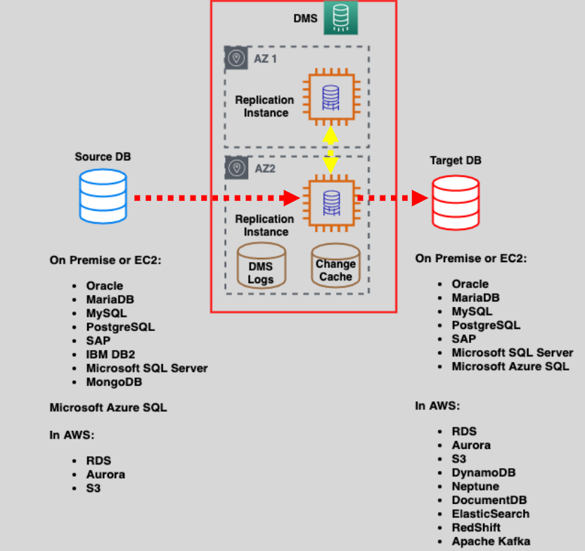
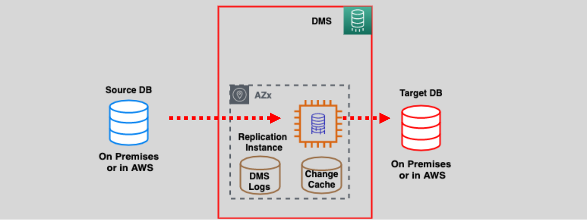
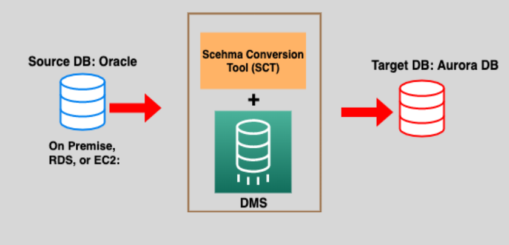

# 📂 AWS Database Migration Service (DMS): Seamless Data Migration

AWS Database Migration Service (DMS) is a web service designed to help you migrate your data efficiently. It supports a wide range of data stores, including **relational databases**, **data warehouses**, and **NoSQL databases**, and enables data transfer between on-premises environments, AWS services, and cloud providers.

---

  

---

## 🌟 Key Features of AWS DMS

### 🔄 Flexible Migration Options

- **Source to Target:** Migrate data from on-premises to AWS, AWS to on-premises, or within AWS.
- **One-Time or Continuous:** Perform one-time migrations or enable ongoing replication for near real-time data synchronization.

### 🔐 Secure Migration

- Supports **SSL encryption** for data in transit.
- Provides encryption at rest using AWS KMS to secure instance storage and endpoint connection details.

---

## 🎯 Migration Types

### 1️⃣ **Homogeneous Migration**

- **Definition:** The source and target databases share the same engine.
- **Examples:** Oracle to Oracle, MySQL to MySQL.
- **Use Case:** Simplifies migrations by eliminating the need for schema transformation.

### 2️⃣ **Heterogeneous Migration**

- **Definition:** The source and target databases use different engines.
- **Examples:** Oracle to Amazon Aurora, SQL Server to Amazon DynamoDB.
- **Use Case:** Ideal for modernizing database engines or switching to AWS-native solutions.

---

## 🖥️ Replication Instances

  

- **Core Role:** Migration is performed using a **Replication Instance** within the customer’s VPC.
- **Multi-AZ Configuration:** Supports high availability through multi-AZ deployment.
- **Efficiency:** Ensures faster migrations and provides a cost-effective pay-as-you-go pricing model.

---

## 🔧 Heterogeneous Migrations and Schema Conversion Tool (SCT)

  

**Heterogeneous migrations involve two key steps:**

### 1️⃣ **Schema Conversion**

- Use **AWS Schema Conversion Tool (SCT)** to:
  - Generate the target database schema if it doesn’t already exist.
  - Convert relational OLTP schemas or OLAP data warehouse schemas from one engine to another.

### 2️⃣ **Data Migration**

- Use **AWS DMS** to transfer data to the newly converted schema, ensuring a seamless migration process.

---

## ✅ Benefits of AWS DMS

1. **Speed and Reliability:** Faster migrations with minimal downtime.
2. **Cost Efficiency:** Pay only for the resources used during migration.
3. **Versatility:** Supports a wide variety of database engines and migration scenarios.
4. **Ease of Use:** Simplified setup with no need for extensive manual configurations.

---

AWS Database Migration Service (DMS) empowers businesses to efficiently migrate their data while maintaining high levels of security and reliability. Whether performing a homogeneous migration or tackling complex heterogeneous migrations, DMS is the go-to tool for seamless data transfer in and out of AWS.
