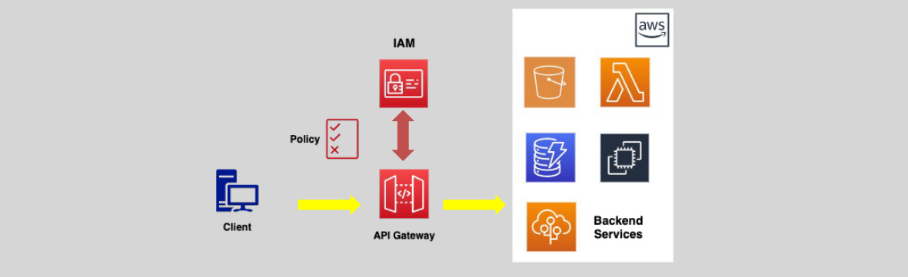
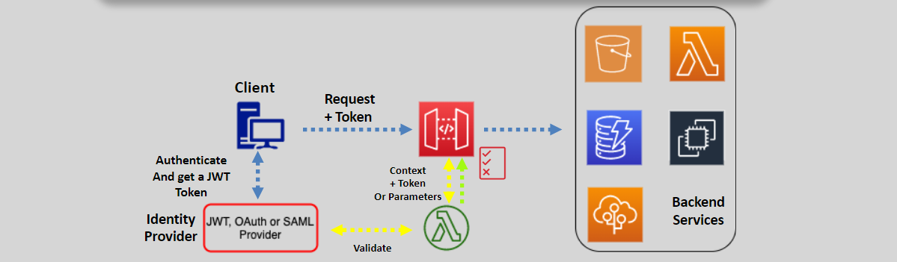
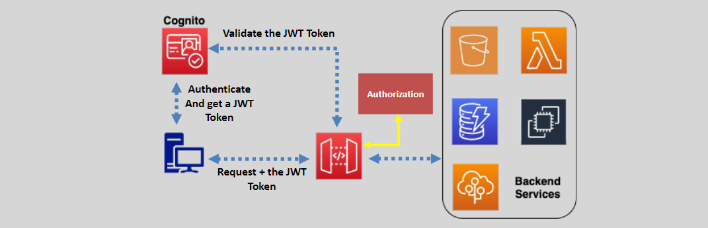

# 🔒 **API Gateway – API Access Management: Securing Your APIs**

Amazon API Gateway provides robust mechanisms for controlling access to your APIs, ensuring that only authorized users and services can invoke them. This guide outlines the key authentication and authorization methods available in API Gateway, helping you implement secure and efficient API access management.

---

## 🔑 **Access Control Overview**

**Access Control** in API Gateway involves two main aspects:

- **Authentication:** Verifying the identity of the requester (who can send requests).
- **Authorization:** Determining what actions the authenticated user can perform (who can invoke APIs).

---

## 🔐 **Authentication Methods**

### 1. **IAM Policies**

**IAM Policies** leverage AWS Identity and Access Management (IAM) to control both authentication and authorization for API access.

- **How It Works:**
  

- **Authentication & Authorization:** Uses IAM credentials to authenticate users and define permissions via IAM access policies.
- **Usage Scenario:** Ideal for internal applications where AWS users and roles manage API access.

### 2. **API Resource-Based Policies**

**API Resource-Based Policies** allow you to specify which principals (IAM users, roles) can access your APIs, supporting both same-account and cross-account access.

- **How It Works:**

  

- **Principal Specification:** Define which IAM users or roles can invoke the API.
- **Usage Scenario:** Best suited for scenarios requiring fine-grained access control across different AWS accounts.

### 3. **Lambda Authorizers**

**Lambda Authorizers** (formerly known as Custom Authorizers) use AWS Lambda functions to implement custom authentication and authorization logic.

- **How It Works:**
  

  1. **Token Validation:** The client obtains a token from an identity provider.
  2. **Invocation:** The client sends a request with the token to the API Gateway.
  3. **Authorization:** API Gateway invokes the Lambda authorizer to validate the token and generate an IAM policy.
  4. **Caching:** The resulting policy can be cached for up to one hour to optimize performance.

- **Usage Scenario:** Suitable for custom authentication mechanisms, such as integrating with third-party identity providers or implementing specific business logic.

### 4. **Cognito User Pools**

**Cognito User Pools** provide a managed service for user authentication, integrating seamlessly with API Gateway for secure access.

- **How It Works:**

  

  1. **User Sign-In:** Clients authenticate with the Cognito User Pool and receive a JSON Web Token (JWT).
  2. **API Invocation:** Clients include the JWT in API requests.
  3. **Token Verification:** API Gateway verifies the JWT with Cognito before granting access.

- **Limitations:** Cognito User Pools handle authentication only; for authorization, you need to use Cognito Identity Pools or Lambda Authorizers.

- **Usage Scenario:** Ideal for applications requiring user authentication without managing custom authentication logic.

---

## 🔐 **Authorization Methods**

Authorization in API Gateway determines what authenticated users can do. The following methods can be used for authorization:

### 1. **IAM Policies**

- **Functionality:** Defines permissions using IAM roles and policies.
- **Use Case:** Suitable for controlling access based on AWS identities.

### 2. **Lambda Authorizers**

- **Functionality:** Implements custom authorization logic through Lambda functions.
- **Use Case:** Allows for flexible and complex authorization scenarios beyond standard IAM policies.

### 3. **API Resource-Based Policies**

- **Functionality:** Specifies which principals can invoke the API resources.
- **Use Case:** Ideal for cross-account access and fine-grained permissions.

---

## 🔒 **Private API Endpoints (VPC)**

For APIs that need to be accessible only within a Virtual Private Cloud (VPC), **Private API Endpoints** provide secure access without exposing the APIs to the internet.

### 🛠️ **How It Works:**

- **VPC Interface Endpoints:** API Gateway uses VPC interface endpoints to serve APIs privately within a VPC.
- **Access Control:** Utilize endpoint policies to control which VPC resources can access the APIs.
- **Connectivity:** On-premises clients can access the APIs via Direct Connect links.

### 📌 **Key Points:**

- **Isolation:** Ensures APIs are only accessible within the specified VPC.
- **Security:** Prevents exposure of APIs to the public internet.
- **Use Case:** Best for internal applications and services requiring restricted access.

---

## 🏁 **Conclusion**

Amazon API Gateway offers comprehensive access management capabilities to secure your APIs effectively. By leveraging IAM Policies, API Resource-Based Policies, Lambda Authorizers, and Cognito User Pools, you can implement robust authentication and authorization strategies tailored to your application's needs. Additionally, Private API Endpoints provide enhanced security for APIs that must remain within a VPC. Choosing the right combination of these methods ensures that your APIs are both secure and accessible to the appropriate users and services.
