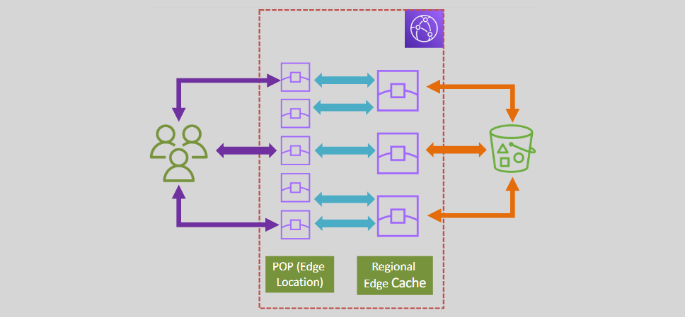
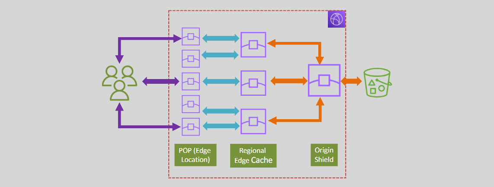

# **CloudFront Origin Groups** 🌍

CloudFront's **Origin Groups** feature is a powerful solution for improving the efficiency and reliability of content delivery while minimizing the load on your origin servers. Origin Groups allow CloudFront to route requests to multiple origins and provide failover capabilities if the primary origin becomes unavailable. This helps ensure high availability and low-latency content delivery.

## **How CloudFront Origin Groups Work** 🔄

### **1. Edge Locations (POPs) and Regional Edge Caches** 🌐

- **Edge Locations**: These are the places where CloudFront initially caches your content. Frequently requested objects are cached here for faster delivery to users.
- **Regional Edge Caches**: For less popular content, CloudFront stores objects in Regional Edge Caches. These caches are located closer to your origin servers, reducing the number of requests that need to go back to the origin.

  **Process**:

  - If a request for an object is not found at the edge location, CloudFront will first check the Regional Edge Cache.
  - If the object is still not found, CloudFront will route the request to the **origin** server.

  **Benefits**:

  - Reduces load on your origin servers.
  - Minimizes duplicate requests to the origin, saving on bandwidth and reducing origin server load.

  

### **2. Origin Shield** 🛡️

- **Origin Shield** is an additional caching layer positioned between the **Regional Edge Cache** and the **origin**.
- All requests from different **Regional Edge Caches** are routed through the **Origin Shield**, ensuring that only one request reaches the origin server for each unique object request.

  **Benefits**:

  - **Duplicate Request Filtering**: Origin Shield filters out duplicate requests, minimizing unnecessary requests to the origin.
  - **Improved Efficiency**: By sending only a single request to the origin, Origin Shield reduces the load on your servers and improves performance.
  - **Cost-Effective**: By reducing the frequency of requests to the origin, Origin Shield can help lower the cost of bandwidth and data transfer.

  

## **Why Use CloudFront Origin Groups?** 🤔

- **High Availability**: By using multiple origins and failover mechanisms, CloudFront Origin Groups ensure that your content is always available, even if one of your origins goes down.
- **Reduced Latency**: With Edge Locations and Regional Edge Caches, CloudFront ensures that your content is delivered as quickly as possible to users, no matter where they are located.
- **Cost Savings**: By minimizing the number of requests to your origin, CloudFront helps reduce data transfer costs and the overall load on your origin infrastructure.

---

CloudFront Origin Groups and features like **Origin Shield** provide an optimized, reliable, and cost-effective solution for serving content from multiple origins. By leveraging these features, you can ensure efficient content delivery while protecting your origin servers from unnecessary load and enhancing your users' experience with faster, more reliable access to content.
