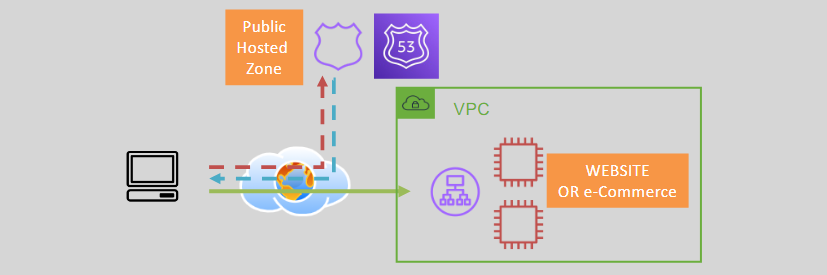
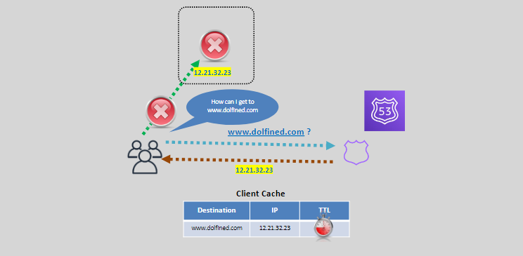
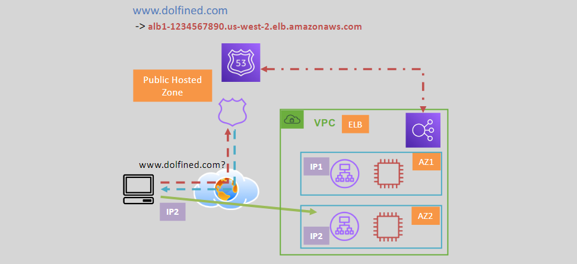
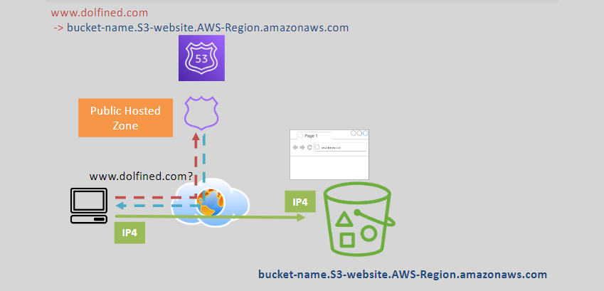
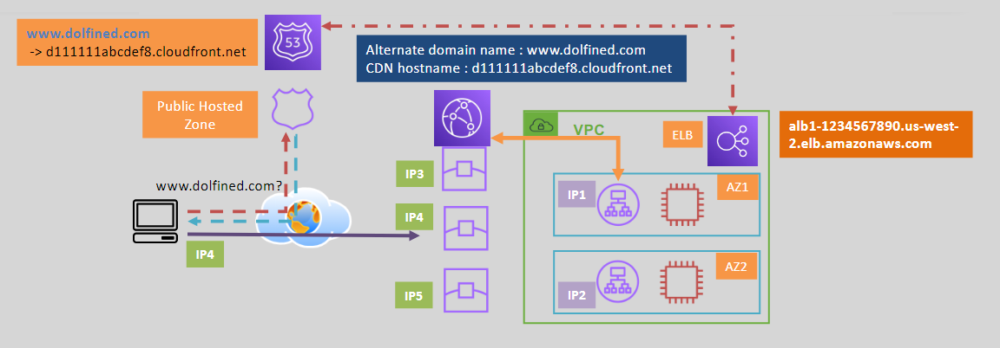

# 🌐 **Comprehensive Guide to Amazon Route 53**

Amazon Route 53 is a scalable and highly available Domain Name System (DNS) web service designed to route end-user requests to internet applications by translating domain names into IP addresses. This guide covers all essential components and functionalities of Route 53, making it easy to understand and implement.

## 🛠️ **Main Functions of Amazon Route 53**

Amazon Route 53 performs three primary functions:

1. **Domain Registration**

   - **Registers domain names**, allowing you to purchase and manage domain names directly through AWS.

2. **DNS Service**

   - **DNS Service/Database**: Manages hosted zones that hold the mappings between domain names and their corresponding IP addresses.

3. **Health Checking**
   - **Resource Health Monitoring**: Continuously checks the health of configured resources over the internet to ensure they are accessible and functioning correctly.

## 📄 **Supported DNS Record Types**

Amazon Route 53 supports various DNS record types to manage different aspects of domain routing:

- **A Record**

  - Example: `www.dolfined.com → 1.1.1.1`
  - Maps a domain to an IPv4 address.

- **AAAA Record**

  - Example: `www.dolfined.com → 2001:d8b1::1`
  - Maps a domain to an IPv6 address.

- **CNAME Record**

  - Maps an alias to another record.
  - Example: `ext.dlfned → www.dolfined.com`
  - **Note**: Cannot be used at the top domain (zone apex/naked domain), e.g., `dolfined.com`.

- **NS Record**

  - Name Server Record used for delegating a zone to a nameserver.

- **Alias Record**
  - **Detailed in the Alias Record Section Below**

## 📁 **Hosted Zones**

A hosted zone is a container in Route 53 where you configure records that define how to route traffic for a domain or subdomain.

### 🌍 **Public Hosted Zone**

- **Usage**: For internet-facing resources or applications both inside and outside AWS.
  

### 🔒 **Private Hosted Zone**

- **Usage**: For resources within AWS, such as applications, databases, or microservices, ensuring private accessibility.
  

## ⏳ **Time to Live (TTL)**

TTL determines how long DNS responses are cached by clients (browsers, curl, etc.).

- **Function**: Instructs clients on how frequently to request updated IP information for a DNS record.
- **Typical TTL**: Up to 24-48 hours in DNS server caches.
- **Challenges**:
  - **IP Changes or Resource Failures**: Long TTLs can delay updates, while short TTLs increase DNS server load.
- **Solutions**:
  - **Balanced TTL Settings**: Set a reasonable TTL to minimize impact while ensuring timely updates.

### 📊 **TTL Workflow**

---

## 🔗 **Alias Records**

Alias records are specific to AWS Route 53 and offer seamless integration with AWS services.

### 📈 **How Alias Records Work**

### 🚀 **Supported AWS Services for Alias Records**

- **Application Load Balancer (ALB)**
- **Network Load Balancer (NLB)**
- **CloudFront**
- **S3 Static Websites**
- **Elastic Beanstalk**
- **API Gateway**
- **VPC Endpoints**
- **Global Accelerator**
- **AppSync**
- **Existing records within the same Route 53 hosted zone**

### 🛠️ **Key Features**

- **Real-Time IP Fetching**: Route 53 automatically retrieves the current IP addresses of the targeted AWS resources.
- **Health Checks**: Alias records have Route 53 health checks enabled by default.
- **No TTL Configuration**: TTL is managed based on the target resource's settings.

### 🚫 **Limitations**

- **Cannot Point to EC2 Instances Directly**: Alias records cannot be directly mapped to an EC2 instance’s DNS hostname.
- **AWS Integration Only**: Alias records cannot point to resources outside of AWS or outside Route 53.

### 📌 **Alias Records with S3 Static Websites**

- **Mapping**: Custom domain to S3 static website endpoint.
- **Note**: Cannot map directly to normal S3 buckets; use CloudFront as an intermediary if needed.

### 📡 **Alias Records with CloudFront CDN & ALB Origin**

- **Configuration**:
  - **CloudFront Distribution**: Uses ALB as the origin.
  - **Alternate Domain Name**: Includes `www.dolfined.com`.
  - **Alias Record**: Maps the domain to the CloudFront Distribution.
- **Behind the Scenes**: Route 53 resolves the ALB DNS hostname to ALB node IP addresses.

### ⚖️ **Alias Record vs. CNAME Record**

| **Feature**                | **CNAME**                                                            | **Alias**                                                                                                                       |
| -------------------------- | -------------------------------------------------------------------- | ------------------------------------------------------------------------------------------------------------------------------- |
| **DNS Queries Chargeable** | DNS queries to a CNAME are chargeable                                | Free                                                                                                                            |
| **Zone Apex Support**      | Cannot point to a zone apex (e.g., dolfined.com)                     | Can point to the zone apex of a domain (except when pointing to a CNAME record in the same hosted zone pointing to a subdomain) |
| **Record Pointing Scope**  | Can point to any DNS record hosted anywhere inside or outside AWS    | Can only point to integrated AWS services or a record in the same hosted zone                                                   |
| **Visibility**             | Visible in the answer section of a DNS query reply                   | Only visible within AWS (console or Route 53 API)                                                                               |
| **Resolver Behavior**      | Followed by a recursive resolver (even if the target is outside AWS) | Only followed inside Route 53, meaning both record and target must be in Route 53                                               |

---

## 🩺 **Health Checks**

Health checks in Route 53 monitor the availability and performance of your resources.

### 📋 **Configuration**

- **Protocols Supported**: HTTP, HTTPS, TCP.
- **Healthy Response Codes**: HTTP 2XX/3XX responses.
- **Health Determination**: If 18% of health checkers report healthy responses, the resource is considered healthy.
- **Notifications**: Integrate with SNS to receive alerts when a resource becomes unavailable.

### 🔄 **High Availability**

- **Traffic Routing**: Automatically routes traffic away from unhealthy resources to maintain high availability.
- **Accessibility**: Resources monitored must be accessible from the internet.
- **Security Requirements**: Ensure security groups and NACLs allow health check traffic from Route 53.

### 🌐 **Endpoint Flexibility**

- **AWS and External Resources**: Health checks can monitor both AWS-hosted and external resources.
- **Alias Records Integration**: When using Alias records pointing to AWS services, Route 53 can evaluate target health without separate health checks.

## 📚 **Conclusion**

Amazon Route 53 is a powerful DNS service that not only manages domain registrations and DNS routing but also ensures the reliability and availability of your applications through health checks and seamless integration with AWS services. By understanding its components—such as hosted zones, TTL, alias records, and health checks—you can effectively manage and optimize your domain's performance and reliability.
