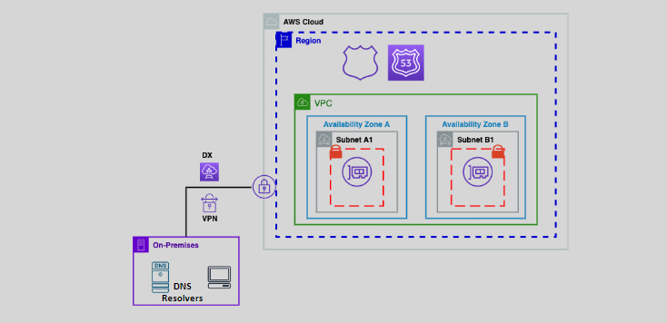
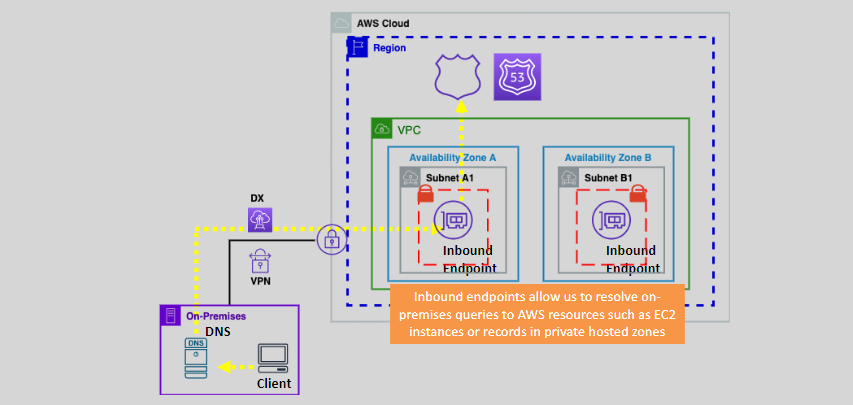
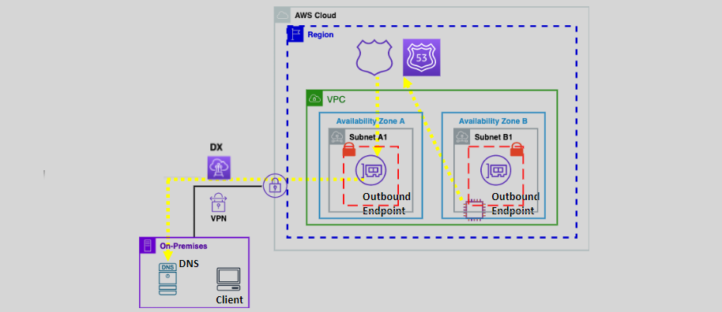

# 🔍 **Amazon Route 53 Resolver: Enhancing DNS in Hybrid Cloud Environments**

Amazon Route 53 Resolver simplifies and optimizes DNS query handling in hybrid cloud setups, seamlessly bridging your on-premises infrastructure with AWS. This guide delves into the functionalities, configurations, and best practices of Route 53 Resolver, ensuring efficient DNS management across diverse environments.

---

## 🌐 **What is Route 53 Resolver?**

**Route 53 Resolver** is a powerful feature of Amazon Route 53 that streamlines DNS queries in hybrid cloud environments. It enables seamless DNS resolution between your AWS VPCs and on-premises networks, facilitating efficient communication and resource accessibility.

### 📌 **Key Features:**

- **Default VPC Integration**: Enabled by default within a VPC to resolve intra-VPC DNS queries for EC2 instances and private hosted zones.
- **Recursive Lookups**: For domain names outside the VPC, it performs recursive lookups against internet DNS resolvers.
- **Hybrid DNS Support**: Responds to queries from on-premises clients and forwards queries to on-premises DNS servers.
- **Secure Query Flow**: DNS queries traverse over the second reserved IP address in each subnet, ensuring secure and efficient data flow.

---

## 🔄 **DNS Query Flow in Hybrid Environments**

Route 53 Resolver facilitates DNS queries between AWS and on-premises environments through inbound and outbound query forwarding mechanisms.

### 🔄 **Inbound Query Forwarding (On-Premises to Route 53)**

Inbound query forwarding allows on-premises clients to send DNS queries to Route 53 Resolver within your AWS VPC.

#### 📈 **How It Works:**

1. **Create an Inbound Endpoint**:

   - An **Elastic Network Interface (ENI)** is configured with one or more IP addresses within your VPC.
   - **Security Groups**: Associate security groups to the ENI to control inbound traffic.

2. **Establish Connectivity**:

   - Set up a **VPN** or **Direct Connect (DX)** connection between your on-premises network and AWS.

3. **Configure On-Premises DNS Servers**:
   - Forward DNS queries from on-premises DNS servers to the ENI IP addresses of the inbound endpoint.

#### 🛠️ **Configuration Steps:**

1. **Navigate to Route 53 Resolver** in the AWS Management Console.
2. **Create an Inbound Endpoint**:
   - Specify VPC, subnets, and IP addresses.
   - Attach appropriate security groups.
3. **Update On-Premises DNS Settings**:
   - Configure DNS servers to forward queries to the inbound endpoint's IP addresses.

### 🔄 **Outbound Query Forwarding (Route 53 to On-Premises)**

Outbound query forwarding enables Route 53 Resolver to forward DNS queries originating within your VPC to your on-premises DNS servers.

#### 📈 **How It Works:**

1. **Create an Outbound Endpoint**:

   - An **Elastic Network Interface (ENI)** is set up within your VPC.
   - **Security Groups**: Associate security groups to manage outbound traffic.

2. **Define Forwarding Rules**:

   - Specify which domain queries should be forwarded to on-premises DNS servers.
   - Provide the IP addresses of your on-premises DNS servers.

3. **DNS Query Source**:
   - The **outbound endpoint's IP address** acts as the source for forwarded DNS queries.

#### 🛠️ **Configuration Steps:**

1. **Navigate to Route 53 Resolver** in the AWS Management Console.
2. **Create an Outbound Endpoint**:
   - Select VPC, subnets, and assign IP addresses.
   - Attach suitable security groups.
3. **Set Up Forwarding Rules**:
   - Define domain names and associate them with on-premises DNS server IP addresses.

---

## 🔐 **Security Considerations**

Ensuring secure DNS query flow between AWS and on-premises environments is paramount.

- **Security Groups**: Configure security groups to allow DNS traffic (typically TCP and UDP on port 53) between your on-premises network and the Route 53 Resolver endpoints.
- **Network ACLs (NACLs)**: Ensure that NACLs associated with your subnets permit DNS traffic.
- **Encryption**: Use VPN or Direct Connect to secure the connection between AWS and on-premises networks.

---

## 🛠️ **Best Practices**

To optimize Route 53 Resolver in your hybrid environment, consider the following best practices:

1. **Redundancy**:

   - **Multiple Endpoints**: Create multiple inbound and outbound endpoints across different Availability Zones to ensure high availability.

2. **Security**:

   - **Least Privilege**: Apply the principle of least privilege when configuring security groups and NACLs.

3. **Monitoring and Logging**:

   - **Enable DNS Query Logs**: Use Amazon Route 53 Resolver Query Logging to monitor DNS queries and troubleshoot issues.
   - **Integrate with CloudWatch**: Monitor Resolver metrics and set up alarms for unusual activity.

4. **Scalability**:

   - **Proper Sizing**: Ensure that your Resolver endpoints are adequately sized to handle the expected DNS query load.

5. **Documentation and Automation**:
   - **Infrastructure as Code**: Use tools like AWS CloudFormation or Terraform to automate the deployment and management of Resolver endpoints.
   - **Maintain Documentation**: Keep detailed records of your DNS configurations and network setups for easier management and troubleshooting.

---

## 📊 **Use Cases**

Route 53 Resolver is versatile and caters to various hybrid cloud scenarios:

- **Hybrid Applications**: Seamlessly integrate on-premises applications with AWS services, ensuring consistent DNS resolution across environments.
- **Disaster Recovery**: Enhance your disaster recovery strategy by ensuring DNS queries are efficiently routed to backup sites.
- **Data Localization**: Comply with data residency requirements by directing DNS queries based on geographic or organizational policies.
- **Multi-Cloud Architectures**: Facilitate DNS resolution across multiple cloud providers and on-premises infrastructure.

---

## 📚 **Conclusion**

Amazon Route 53 Resolver is an essential tool for managing DNS queries in hybrid cloud environments. By enabling seamless DNS resolution between AWS and on-premises networks, it ensures efficient communication, high availability, and robust security. Implementing Route 53 Resolver with best practices and a clear understanding of its functionalities can significantly enhance your hybrid cloud architecture.
