# 🛠️ **Microsoft Active Directory (AD)**

**Microsoft Active Directory (AD)** is a centralized directory service that simplifies how organizations manage users, computers, and other resources. It provides secure authentication, authorization, and administration across your network, ensuring consistency and efficiency.

---

## 🧩 **2. Core Components of Active Directory**

For clarity, the components of AD can be grouped into **Logical Components** (the policy and configuration elements) and **Physical Components** (the server-based infrastructure that hosts AD). Additionally, we include other critical concepts that help AD function seamlessly in real-world environments.

### **A. Logical Components**

1. **Active Directory Domain Services (AD DS)**
   - **Role:** The heart of AD that stores directory data and handles user authentication and authorization.
   - **Function:**  
     - Uses protocols such as **Kerberos** and **LDAP** to verify identities.  
     - Issues security tokens (tickets) that allow users to access resources seamlessly.

2. **Organizational Units (OUs)**
   - **Role:** Logical containers used to group related objects (users, computers, etc.) within a domain.
   - **Function:**  
     - **Hierarchical Organization:** Structure resources by department, location, or function.  
     - **Delegated Administration:** Assign administrative control to specific users or groups over subsets of the directory.

3. **Group Policy Objects (GPOs)**
   - **Role:** Collections of settings that define security configurations, software deployment, and system behavior.
   - **Function:**  
     - **Enforce Policies:** Automatically apply configurations (e.g., password complexity, screen lock settings).  
     - **Streamline Management:** Reduce manual configurations on individual machines.

4. **Active Directory Schema**
   - **Role:** The blueprint that defines the types of objects (users, computers, printers, etc.) and their attributes stored in AD.
   - **Function:**  
     - **Structure & Consistency:** Ensures all objects follow a defined format.  
     - **Extensibility:** Can be extended to include custom attributes tailored to organizational needs.

5. **Domains & Forests**
   - **Domains:**  
     - **Role:** Logical boundaries that group objects and policies within a network.  
     - **Function:** Manage security and administrative settings for a set of objects.
   - **Forests:**  
     - **Role:** A collection of one or more domains that share a common schema and global catalog.  
     - **Function:** Provide trust relationships and unified policies across multiple domains.

6. **Active Directory Sites and Services**
   - **Role:** Defines the physical (network) topology of your AD environment.
   - **Function:**  
     - **Optimize Replication:** Controls how and when data is replicated between Domain Controllers based on geographical location and network speed.
     - **Efficient Resource Access:** Improves user experience by directing authentication and queries to the nearest DC.

---

### **B. Physical Components**

1. **Domain Controllers (DCs)**
   - **Role:** Servers that host AD DS and manage the authentication and authorization processes.
   - **Function:**  
     - **User Validation:** Process login requests and security token issuance.
     - **Data Replication:** Ensure that changes to the directory are synchronized across multiple servers for high availability.
     - **Redundancy:** Multiple DCs safeguard against single points of failure.

2. **Global Catalog (GC)**
   - **Role:** A specialized feature on Domain Controllers that stores a partial, read-only replica of every object in the directory.
   - **Function:**  
     - **Fast Searches:** Provides quick responses to queries across the entire forest.
     - **Assists in Logon:** Supplies necessary user and group information during the authentication process.

---

### **Visual Overview: AD Components Flowchart**

Below is a flowchart diagram that visually organizes these core components:

```mermaid
---
config:
  look: handDrawn
  layout: elk
  elk:
    mergeEdges: false
    nodePlacementStrategy: LINEAR_SEGMENTS
---
flowchart TD
    A[🔐 **Microsoft Active Directory AD**]
    A --> B[🧩 **Logical Components**]
    A --> C[💽 **Physical Components**]
    A --> D[🌍 **Topology & Structure**]

    %% Logical Components
    B --> E[📡 **AD Domain Services AD DS**]
    B --> F[📂 **Organizational Units OUs**]
    B --> G[🛠️ **Group Policy Objects GPOs**]
    B --> H[📜 **AD Schema**]
    B --> I[🔗 **Domains & Forests**]

    %% Physical Components
    C --> J[🖥️ **Domain Controllers DCs**]
    C --> K[🌐 **Global Catalog GC**]

    %% Topology & Structure
    D --> L[📍 **AD Sites and Services**]

    %% Relationships
    J --- E
    J --- K
    I --- L
```

> **Key Takeaways:**  
> - **Logical Components** handle the policies, organization, and data structure within AD.  
> - **Physical Components** are the servers and infrastructure that bring these policies to life.  
> - **Topology & Structure** ensures that the physical network optimizes replication and user access.

---

## 🔄 **3. How AD Works Together: A Detailed Sequence**

The following sequence diagram illustrates how AD components interact during a typical authentication and resource access process:

```mermaid
sequenceDiagram
    autonumber
    participant U as 👤 **User**
    participant WS as 💻 **Workstation**
    participant DC as 🖥️ **Domain Controller (AD DS)**
    participant GC as 🌐 **Global Catalog**
    participant FS as 🗄️ **File Server**
    participant AS as 📱 **Application Server**

    U->>WS: Logs into Windows (enter credentials)
    WS->>DC: Sends Kerberos Authentication Request
    DC->>WS: Issues Ticket Granting Ticket (TGT) after verifying via AD DS
    WS->>DC: Requests Service Ticket for a specific resource (e.g., file share)
    DC->>WS: Provides Service Ticket based on policies from GPOs and AD DS
    WS->>GC: Queries for user details and group memberships
    GC->>WS: Returns user attributes and group info quickly
    WS->>FS: Attempts to access a file share using the Service Ticket
    FS->>DC: Validates the Service Ticket and checks user permissions
    DC->>FS: Confirms authorization based on AD DS data and GPO rules
    FS->>U: Grants access to the file share
    U->>AS: Launches an enterprise application
    AS->>DC: Validates user credentials for application access
    DC->>AS: Confirms access rights as per AD DS and GPO settings
    AS->>U: Loads the personalized application interface
```

> **Highlights:**  
> - **Authentication:** User credentials are verified via Domain Controllers using secure Kerberos tickets.  
> - **Authorization:** Group Policy settings and user attributes from the Global Catalog determine resource access.  
> - **Efficient Access:** Rapid queries and validations ensure smooth user experiences across the network.

---

## 🏢 **4. Real-World Example: TechCorp in Action**

Imagine a mid-sized company, **TechCorp**, that leverages Active Directory to streamline its IT operations. Here’s a detailed look at how TechCorp uses AD in its daily workflow:

### **TechCorp Overview:**

- **Domain:** `TechCorp.local`  
  All employee accounts, devices, and resources are centrally managed under this domain.

### **Organizational Structure via OUs:**

- **HR OU:**  
  - **Users:** HR Managers, Recruiters, Payroll Specialists.  
  - **Policies:** Enforced via GPOs that require strict password policies, screen lock settings, and limited access to sensitive data.

- **IT OU:**  
  - **Users:** System Administrators, Help Desk, Network Engineers.  
  - **Policies:** GPOs enable remote management, automatic software updates, and elevated privileges for system tasks.

- **Sales OU:**  
  - **Users:** Sales Representatives, Account Managers.  
  - **Policies:** GPOs configure VPN access, deploy CRM applications, and enforce mobile device management.

- **Finance OU:**  
  - **Users:** Accountants, Financial Analysts.  
  - **Policies:** GPOs enforce multi-factor authentication (MFA), disable USB ports for data security, and ensure compliance with financial regulations.

### **How AD Powers Daily Operations:**

1. **User Authentication & Login:**
   - Every morning, employees log in to their workstations using their domain credentials.
   - **Domain Controllers (DCs)** verify these credentials using AD DS and issue Kerberos tickets for secure access.

2. **Policy Enforcement:**
   - Based on the OU to which an employee belongs, specific **GPOs** are automatically applied.
   - For instance, when a Finance employee logs in, the workstation immediately adopts strict security settings such as MFA prompts and restricted USB usage.

3. **Resource Access:**
   - When an employee attempts to access a file share or an enterprise application, the service (e.g., file server or app server) validates the user’s credentials with a DC.
   - The **Global Catalog (GC)** is queried to fetch the user’s group memberships and permissions, ensuring the user has proper access rights.

4. **Centralized Administration & Delegation:**
   - The IT department can delegate administrative tasks by assigning control over specific OUs.
   - For example, HR managers can update personnel records without affecting the rest of the network, thanks to the hierarchical organization provided by OUs.

5. **Replication & High Availability:**
   - Multiple **Domain Controllers** ensure that if one server fails, authentication and directory services remain available.
   - **Active Directory Sites and Services** optimize data replication across different geographic locations, keeping the network responsive and secure.

> **Real-World Impact:**  
> TechCorp’s IT team saves countless hours by managing hundreds of devices and users centrally. Automated policy enforcement reduces security risks, and rapid authentication means employees can work without interruption—even when they’re remote or traveling.

---

## 🏆 **Final Thoughts**

Microsoft Active Directory is more than just a directory—it’s the backbone of enterprise IT. By organizing AD into clear **logical components** (like AD DS, OUs, GPOs, and Schema) and **physical components** (like Domain Controllers and Global Catalogs), organizations like TechCorp can ensure robust security, efficient administration, and seamless user experiences.

This guide—with its detailed explanations, flowchart, sequence diagram, and real-world example—aims to make AD both exciting and accessible. Embrace AD to build a secure, scalable, and efficient network infrastructure!

Happy managing!