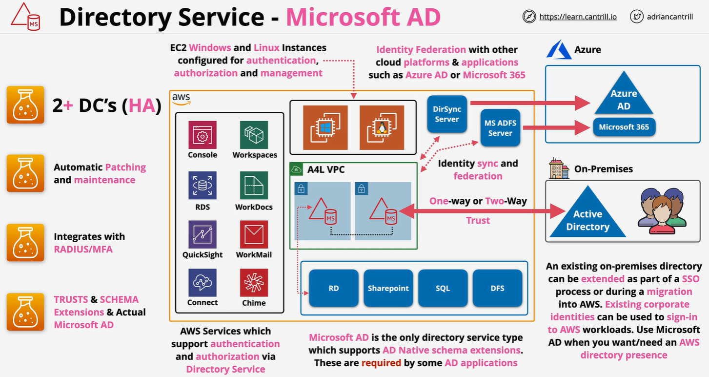
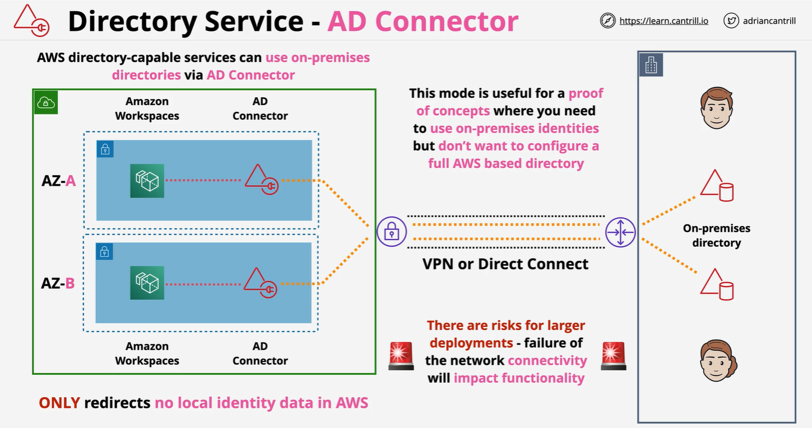

# MS Active Directory 🖥️

Microsoft Active Directory (AD) is a **directory service** developed by Microsoft for Windows domain networks. It provides tools for managing users, computers, and resources within an organization. Understanding Active Directory is critical for deploying and managing workloads in AWS that integrate with MS AD.

---

## 🌟 **What is Active Directory (AD)?**

Microsoft Active Directory is essentially a **database** and **set of services** that helps manage networked resources. It enables IT administrators to:

- **Authenticate and authorize users and devices** in a network.
- **Organize resources** like users, computers, printers, and applications.
- Enforce **security policies** across the organization.

---

## 🛠️ **Core Components of Active Directory**

1. **Domain**

   - The **core unit** of Active Directory.
   - Represents a security boundary containing objects like users, groups, and computers.

2. **Domain Controller (DC)**

   - A **server** that hosts the Active Directory database.
   - Handles authentication requests and enforces security policies.

3. **Active Directory Database (NTDS.dit)**

   - Stores all directory data, including user accounts, passwords, and permissions.

4. **Organizational Units (OUs)**

   - Containers used to organize objects (e.g., users, computers) within a domain.
   - Enable administrators to apply **Group Policies** to subsets of users or devices.

5. **Group Policy**

   - A feature that allows administrators to define security and configuration settings for users and computers.
   - Examples:
     - Enforcing password policies.
     - Disabling USB ports.

6. **Trust Relationships**
   - Allow one domain to trust another domain for authentication.
   - Useful in multi-domain or hybrid environments.

---

## 🔑 **Authentication and Authorization in AD**

1. **Authentication**

   - Verifies a user’s identity using their **username and password**.
   - Uses protocols like **Kerberos** and **NTLM**.

2. **Authorization**
   - Determines the resources a user can access after authentication.
   - Permissions are often granted through **group memberships**.

---

## 🏢 **Active Directory in AWS**

AWS offers several options for integrating and managing Active Directory in the cloud:

### 1️⃣ **AWS Managed Microsoft Active Directory (AWS Managed MS AD)**

A fully managed Active Directory service in AWS that:

- Mirrors on-premises AD capabilities.
- Enables **single sign-on (SSO)** to AWS resources.
- Can establish **trust relationships** with on-premises AD for hybrid setups.

---

  

---

### 2️⃣ **AD Connector**

A lightweight proxy service that:

- Connects AWS resources to an existing **on-premises AD**.
- Does not replicate the AD database to AWS.

### 3️⃣ **Simple AD**

A low-cost, lightweight directory option for basic AD compatibility:

- Ideal for LDAP-aware applications.
- Does not support advanced AD features like trust relationships.

---

  

---

## 🌍 **How Active Directory Works with AWS Services**

1. **Amazon RDS for SQL Server**

   - Integrates with AD for database authentication using Windows credentials.

2. **Amazon WorkSpaces**

   - Provides managed virtual desktops that users can log into using AD credentials.

3. **AWS SSO and Cognito**

   - Uses AD for **user authentication** in AWS Single Sign-On (SSO).
   - Can federate AD users into AWS Cognito for SaaS application access.

4. **Hybrid Scenarios**
   - Trust relationships between on-premises AD and AWS Managed AD enable hybrid cloud setups.

---

## 🤔 **Key Benefits of Active Directory**

1. **Centralized Management**

   - Manage users, devices, and resources from a single console.

2. **Security**

   - Enforce policies like password complexity and account lockouts.
   - Supports MFA for added security.

3. **Scalability**

   - Supports small businesses to large enterprises with millions of objects.

4. **Hybrid Compatibility**
   - Seamlessly integrate on-premises AD with AWS resources.

---

## 🚀 **Key Concepts for AWS SAP Certification**

1. **Active Directory Basics**

   - Understand what domains, domain controllers, and OUs are.
   - Know how authentication and authorization work.

2. **AWS Integration with AD**

   - **AWS Managed Microsoft AD**: Fully managed service for running AD in AWS.
   - **AD Connector**: Lightweight proxy for connecting to on-premises AD.
   - **Simple AD**: For low-cost, basic directory needs.

3. **Use Cases**

   - Use AWS Managed AD for hybrid setups requiring trust relationships.
   - Use AD Connector when you want to avoid managing another AD instance in AWS.

4. **Compliance and Security**

   - Understand Group Policy enforcement and MFA integration for securing workloads.

5. **AWS Services with AD Integration**
   - Familiarize yourself with RDS, WorkSpaces, and Cognito integrations with AD.

---

## ✅ **Conclusion**

Microsoft Active Directory is a cornerstone of identity and access management for enterprises. For AWS SAP Certification, focus on how AWS integrates with AD through Managed MS AD, AD Connector, and Simple AD. Understanding these services and their use cases will prepare you for securing and managing hybrid workloads effectively.
