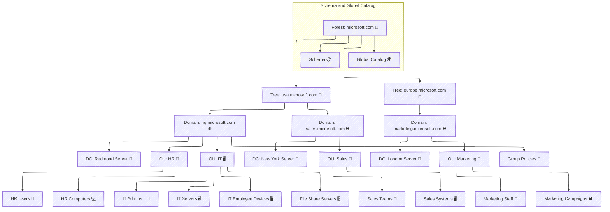

# 🔐 **Microsoft Active Directory (AD)**

**Microsoft Active Directory (AD)** is a **centralized identity management system** designed for **Windows-based networks**. It allows IT administrators to:  
✔ **Manage users, computers, and resources centrally**  
✔ **Authenticate & authorize access to network resources**  
✔ **Implement security policies & enforce compliance**

🔹 **Example:**  
A multinational company like **Microsoft** has employees across the USA and Europe.

- **Without AD:** Each office **manages users separately**, leading to inefficiency.
- **With AD:** A **single directory structure** manages **users, computers, and security policies** centrally.

💡 **Active Directory simplifies identity & resource management across multiple locations.**

---

## 🏗️ **2. Microsoft Active Directory Components**

---

### **🔹 1. Forest 🌳**

A **forest** is the highest-level container in an Active Directory environment. It represents an **entire organization** and contains **one or more domains**.

✔ **Defines security boundaries** for the organization  
✔ Contains **Global Catalog & Schema**  
✔ Allows **trust relationships** between multiple domains

🔹 **Example:**  
**Microsoft's AD Forest:** `microsoft.com`

- **Contains two trees:** `usa.microsoft.com` & `europe.microsoft.com`

💡 **All domains in a forest share the same schema & global catalog.**

---

### **🔹 2. Trees 🌲**

A **tree** is a collection of **related domains** that share a **common namespace**.

✔ **Used to organize domains hierarchically**  
✔ **Supports parent-child domain relationships**

🔹 **Example:**

- **Tree 1:** `usa.microsoft.com`
  - Contains **`hq.microsoft.com`** (Headquarters)
  - Contains **`sales.microsoft.com`** (Sales Department)
- **Tree 2:** `europe.microsoft.com`
  - Contains **`marketing.microsoft.com`** (Marketing Department)

💡 **Trees enable organizations to manage different divisions while maintaining a structured hierarchy.**

---

### **🔹 3. Domains 🌐**

A **domain** is a collection of **users, computers, and security policies** under a single administrative boundary.

✔ **Each domain has a unique name** (e.g., `hq.microsoft.com`)  
✔ **All resources inside a domain follow the same security policies**  
✔ **Domains within the same tree can trust each other**

🔹 **Example:**

- **HQ Domain:** `hq.microsoft.com`
- **Sales Domain:** `sales.microsoft.com`
- **Marketing Domain:** `marketing.microsoft.com`

💡 **Each domain is managed independently but can share resources with other domains via trust relationships.**

---

### **🔹 4. Domain Controllers (DCs) 📡**

A **Domain Controller (DC)** is a **server** that manages **authentication & security policies**.

✔ Hosts the **Active Directory database (NTDS.dit)**  
✔ **Authenticates users & devices**  
✔ Ensures **redundancy with multiple DCs**

🔹 **Example:**

- `Redmond Server (HQDC1)`: **Authenticates users in `hq.microsoft.com`**
- `New York Server (SalesDC1)`: **Authenticates users in `sales.microsoft.com`**

💡 **A domain should have multiple DCs for redundancy & failover protection.**

---

### **🔹 5. Organizational Units (OUs) 🏢**

An **Organizational Unit (OU)** is a **logical container** used to organize users, groups, and computers.

✔ Helps **manage departments separately**  
✔ Allows **delegation of administrative tasks**  
✔ Used to **apply Group Policies (GPOs) efficiently**

🔹 **Example:**

- `HR OU` contains **HR Users & Computers**
- `IT OU` contains **IT Admins & Servers**
- `Marketing OU` contains **Marketing Staff & Campaign Data**

💡 **OUs simplify administrative management & security enforcement.**

---

### **🔹 6. Group Policy Objects (GPOs) 📜**

A **GPO (Group Policy Object)** enforces **security settings & configurations** across an organization.

✔ **Applies password policies, access rules, software restrictions**  
✔ **Automates desktop configurations & security compliance**  
✔ **Can be applied to Domains, OUs, or Groups**

🔹 **Example:**

- `HQGroupPolicies` applies:
  - **Password complexity rules** (Min 12 chars, expiry 90 days)
  - **Disable USB Access** (Prevent data theft)
  - **Enforce Windows Updates** (Security patches auto-installed)

💡 **GPOs help IT admins enforce security policies consistently.**

---

### **🔹 7. Global Catalog & Schema 🌍**

The **Global Catalog (GC)** is a **read-only database** that stores information about **all objects in a forest**.

✔ **Speeds up searches across multiple domains**  
✔ **Helps locate users & groups across trees**

🔹 **Example:**

- A **London employee** in `marketing.microsoft.com` needs access to `sales.microsoft.com`.
- The **Global Catalog** quickly finds the required permissions without querying `sales.microsoft.com` directly.

💡 **Global Catalog speeds up authentication across multiple domains.**

---

## 🏆 **Final Thoughts**

Microsoft Active Directory (AD) **is the foundation of enterprise identity management**, providing:  
✔ **Centralized user authentication & resource management**  
✔ **Hierarchical structure for scalable IT environments**  
✔ **Secure access control using Group Policies (GPOs)**

💡 **With its structured hierarchy, Active Directory simplifies IT administration & enhances security!** 🚀
