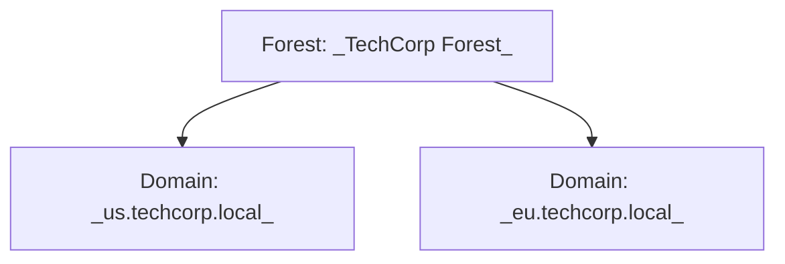
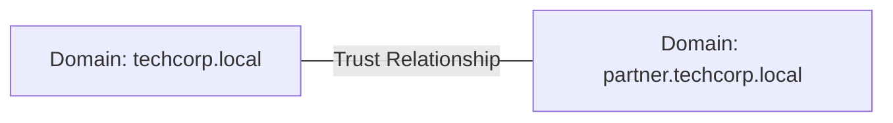
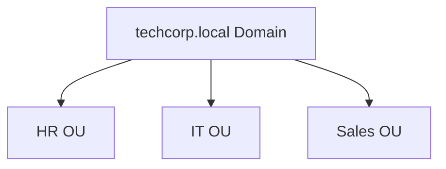
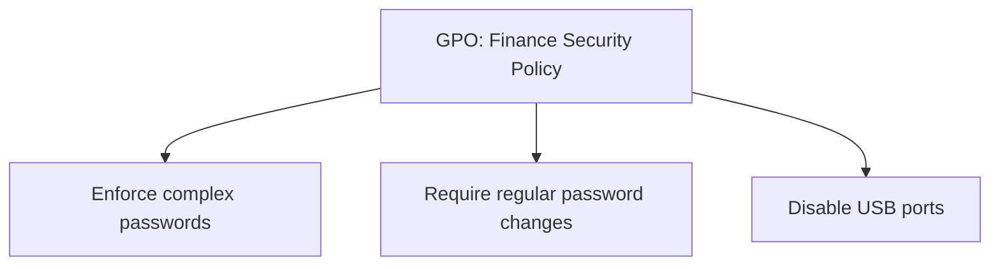
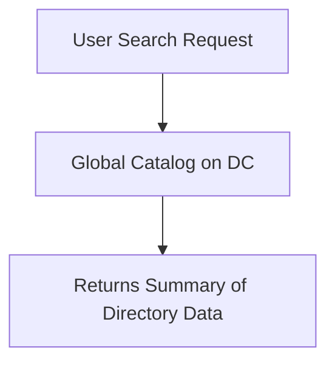

Below is a simplified, step-by-step explanation of the **Core Components of Active Directory**. Each component is explained in simple language—with examples and diagrams (or simple text/JSON) where applicable—to help you understand without confusion.

---

## 🧩 Core Components of Active Directory – Simplified

Active Directory (AD) is built from several components that work together to manage users, computers, and resources. These components fall into two broad groups:

- **Logical Components:** Define the structure, rules, and policies.
- **Physical Components:** Are the actual servers and files that store and process the data.

Below are the key components:

---

### 1. Domains & Forests

**What They Are:**

- **Domain:**  
  A domain is a grouping of users, computers, and other resources that share common security policies and administration. Think of it as a "building" where everything inside is managed under the same rules.

- **Forest:**  
  A forest is a collection of one or more domains that share a common directory structure (schema) and global catalog. In simple terms, if a domain is a building, then a forest is the entire campus that may contain several buildings. The forest ensures that all domains work together under one umbrella.

**Real-World Example:**

- **TechCorp** might have one domain called `techcorp.local` for all its resources.
- In a larger organization, you might see multiple domains (e.g., `us.techcorp.local` and `eu.techcorp.local`) grouped together in one forest so that users in any domain can be managed with a unified set of rules.

**Diagram Example:**



---

### 2. Trust Relationships

**What They Are:**

- **Trust Relationships** are secure links established between domains (or forests) that allow users from one domain to access resources in another.
- They enable collaboration between different groups without needing separate logins for each domain.

**Real-World Example:**

- If TechCorp has two domains, `techcorp.local` and `partner.techcorp.local`, a trust relationship allows a user in `techcorp.local` to access a file share in `partner.techcorp.local` seamlessly.

**Diagram Example:**



---

### 3. Organizational Units (OUs)

**What They Are:**

- **Organizational Units (OUs)** are sub-containers within a domain that help organize users, computers, and other objects by department, location, or function.

**Real-World Example:**

- In TechCorp, you might have OUs such as “HR,” “IT,” and “Sales.” Each OU allows for targeted policies and easier administration. For instance, the IT OU might receive specific software updates or security settings that differ from those applied to the Sales OU.

**Diagram Example:**



---

### 4. Group Policy Objects (GPOs)

**What They Are:**

- **Group Policy Objects (GPOs)** are sets of rules that define how user and computer environments are configured. They enforce security settings, software restrictions, and desktop configurations.

**Real-World Example:**

- A GPO applied to the Finance OU at TechCorp might require all users to have complex passwords and restrict the use of USB ports for added security.

**Diagram Example:**



---

### 5. Active Directory Schema

**What It Is:**

- The **Active Directory Schema** is like a blueprint that defines all the types of objects (such as users, computers, printers) and their attributes (like name, email, employeeID) that can be stored in AD.
- It ensures every record follows a consistent structure.

**Real-World Example in JSON-like Format:**

Imagine each user in TechCorp is stored with the following fields:

```yaml
User: John Doe
- Username: jdoe@techcorp.local
- Department: IT
- Title: System Administrator
- Phone: 123-456-7890
```

---

### 6. Domain Controllers (DCs) & Active Directory Database (NTDS.dit)

**What They Are:**

- **Domain Controllers (DCs):**  
  These are the physical servers that store and manage Active Directory data. They process logon requests, enforce policies, and ensure that all AD data is up-to-date.

- **Active Directory Database (NTDS.dit):**  
  This is the file stored on each Domain Controller that contains all the directory data.  
  _Note: NTDS.dit is part of the Domain Controller’s storage—it is not a separate service._

**Real-World Example:**

- TechCorp uses two Domain Controllers, **DC1** and **DC2**. They both store an NTDS.dit file. If DC1 goes offline, DC2 continues to serve authentication requests so that employees can still log in.

**Diagram Example:**

```mermaid
flowchart TD
    A[User Request]
    A --> B[DC1 (with NTDS.dit)]
    A --> C[DC2 (with NTDS.dit)]
    B --- C[Data Replication & Redundancy]
```

---

### 7. Global Catalog (GC)

**What It Is:**

- The **Global Catalog (GC)** is a feature on Domain Controllers that holds a partial, read-only copy of every object in the directory. It is used to speed up searches and helps during the logon process by quickly providing necessary user and group information.

**Real-World Example:**

- When a TechCorp employee uses an email client to look up a colleague’s contact information, the Global Catalog provides a fast response even if the full details are stored elsewhere.

**Diagram Example:**



---

## Quick Recap in Plain Text

- **Domains & Forests:**

  - A **domain** is like a building of users and computers sharing common rules.
  - A **forest** is a campus of one or more domains that work together.

- **Trust Relationships:**

  - Secure connections between domains, allowing resource sharing across different domains.

- **Organizational Units (OUs):**

  - Subdivisions within a domain that group objects for easier management.

- **Group Policy Objects (GPOs):**

  - Sets of rules that automatically configure settings on users’ computers.

- **Active Directory Schema:**

  - The blueprint defining what data (fields) every object in AD will contain.

- **Domain Controllers (DCs) & NTDS.dit:**

  - Physical servers that run AD; NTDS.dit is the database file that stores all the directory information.

- **Global Catalog (GC):**
  - A summary copy of AD data to speed up searches and logons.

---

This breakdown should help you understand each part of Active Directory in simple terms. If you need to see a component in a diagram, refer to the examples provided. Otherwise, the plain text explanations and JSON snippet for the AD Schema are here to make things clear—even if you feel "stupid," remember that these basics are the building blocks of a very powerful system!
