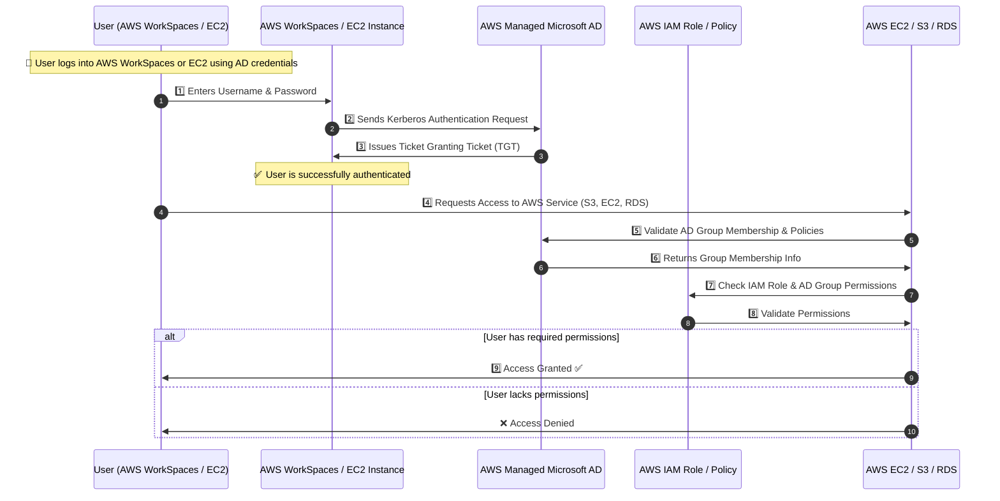
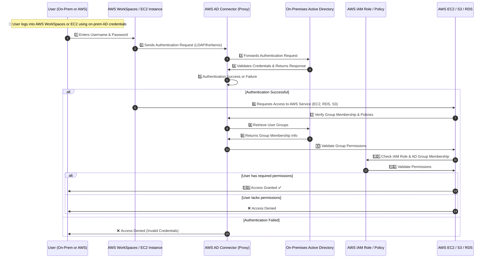
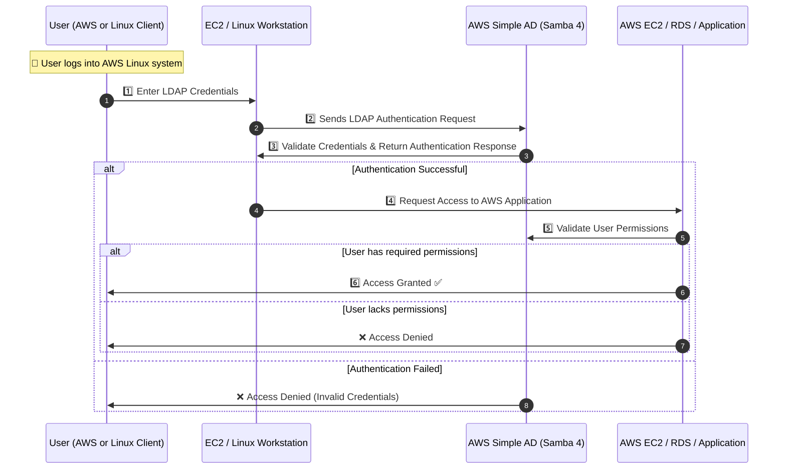

# AWS Directory Service Flows

## **1️⃣ AWS Managed Microsoft AD - Detailed Sequence Flow**

**💡 A fully managed Active Directory running on AWS.**

- Provides **full AD functionality** including **Group Policies, Kerberos, LDAP, NTLM, and Trust Relationships**.
- Can establish **trust relationships with on-prem AD**.
- Supports **AWS IAM integration** for resource access.

✅ **Best for:** Large enterprises **running full Microsoft AD on AWS**.  
✅ **Supports:** **Kerberos Authentication, Group Policies, Trust Relationships, Multi-AZ Deployment**.  
✅ **Example:** Using **AWS AD for Amazon WorkSpaces and RDS authentication**.

---

## **2️⃣ AWS AD Connector - Detailed Sequence Flow**

**💡 AWS AD Connector acts as a proxy for on-premises AD.**

- **No AD data is replicated to AWS** – authentication happens **directly with on-prem AD**.
- Used for **AWS IAM integration and Single Sign-On (SSO)**.
- **No need to deploy additional domain controllers in AWS**.

✅ **Best for:** Companies **already using on-prem AD** and needing AWS authentication.  
✅ **Supports:** **AWS SSO, IAM Role-based Access, AWS WorkSpaces, and RDS Authentication**.  
✅ **Example:** Using **on-prem AD credentials to log into AWS services without replicating AD data to AWS**.

---

## **3️⃣ AWS Simple AD - Detailed Sequence Flow**

**💡 AWS Simple AD is a lightweight directory service based on Samba 4.**

- **Does not support Group Policies or Trust Relationships**.
- Works with **basic LDAP authentication** (not full AD features).
- **Ideal for Linux-based applications** needing LDAP authentication.

✅ **Best for:** Small businesses needing **basic LDAP authentication** for applications.  
✅ **Supports:** **Samba 4, LDAP-based authentication** (No Group Policies or Trusts).  
✅ **Example:** Using **Simple AD to authenticate users for a Linux-based application in AWS**.

---

## **🛠️ Choosing the Right AWS Directory Service**

| **AWS Directory Service**    | **Best For**                                       | **Supports**                                            |
| ---------------------------- | -------------------------------------------------- | ------------------------------------------------------- |
| **AWS Managed Microsoft AD** | Full **Microsoft Active Directory** in AWS         | **Group Policies, Kerberos, LDAP, Trust Relationships** |
| **AWS AD Connector**         | Using **on-prem AD credentials in AWS**            | **AWS SSO, IAM Role Mapping, No AD replication**        |
| **Simple AD**                | Basic **LDAP authentication** for small businesses | **Samba 4, No Group Policies or Trusts**                |

---

## ✅ **Final Thoughts**

AWS Directory Service **simplifies Active Directory and LDAP management in AWS**.

- **AWS Managed Microsoft AD** = **Full AD in AWS** for enterprises.
- **AWS AD Connector** = **Extend on-prem AD** to AWS without replication.
- **Simple AD** = **Basic LDAP authentication** for small workloads.

💡 **Choosing the right AWS Directory Service depends on your authentication and access control needs.** 🚀
