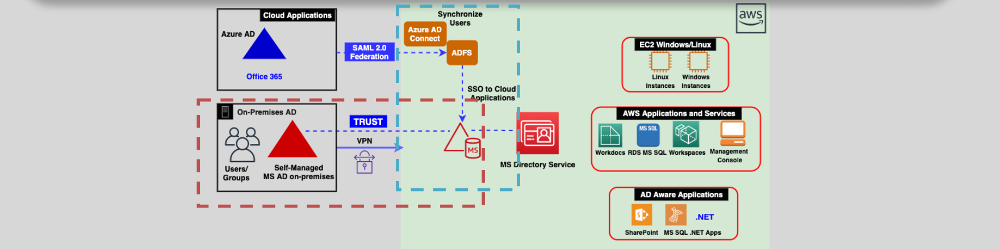
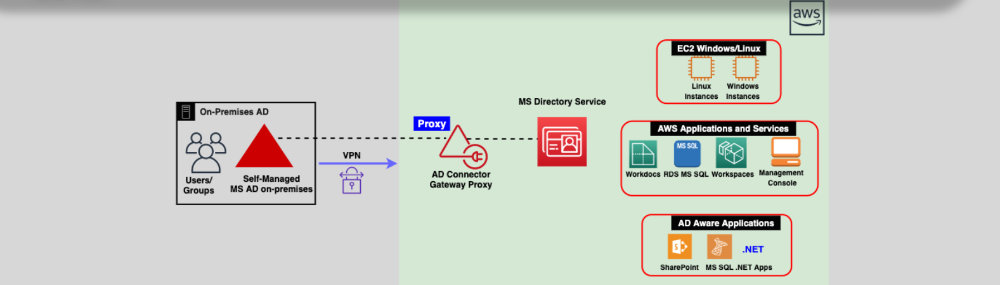

# AWS Directory Service 🖥️

AWS Directory Service helps organizations extend or migrate their **Microsoft Active Directory (AD)** workloads to the cloud. It provides managed solutions for integrating **Windows-based applications**, enabling **single sign-on (SSO)**, and connecting to existing on-premises **AD environments**.

---

## 🌟 **What is AWS Directory Service?**

AWS Directory Service is primarily designed for businesses using **Microsoft Active Directory**. It allows applications and users to:

1. **Authenticate**: Sign in to workloads like SharePoint, Microsoft SQL Server, and .NET applications using existing AD credentials.
2. **Integrate with AWS Services**: Access services like **WorkDocs**, **Workspaces**, and **RDS for SQL Server**.
3. **Enable SSO**: Provide seamless single sign-on for both **on-premises** and **cloud-based workloads**.

### Why Use AWS Directory Service?

- Simplifies managing Microsoft workloads in AWS.
- Extends on-premises AD to AWS without requiring users to sign in multiple times.
- Reduces the complexity of deploying and maintaining Active Directory infrastructure.

---

## 🛠️ **AWS Directory Service Options**

AWS offers three main solutions tailored to different use cases:

### 1️⃣ **AWS Managed Microsoft Active Directory (AWS Managed MS AD)**

  

- **Fully Managed**: AWS handles deploying and maintaining a highly available **Active Directory** in the cloud.
- **Supports MFA**: Multi-Factor Authentication for enhanced security.
- **Trust Relationships**:
  - Can establish a **trust relationship** with your **on-premises AD** via a **VPN** or **Direct Connect (DX)**.
  - This enables users to use the same credentials for on-premises and AWS resources.
- **Integration with Azure AD**: Using **Azure AD Connect** or **ADFS**, AWS Managed AD can be used with **Azure applications** like **Office 365**.

### 2️⃣ **AD Connector**

  

- **Proxy for On-Premises AD**:
  - Acts as a bridge between AWS and your on-premises Active Directory.
  - Proxies all authentication and authorization requests to the on-premises AD.
- **No New Directory**:
  - Does not create a new AD in AWS; relies entirely on your existing on-premises AD.
- **MFA Support**: Fully supports MFA configured in the on-premises AD.
- **Low Latency**: Requires **VPN** or **Direct Connect** for communication.

### 3️⃣ **Simple AD**

- **Lightweight Alternative**:
  - A simplified directory for lightweight workloads requiring basic **Active Directory compatibility**.
- **No MFA or Trust Support**:
  - Does not support MFA or trust relationships with other ADs.
- **Use Case**:
  - Ideal for **low-cost** setups or LDAP-compatible applications that don’t require full AD functionality.

---

## 🤔 **Which Directory Service Should You Use?**

| **Scenario**                          | **Recommended Service**                                                                                            |
| ------------------------------------- | ------------------------------------------------------------------------------------------------------------------ |
| Extend on-premises AD to AWS          | **AD Connector**: Leverage existing AD without deploying a new one in AWS.                                         |
| Fully managed AD in AWS with SSO      | **AWS Managed MS AD**: Deploy a managed Active Directory in AWS with seamless integration and trust relationships. |
| Low-cost, lightweight directory needs | **Simple AD**: For basic Active Directory or LDAP-compatible applications.                                         |
| Latency-sensitive applications in AWS | **AWS Managed MS AD**: Avoid delays by running AD directly in AWS.                                                 |

---

## 🔑 **Key Features of AWS Directory Service**

1. **Single Sign-On (SSO)**:

   - Provides seamless access to workloads without requiring multiple logins.
   - Enables users to use their **on-premises credentials** for AWS services.

2. **High Availability**:

   - Managed MS AD and AD Connector ensure redundancy across **multiple Availability Zones**.

3. **Integration with AWS Services**:

   - Services like **RDS for SQL Server**, **WorkDocs**, and **Workspaces** can be accessed using AD credentials.

4. **Supports Both Windows and Linux**:
   - Works with both Windows instances and Linux workloads that require Active Directory or LDAP integration.

---

## 🔄 **Comparison: AWS Directory Service vs Cognito**

| **Feature**        | **AWS Directory Service**                                                                | **AWS Cognito**                                                                                      |
| ------------------ | ---------------------------------------------------------------------------------------- | ---------------------------------------------------------------------------------------------------- |
| **Purpose**        | Provides **LDAP** or **Active Directory** services for applications hosted in the cloud. | Provides authentication and authorization for **SaaS** applications and user management.             |
| **Use Case**       | For enterprise environments with **Microsoft workloads** or LDAP-compatible apps.        | For managing user sign-in, including **social identity providers** like Google, Facebook, and Apple. |
| **Authentication** | Uses **Active Directory credentials**.                                                   | Supports sign-in via user pools, social logins, or custom identity providers.                        |
| **Authorization**  | Provides access to AWS services like RDS or WorkDocs using AD credentials.               | Grants temporary AWS credentials for resource access using identity pools.                           |

---

## ✅ **Conclusion**

AWS Directory Service simplifies the management of **Active Directory** workloads in AWS. Whether you want to extend your on-premises AD, deploy a fully managed AD in the cloud, or use a lightweight directory for basic needs, AWS Directory Service offers flexible solutions. With seamless integration, support for SSO, and compatibility with Windows and Linux applications, it is a powerful tool for managing enterprise identities in the cloud.
