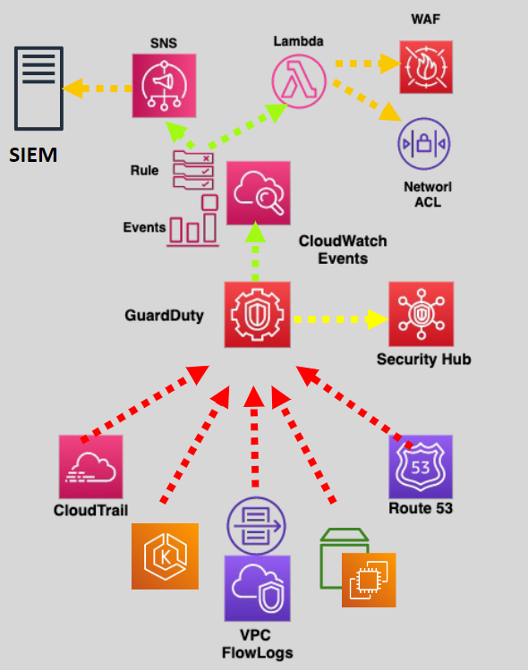

# 🤖 AWS GuardDuty: Easy Security Monitoring

## 🛡️ What is AWS GuardDuty?

**AWS GuardDuty** is a security tool that watches over your AWS cloud environment to spot any bad activities. Think of it as a security camera for your cloud.

  

## 🔍 How AWS GuardDuty Works

- **Smart Detection:** Uses advanced technology like threat intelligence feeds, anomaly detection, machine learning, and lists of bad IP addresses and domains to look for malicious activities and unusual behaviors.
- **Analyzes Logs:** Looks at various logs such as VPC Flow logs, DNS logs, CloudTrail management events, CloudTrail data events for S3, Amazon EBS volume data, and EKS audit logs to find threats.

## 🚨 What Does GuardDuty Detect?

GuardDuty can find:

- **Credential Theft:** If someone uses stolen credentials.
- **Exposed Credentials:** If someone uses leaked credentials.
- **Malicious Communications:** If your servers are talking to bad IP addresses, URLs, or domains (command-and-control servers).
- **Malware:** If there’s malware on your servers or containers, including instances serving malware or mining cryptocurrency.
- **Account Issues:** Signs of account problems, such as:
  - Instances appearing in new regions.
  - API calls to change security policies to weaker ones.

## 🛠️ How to Use GuardDuty

- **Enable Per Region:** Turn it on in each AWS region. AWS recommends enabling it in all regions.
- **View Findings:** Shows what it found through the GuardDuty console, command line (CLI), or APIs.
- **Automate Responses:** Set it up to automatically respond to threats using CloudWatch Events and AWS Lambda.

## 🌟 Key Features

- **Multi-Account Support:** Works with multiple AWS accounts using AWS Organizations.
- **Trusted IP Lists:** You can tell it which IPs are safe to avoid false alerts.
- **Data Security:** Keeps your data safe by encrypting it both at rest and in transit.

## 📊 Handling Findings

- **Detailed Findings:** Produces findings that include the affected resource and attacker information, such as geo-location and IP.
- **CloudWatch Events:** Creates an event for every finding, allowing easy integration with automation tools.
- **Notifications:** Sends notifications based on CloudWatch Events when any changes in findings occur.

## 💰 Costs

- **Charges:** You pay based on the analysis of CloudTrail events, EKS audit logs (per million events/month), and VPC flow logs, EBS volume data, and DNS logs (GB/month).
