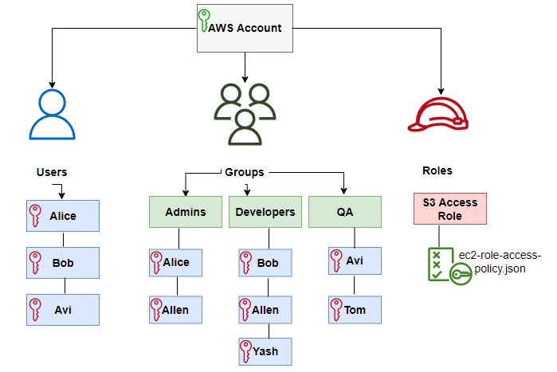
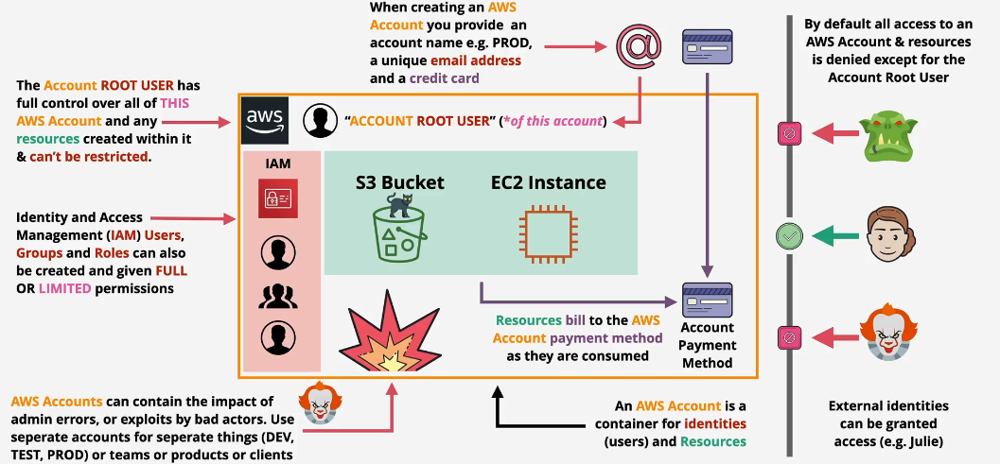

# 🌟 AWS Account: Your Gateway to the AWS Cloud

An AWS account is the foundation for using Amazon Web Services. It provides access to the AWS Management Console, AWS CLI, and APIs, enabling you to manage cloud resources, configure services, and track usage effectively. AWS accounts can also be used to structure cloud usage for different environments, such as production, development, and testing.

---

---

## 🎯 Use Cases for AWS Accounts

1. **Environment Segmentation:**
   - Create separate accounts for **production**, **staging**, and **development** to ensure resource isolation and better cost tracking.
2. **Centralized Billing with AWS Organizations:**
   - Use linked accounts under a single payer account for simplified billing and management.
3. **Compliance Requirements:**
   - Use individual accounts to enforce specific compliance or security standards.
4. **Multi-Project Management:**
   - Assign separate accounts for different projects or teams to control permissions and budgets.

---

## 🛡️ **Password Policy**

AWS enforces a default password policy for IAM users:

- Minimum password length: 8 characters.
- Password must mix alphanumeric and special characters.
- Password cannot match the username or email address.

### Customizing Password Policies

- Enforce changes immediately for new passwords.
- Apply expiration policies for regular password updates.
- Does not apply to root user credentials or access keys.

---

## 🔑 **Tasks Requiring Root Credentials**

Certain sensitive tasks require the root user:

- Changing account settings (e.g., email, root password).
- Managing billing and cost management access.
- Restoring permissions for IAM users.
- Closing the AWS account.
- Registering as a seller in the Reserved Instance Marketplace.

---

## 🛠️ How to Create and Secure an AWS Root Account

### 1️⃣ **Steps to Create a Root Account**

1. **Sign Up on AWS:**
   - Visit [AWS Signup](https://aws.amazon.com).
   - Provide your email, set a password, and specify an account name.
2. **Add Payment Information:**
   - Enter valid credit or debit card details for billing purposes.
3. **Verify Identity:**
   - Confirm identity via phone or email.
4. **Choose Support Plan:**
   - Select the appropriate plan (Basic, Developer, or Business).
5. **Complete Setup:**
   - Log in to the AWS Management Console using the root account credentials.

### 2️⃣ **Securing the Root Account with MFA**

1. **Access Account Settings:**
   - Log in as the root user and navigate to **My Account** > **Security Credentials**.
2. **Enable MFA:**
   - Choose **Activate MFA** and select a **virtual MFA device**.
3. **Set Up MFA App:**
   - Use an authenticator app (e.g., Google Authenticator) to scan the QR code.
4. **Verify Codes:**
   - Enter the generated codes to complete setup.
5. **Best Practice:**
   - Avoid using the root account for daily tasks; create IAM users for regular activities.

---

## 💰 How to Create a Budget in AWS

1. **Access Billing Dashboard:**
   - Navigate to **Billing** in the AWS Management Console.
2. **Create a Budget:**
   - Go to **Budgets** > **Create Budget**.
   - Choose a budget type: **Cost**, **Usage**, or **Reservation**.
3. **Set Budget Details:**
   - Define the time period, cost threshold, and notifications.
4. **Enable Alerts:**
   - Set up email alerts for when the budget threshold is exceeded.
5. **Save Budget:**
   - Finalize and monitor via the Budgets Dashboard.

---

## 🔄 Account Management Best Practices

### 🔒 Secure Your Root Account

- Enable MFA for the root account.
- Use strong, unique passwords.
- Delegate tasks to IAM users and avoid using the root account for daily activities.

### 🛡️ Organize with AWS Organizations

- Create separate accounts for different environments.
- Enforce Service Control Policies (SCPs) to restrict actions at the account level.

### 📊 Monitor and Audit

- Use AWS CloudTrail to log API calls and account activity.
- Enable AWS Config to track resource compliance.

### 🏷️ Tagging and Budgeting

- Apply consistent tagging strategies to organize resources.
- Set up AWS Budgets to monitor and control costs.

An AWS account is the gateway to the cloud, offering robust tools for managing and scaling your workloads. By following best practices and leveraging AWS features, you can ensure secure, cost-effective, and efficient use of cloud resources.
