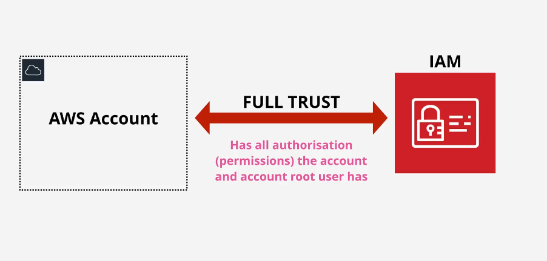
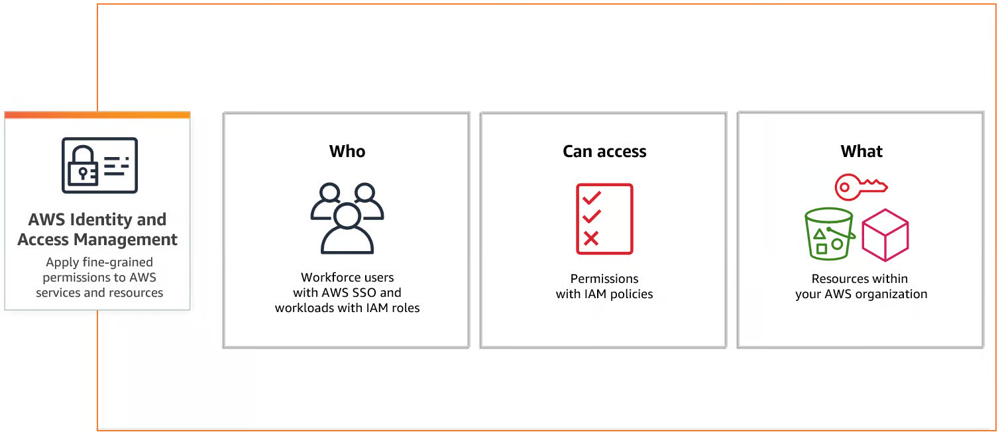
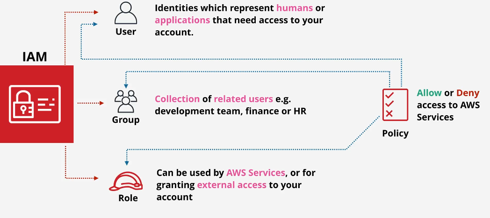

# AWS Identity and Access Management (IAM)

AWS **Identity and Access Management (IAM)** is a secure and flexible service that helps manage **identities, authentication, and authorization** for AWS accounts and resources. It ensures that only authenticated and authorized entities can access AWS resources.

 

## 🌟 **Key Features**

 

- **Global Service**: IAM is a global AWS service, meaning its configurations are applied across all regions.
- **Shared Access**: Allows multiple users to share access to an AWS account.
- **Granular Permissions**: Offers fine-grained control over who can access what resources and under what conditions.
- **Multi-Factor Authentication (MFA)**: Enhances security with an additional layer of authentication.
- **Identity Federation**: Integrates with external identity providers (e.g., Google, Microsoft AD).
- **Auditing and Compliance**: Maintains detailed identity activity logs for security and compliance.
- **Temporary Access**: Provides temporary credentials through AWS Security Token Service (STS).
- **Cost**: IAM is free to use.

---

## 🔒 **IAM Best Practices**

1. **Protect Root Account Credentials**:

   - Lock away root user credentials.
   - Enable MFA for the root user.
   - Use root credentials only for tasks that require them.

2. **Use Individual IAM Users**:

   - Create separate users for each individual or application.
   - Avoid sharing credentials.

3. **Grant Least Privilege**:

   - Assign the minimum permissions required to perform tasks.
   - Regularly review and adjust permissions.

4. **Use IAM Groups**:

   - Manage permissions collectively by assigning them to groups.
   - Simplifies user management.

5. **Enable MFA**:

   - Require MFA for users with privileged access.

6. **Rotate Credentials Regularly**:

   - Regularly update passwords and access keys.

7. **Use AWS-Managed Policies**:

   - Prefer predefined policies for common use cases over creating custom policies.

8. **Implement Strong Password Policies**:

   - Enforce minimum password length and complexity requirements.

9. **Monitor Activity**:

   - Use CloudTrail to track user activities and detect anomalies.
   - Regularly audit permissions using IAM Access Analyzer.

10. **Delegate Access Using Roles**:
    - Assign roles instead of sharing long-term credentials.

---

## 🛠️ **IAM Identities**

IAM identities represent entities (users, groups, or roles) that interact with AWS resources.

### 1. **IAM Users**

- Represents an individual person or application.
- Each user has:
  - A username.
  - Password for AWS Management Console access.
  - Optional access keys (Access Key ID and Secret Access Key) for programmatic access.
- **Best Practice**: Enable MFA for root and privileged users.

### 2. **IAM Groups** [🔞 Not Identity or Principal it is just collection of users]

- A collection of IAM users.
- Permissions are assigned to the group, and all users inherit those permissions.
- Simplifies management by grouping users with similar access requirements.

### 3. **IAM Roles**

- Used to grant temporary permissions to users, applications, or services.
- Common use cases:
  - Assigning permissions to applications running on EC2 instances.
  - Delegating access to other AWS accounts.
  - Allowing AWS services (e.g., Lambda) to interact with resources.

---

## 🛠️ **IAM Policies**

IAM policies define what actions are allowed or denied for an identity.

### Types of Policies

1. **AWS-Managed Policies**:
   - Predefined by AWS.
   - Simplifies permissions management.
2. **Customer-Managed Policies**:
   - Created and managed by the customer.
   - Offers flexibility for custom use cases.
3. **Inline Policies**:
   - Embedded directly in a single user, group, or role.
   - Best used for unique, non-reusable permissions.

---

## ⚙️ **Temporary Credentials with AWS STS**

AWS Security Token Service (STS) allows you to issue temporary credentials for:

- IAM users.
- Applications requiring short-term access.
- Cross-account access.

**Benefits**:

- Temporary credentials enhance security by reducing exposure.
- Ideal for federated users and applications.

---

## 🛠️ **IAM in Action**

### Example Use Case

1. A developer needs programmatic access to an S3 bucket.
2. Create an **IAM user** for the developer.
3. Assign the user a policy granting S3 access.
4. Provide the developer with an **Access Key ID** and **Secret Access Key**.
5. Require MFA for additional security.

---

## 💡 **Why IAM is Important**

IAM is the backbone of AWS security and access management. It ensures:

- Secure and controlled access to resources.
- Centralized management of users and permissions.
- Compliance with security standards like PCI DSS.

---

AWS IAM is the foundation for securing your AWS environment. By following best practices, leveraging IAM roles, and maintaining a strong password policy, you can ensure robust security and seamless access management for your AWS resources.
