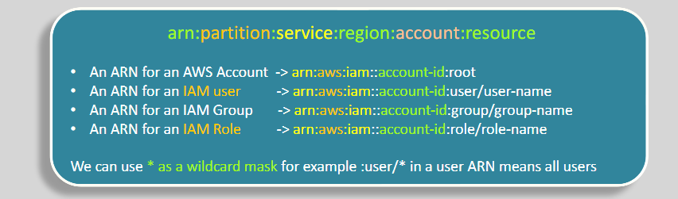

# **Amazon Resource Name (ARN) 🔑**

Amazon Resource Name (ARN) is a unique identifier for AWS resources. It's used to reference resources within IAM policies, and understanding its format is essential for defining access permissions.

## **The General Format of an ARN 📜**

The general structure of an ARN is:

- `arn`:`partition`:`service`:`region`:`account-id`:`resource`

  

Where:

- **arn**: This is the prefix for all ARNs.
- **partition**: Specifies the partition. For example:
  - `aws` for public AWS regions.
  - `aws-cn` for AWS China regions.
  - `aws-us-gov` for AWS GovCloud (US).
- **service**: The AWS service, like `iam`, `dynamodb`, etc.
- **region**: The AWS region where the resource is located (e.g., `us-east-2`).
  - `::` empty mean all region.
- **account-id**: Your AWS account ID.
- **resource**: The resource type and identifier (e.g., `user/hadywafa` or `table/books`).

## **Wildcards in ARNs 🌐**

You can use `*` (wildcard) to reference all resources or multiple instances of a resource.

For example:

- `arn:aws:iam::account-id:user/*` — Refers to all users in the account.
- `arn:aws:s3:::bucket-name/*` — Refers to all objects in the specified S3 bucket.

## **Examples of ARNs 📚**

Here are a few examples of ARNs:

- **IAM User ARN**:  
  `arn:aws:iam::account-id:user/hadywafa`
- **IAM Group ARN**:  
  `arn:aws:iam::account-id:group/devops`
- **IAM Role ARN**:  
  `arn:aws:iam::account-id:role/s3readers`
- **DynamoDB Table ARN**:  
  `arn:aws:dynamodb:us-east-2:123456789012:table/books`
- **DynamoDB Table with Wildcard**:  
  `arn:aws:dynamodb:us-east-2:123456789012:table/*`

These ARNs are crucial for managing permissions and policies within AWS, allowing fine-grained control over who can access specific resources.
