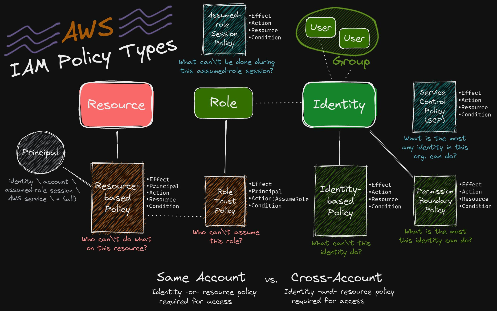

# **IAM Policies** 📑

**AWS IAM Policies** are essential for managing **access control** within your AWS environment. They define **who** can access your resources, and what **actions** they are allowed to perform. In this topic, we’ll break down the key aspects of IAM Policies, explore how they work, and highlight important features and best practices.

**What Are IAM Policies?**

IAM Policies are **JSON documents** that define **permissions** for an **identity** (such as an IAM user, role, or federated user) or a **resource**. These policies specify which **actions** are allowed or denied on specific resources.

---

<p align="center">
  
</p>

---

## **Key Components of a Policy** 🏔️

- **Key Components of a Policy**:
  - **Version**: The version of the policy language (always `2012-10-17` for AWS).
  - **Statement**: Contains the policy details, including actions, resources, and the effect (allow or deny).
  - **Effect**: Whether the action is allowed or denied.
  - **Action**: The AWS actions this policy allows or denies.
  - **Resource**: The resources that the policy applies to (e.g., an S3 bucket).

```json
{
  "Version": "2012-10-17",
  "Statement": [
    {
      "Effect": "Allow",
      "Action": "s3:GetObject",
      "Resource": "arn:aws:s3:::mybucket/*"
    }
  ]
}
```

---

## **Policy Evaluation Logic** 🔍

IAM policies use a **default deny** model and evaluate requests in a specific way:

1. **Default Deny**: By default, **all requests are denied** until explicitly allowed by a policy.

2. **Explicit Allow**: If a policy explicitly allows an action, it will be granted even if a general **deny** is in place.

3. **Explicit Deny**: If a policy explicitly denies an action, that denial **overrides any allows**. Deny always takes precedence over allow.

### Example

- **Allow**: "You can read from S3."
- **Deny**: "You cannot delete objects from S3."
- If a request tries to delete an S3 object, even if there's an allow for read access, the deny will override it.

---

## **Common IAM Policy Use Cases** 🎯

- **Allowing EC2 instances to access S3**:

  - **Policy**: Attach an **IAM role** to an EC2 instance that allows it to interact with S3.

- **Restricting S3 bucket access**:

  - **Policy**: Attach a **resource-based policy** to an S3 bucket to restrict who can access it.

- **Limiting user permissions**:
  - **Policy**: Create a **customer-managed policy** that grants users access to only specific resources in a region.

---

## **Types of IAM Policies** 🧩

  

---

### **1. Identity-Based Policies**

_`What can’t this identity do?`_

---

These policies are attached to IAM identities (users, groups, or roles).

- **Description**: Policies that are attached to IAM identities (users, groups, or roles). They are unique to the entity they are attached to.
- **Attachment Type**:
  - Inline
  - AWS Managed (predefined by AWS)
  - Customer Managed (created and managed by the user)
- **Example**:

  ```json
  {
    "Version": "2012-10-17",
    "Statement": [
      {
        "Effect": "Allow",
        "Action": "s3:ListBucket",
        "Resource": "arn:aws:s3:::example_bucket"
      }
    ]
  }
  ```

IAM policies are attached to **principals**, which can be:

- **IAM Users**: Individual AWS accounts.
- **IAM Roles**: Assigned to AWS resources or services.
- **Federated Users**: External identities that are granted temporary access.
- **Applications**: AWS services or third-party applications using your AWS resources.

> ⚠️ Note:
> 📌 **IAM Groups** cannot be IAM **Principals**, although policies can be attached to groups for the users within them.
>
> **Multiple Policies**: An **identity** can have more than one policy attached. This gives you flexibility in managing access for a user or service.

---

### 2. Resource-Based Policies

_`Who can’t do what on this resource?`_

---

These policies are attached to AWS resources like **S3 buckets**, **Lambda functions**, etc.

- **Description**: Policies defined in the resource’s policy document and attached directly to the resource. They can grant permissions to other AWS accounts.
- **Attachment Type**: Inline (as they are embedded within the resource’s policy document)
- **Example**:

  ```json
  {
    "Version": "2012-10-17",
    "Statement": [
      {
        "Effect": "Allow",
        "Principal": "*",
        "Action": "s3:GetObject",
        "Resource": "arn:aws:s3:::example_bucket/*"
      }
    ]
  }
  ```

---

### 3. Permission Boundary Policies

_`What is the most this identity can do?`_

---

These policies set the maximum permissions that identity-based policies can grant.

- **Description**: Policies that define the maximum permissions an IAM user or role can have. They act as a boundary for what permissions can be granted.
- **Attachment Type**: Customer Managed (created and managed by the user)
- **Example**:

  ```json
  {
    "Version": "2012-10-17",
    "Statement": [
      {
        "Effect": "Allow",
        "Action": "s3:ListBucket",
        "Resource": "arn:aws:s3:::example_bucket"
      }
    ]
  }
  ```

---

### 4. Service Control Policies (SCPs)

_`What is the most any identity in this org can do?`_

---

These policies are used in AWS Organizations to manage permissions across accounts.

- **Description**: Policies that define the maximum available permissions for accounts within an AWS organization. They are enforced across all entities within the organization.
- **Attachment Type**: AWS Managed (predefined by AWS) and Customer Managed (created and managed by the user)
- **Example**:

  ```json
  {
    "Version": "2012-10-17",
    "Statement": [
      {
        "Effect": "Deny",
        "Action": "s3:DeleteBucket",
        "Resource": "*"
      }
    ]
  }
  ```

---

### 5. Role Trust Policy

_`Who can’t assume this role?`_

---

These policies define which principals can assume the role.

- **Description**: Policies embedded within the role that specify who can assume the role and under what conditions.
- **Attachment Type**: Inline only
- **Example**:

  ```json
  {
    "Version": "2012-10-17",
    "Statement": [
      {
        "Effect": "Allow",
        "Principal": {
          "Service": "ec2.amazonaws.com"
        },
        "Action": "sts:AssumeRole"
      }
    ]
  }
  ```

---

### 6. Assumed Role Session Policies

_`What can’t be done during this assumed-role session?`_

---

These are temporary policies passed when assuming a role.

- **Description**: Policies that provide additional permissions or constraints for the duration of the session. They are passed during the role assumption process.
- **Attachment Type**: Inline (as they are temporary and specific to the session)
- **Example**:

  ```json
  {
    "Version": "2012-10-17",
    "Statement": [
      {
        "Effect": "Allow",
        "Action": "s3:ListBucket",
        "Resource": "arn:aws:s3:::example_bucket"
      }
    ]
  }
  ```

---

### **Summary**

---

| Policy Type                     | Description                                                | Attachment Methods                    |
| ------------------------------- | ---------------------------------------------------------- | ------------------------------------- |
| Identity-Based Policies         | Policies attached to IAM identities (users, groups, roles) | Inline, AWS Managed, Customer Managed |
| Resource-Based Policies         | Policies attached to AWS resources                         | Inline                                |
| Permission Boundary Policies    | Policies that set maximum permissions                      | Customer Managed                      |
| Service Control Policies (SCPs) | Policies for AWS Organizations                             | AWS Managed, Customer Managed         |
| Role Trust Policy               | Policies defining which principals can assume the role     | Inline                                |
| Assumed Role Session Policies   | Temporary policies during role assumption                  | Inline                                |

---

## **Best Practices for IAM Policies** ⚡

1. **Use Managed Policies**: Whenever possible, use **AWS managed policies** to save time and reduce the chance of errors.

2. **Grant Least Privilege**: Always grant the **minimum permissions** necessary for users and roles to perform their tasks.

3. **Monitor and Review**: Regularly **audit** your IAM policies and use **CloudTrail** to log and review access.

4. **Use Policy Versioning**: For **customer-managed policies**, use **versioning** to keep track of changes and prevent mistakes.

5. **Avoid Using Inline Policies**: While inline policies are useful in some cases, they are harder to manage and audit. **Managed policies** are usually better for most use cases.

## **Conclusion** 🎉

**IAM Policies** are the backbone of security in AWS. Understanding how policies are structured, evaluated, and applied will help you control access to AWS resources effectively. By attaching policies to **users**, **roles**, or **resources**, and following **best practices**, you can ensure that your AWS environment remains secure, efficient, and manageable.
