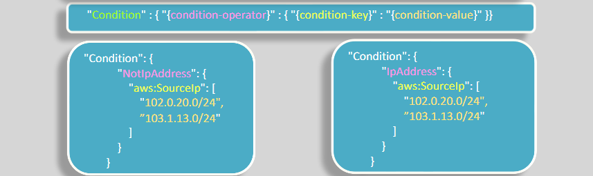

# Identity Based Policy

- IAM identity-based policies attach to IAM users, IAM groups, or IAM roles
- `Identity policies have no principal element`. The identity it attaches to becomes the principal.
- Typically, users in an account would have multiple policies attached.

## IAM Policy Structure

An IAM policy is a JSON document that consists of one or more statements.

Each statement is structured as shown

- Use ARN to specify the resource(s), or Wildcard (\*) to indicate all resources.
- Policies are stored as JSON documents in AWS.

```json
// IAM Policy
{
  "Statement": [
    {
      "Effect": "[effect]",
      "Action": "[action]",
      "Resource": "[resource-arn]",
      "Condition": {
        "[condition-operator]": {
          "[condition-key]": "[condition-value]"
        }
      }
    }
  ]
}
```

### 1. Action Field

- action of services such as:

  - iam:
  - s3:
  - ec2:
  - dynamodb:
  - ds: => Directory Services.
  - kms:
  - logs: => CloudWatch Logs

- `NotAction` is an advanced policy element that explicitly matches everything except the specified list of actions.

```json
// example of not action statement
{
  "Version": "2012-10-17",
  "Statement": [
    {
      "Effect": "Allow",
      "NotAction": "s3:DeleteBucket",
      "Resource": "arn:aws:s3:::*"
    },
    {
      "Effect": "Allow",
      "NotAction": "iam:*",
      "Resource": "*"
    }
  ]
}
```

### 2. Policy Effect

- By default, all requests are denied
- An explicit allow overrides the default.
- An `explicit` deny overrides all allows.

```json
// example of explicit deny statement
{
  "Version": "2012-10-17",
  "Statement": [
    {
      "Sid": "SomeServices",
      "Effect": "Allow",
      "Action": ["cloudwatch:*", "dynamodb:*", "ec2:*", "s3:*"],
      "Resource": "*"
    },
    {
      "Sid": "NoCalssifiedBucket",
      "Effect": "Deny",
      "Action": "s3:*",
      "Resource": ["arn:aws:s3:::dolfinedcal123/*", "arn:aws:s3:::dolfinedcal123"]
    }
  ]
}
```

### 3. Policy Conditions

- Use conditions to specify when should an allow or a deny action take place.
- The condition must return a true for the corresponding action to take place.Otherwise, the statement is ignored, and other statements are evaluated.
- Can be used in both IAM identity-based and resource-based policies
  

```json
// This policy statement denies any IP
// address outside of the two listed ranges
// from terminating EC2 instances
{
  "Version": "2012-10-17",
  "Statement": [
    {
      "Effect": "Deny",
      "Action": "ec2:TerminateInstances",
      "Resource": "*",
      "Condition": {
        "NotIpAddress": {
          "aws:SourceIp": ["192.0.2.0/24", "203.0.113.0/24"]
        }
      }
    }
  ]
}
```

```json
// This policy statement allows users with
// source IP address from the ranges
// 203.0.113.0/24 or 2001:DB8:1234:5678::/
// to do all  EC2 actions on all EC2 resources
{
  "Version": "2012-10-17",
  "Statement": {
    "Effect": "Allow",
    "Action": "ec2:*",
    "Resource": "*",
    "Condition": {
      "IpAddress": {
        "aws:SourceIp": ["203.0.113.0/24", "2001:DB8:1234:5678::/64"]
      }
    }
  }
}
```

```json
// This policy statement denies users
// who have not been authenticated
// with MFA from terminating or
// stopping EC2 instances.
{
  "Version": "2012-10-17",
  "Statement": [
    {
      "Sid": "DenyStopAndTerminateWhenMFAIsNotPresent",
      "Effect": "Deny",
      "Action": ["ec2:StopInstances", "ec2:TerminateInstances"],
      "Resource": "*",
      "Condition": {
        "BoolIfExists": { "aws:MultiFactorAuthPresent": false }
      }
    }
  ]
}
```
