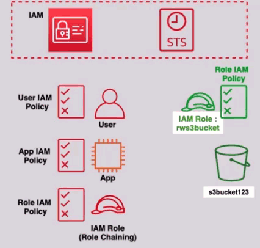

# **Security Token Service (STS) 🔐**

Security Token Service (STS) is a service that can generate temporary access credentials, often referred to as STS Tokens, to allow users or applications to securely access AWS resources.

## **Key Features of STS:**

- **Temporary Credentials**: STS provides credentials that are short-lived and automatically expire after a set period.
- **Duration of Credentials**: The temporary credentials' lifetime can range from as short as 15 minutes to several hours (configurable by the user).
- **No Credential Rotation Required**: With STS, there’s no need to worry about rotating credentials manually—STS automatically handles the expiration and renewal.

## **Benefits of Using STS 🔑**

- **Security**: No need to store permanent credentials within your application or systems, reducing the risk of credentials being compromised.
- **Flexibility**: Temporary credentials can be used across AWS services, offering fine-grained control over access.
- **Access for External Users**: External users can access your AWS resources temporarily without requiring IAM accounts, streamlining partner integrations or user-specific access.
- **Automated Expiration**: Since the credentials are temporary, they automatically expire and cannot be used once they are expired.

## **STS Use Cases 📦**

- **IAM Role Assumption**: Allow users or applications to assume specific IAM roles for temporary access.
- **Identity Federation**: Enable external identities (like corporate AD, social logins, or SSO) to access AWS resources securely.
- **Cross-Account Access**: Allow access to resources in different AWS accounts without permanent IAM user credentials.

## **How STS Works 🚀**

    

1. **Request Temporary Credentials**:

   - When an application or user requires access to AWS resources, they can request temporary credentials by calling the STS APIs.

2. **Permission to Request Credentials**:

   - The only users who can request temporary credentials by calling the STS APIs are those who have the appropriate IAM policy that grants them permission. This permission is typically specified using `sts:AssumeRole` or similar actions in the policy.

3. **Dynamic Creation of Credentials**:

   - When requested, STS dynamically creates temporary credentials and delivers them to the requester.

4. **Access Without Hard-Coded Credentials**:

   - The key benefit of using STS is that applications do not need to hard-code permanent credentials, which is more secure. Instead, temporary credentials are used, which expire after a set time period.

5. **External User Access**:
   - STS allows access to AWS resources for external users (those who are not IAM users), making it easier to grant access to non-IAM users, partners, or other applications.

---

By using STS, AWS customers can manage access in a secure and flexible manner, particularly when working with dynamic environments or external users. It allows for short-lived, configurable access credentials that expire automatically, reducing the chances of long-term credential leakage. The only users who can make these requests are those granted permission via an IAM policy, ensuring controlled access to the STS service.
