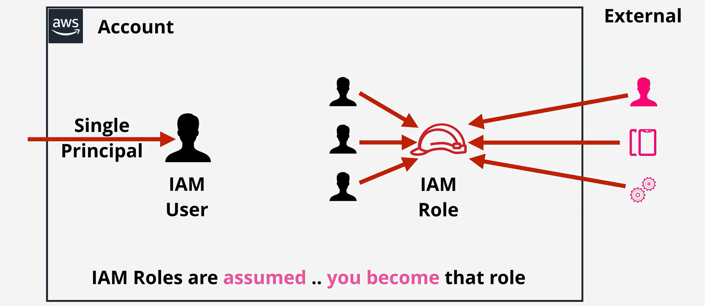
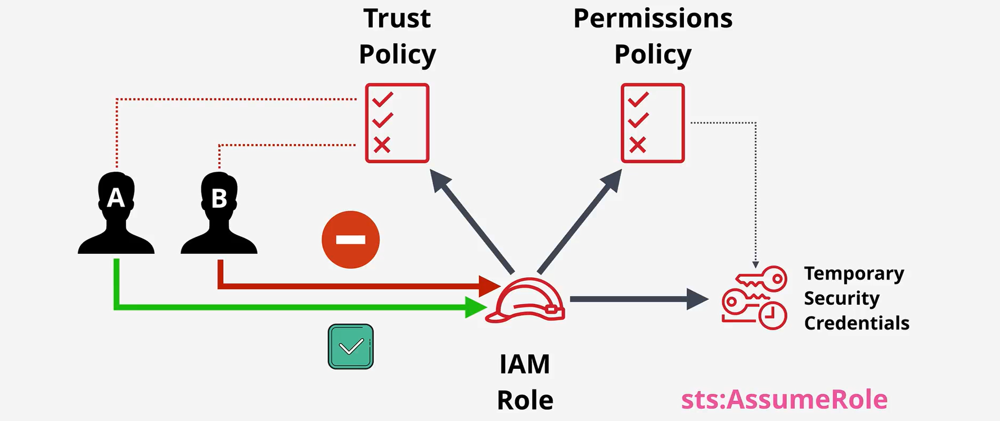

# **IAM Roles in AWS** 🎭

**IAM Roles** are a core part of AWS’s **Identity and Access Management (IAM)** service. They enable secure, temporary access to AWS resources without relying on permanent credentials such as Access Key IDs and Secret Access Keys. Unlike IAM users, **IAM roles** are not tied to a specific identity but are assumed by **users**, **services**, or **applications** that require specific permissions.



---

## **What Is an IAM Role?** 🔑

An **IAM Role** is an **AWS identity** that grants **permissions** to trusted entities such as **IAM users**, **AWS services**, or **external applications**. Unlike IAM users, which have permanent credentials, roles only provide **temporary credentials** when assumed.

### **Key Features of IAM Roles**

- **Temporary Credentials**: Provide access for a limited time.
- **No Permanent Access Keys**: Unlike IAM users, roles do not have static credentials.
- **Flexible Usage**: Can be assumed by users, services, and external applications.
- **Enhanced Security**: Dynamically manage permissions without hardcoding credentials.

---

## **Who Can Assume an IAM Role?** 👥

IAM roles can be assumed by:

1. **IAM Users**: Temporary permissions for specific tasks.
2. **AWS Services**: Services like **EC2**, **Lambda**, and **RDS** can assume roles to access other resources.
3. **Federated Users**: External users authenticated via identity providers (e.g., Google, Microsoft, Active Directory) can assume roles through **web identity federation**.
4. **Applications**: Applications (internal or external) can assume roles to securely interact with AWS resources.

---

## **How IAM Roles Work** 🔄



### 1. **Trust Policy 🔑**

- It is resource based policy that attach inline to iam role
- Decides _who_ is allowed to assume (wear) the role. Example: "Only EC2 instances can wear this role."

### 2. **Permissions Policy 📝**

- it is identity based policy that attached to iam role
- Specifies _what_ the role can do once assumed. Example: "This role can read objects from S3 buckets."

### 🤔 **Why Do Users Need Another Policy?**

Before a user (or service) can wear a role, they need their own **policy** granting the `sts:AssumeRole` action.  
Without this, it’s like having a costume but no ticket to enter the party.

---

## **How to Use IAM Roles**

### **1. Prepare and Create the IAM Role**

- Define a **trust policy** to specify the trusted entity (e.g., EC2, Lambda, or another AWS account).
- Attach **permissions policies** to grant specific access.

### **2. Assume the Role**

- The trusted entity assumes the role to receive **temporary credentials**.
- These credentials are valid for a defined session (e.g., 15 minutes to 12 hours).

### **3. Perform Actions**

- Use the temporary credentials to perform actions allowed by the role’s permissions policy.

### **4. Handle Role Session Expiry**

- Once the session expires, credentials become invalid, and the entity must re-assume the role.

---

## **Types of IAM Roles** ⚙️

1. **Service Roles**: Used by AWS services to perform actions on your behalf.
   - **Example**: An EC2 instance accessing S3.
2. **Cross-Account Roles**: Allow access between AWS accounts.
   - **Example**: Account A allows Account B’s users to access its S3 buckets.
3. **Federated Roles**: Used by external users authenticated through identity providers.
   - **Example**: A corporate user accessing AWS via Active Directory.

---

## **Trust Policies** 🛡️

A **Trust Policy** specifies the **trusted entities** allowed to assume a role.

### **Example: Trust Policy for EC2**

```json
{
  "Version": "2012-10-17",
  "Statement": [
    {
      "Effect": "Allow",
      "Principal": {
        "Service": "ec2.amazonaws.com"
      },
      "Action": "sts:AssumeRole"
    }
  ]
}
```

This policy allows **EC2 instances** to assume the role.

---

## **IAM Roles vs. IAM Users** 🤔

| **Feature**            | **IAM User**                          | **IAM Role**                                               |
| ---------------------- | ------------------------------------- | ---------------------------------------------------------- |
| **Access**             | Permanent credentials                 | Temporary credentials                                      |
| **Credentials**        | Access Key ID and Secret Access Key   | No permanent credentials                                   |
| **Trust Relationship** | Tied to a specific person/application | Can be assumed by users, services, or federated identities |
| **Duration**           | Unlimited access                      | Time-limited (e.g., 15 minutes to 12 hours)                |

---

## **Use Cases for IAM Roles** 🌟

### **1. EC2 Role**

Assign an IAM role to an **EC2 instance** to allow it to interact with AWS services (e.g., S3, DynamoDB) without embedding credentials.

**Example**: An EC2 instance reads objects from an S3 bucket using a role with `s3:GetObject` permission.

### **2. Lambda Role**

AWS **Lambda functions** can assume roles to interact with AWS resources like DynamoDB, S3, or SNS.

**Example**: A Lambda function writes to a DynamoDB table using a role with `dynamodb:PutItem` permission.

### **3. Cross-Account Access**

An IAM role in one account can be assumed by users or services from another account.

**Example**: Account A creates a role that Account B’s users assume to read S3 buckets.

---

## **Best Practices for IAM Roles** ⚡

1. **Principle of Least Privilege**: Assign only the permissions necessary for the role’s task.
2. **Regularly Review and Rotate Roles**: Periodically review roles to ensure relevance and security.
3. **Monitor Role Usage with CloudTrail**: Detect suspicious activity by logging role assumptions.
4. **Use Roles for Cross-Account Access**: Avoid sharing credentials; use roles for secure access between accounts.

---

## **Summary** 📚

- **IAM Roles** enable temporary, secure access to AWS resources without permanent credentials.
- **Trust policies** specify **who** can assume the role, and **permissions policies** define **what actions** are allowed.
- IAM roles are versatile and used for scenarios like EC2 instance access, Lambda functions, and cross-account access.
- Following **best practices** ensures roles are secure and efficient.

---
