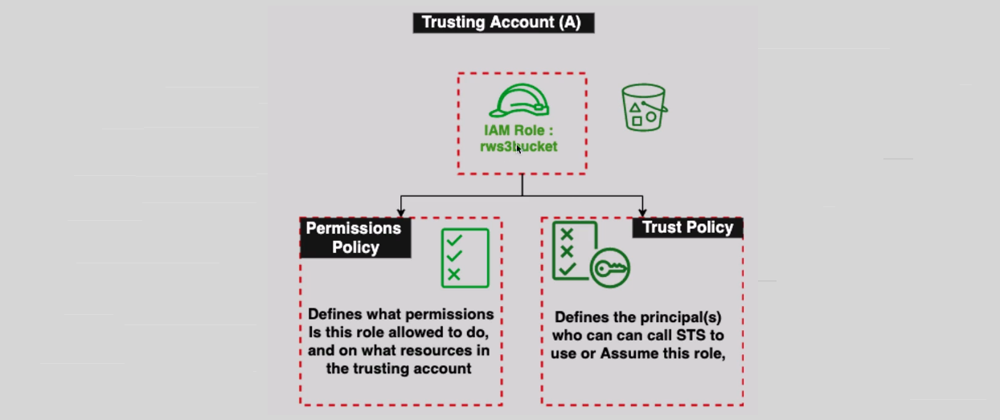
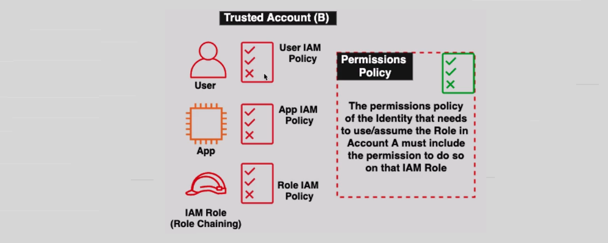
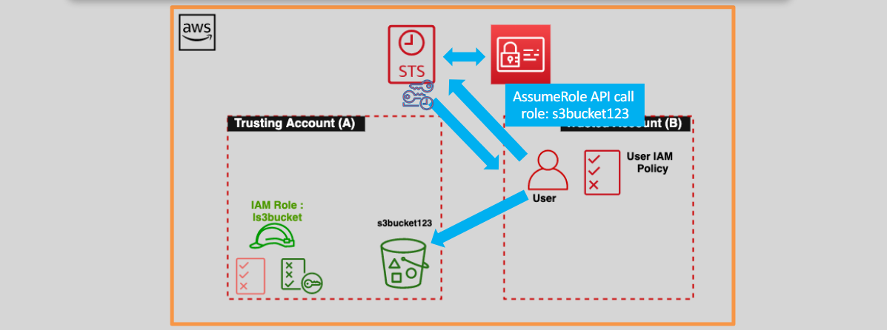

# iam-role Cross-Account 🏦

IAM roles are commonly used for **cross-account access**, allowing resources from one AWS account (Account A) to be accessed by resources in another AWS account (Account B). This is useful when multiple AWS accounts need to interact with each other.

---

## **How Cross-Account Access Works 🔗**

1. **Trusting Account (Account A)**:

   - The IAM role in **Account A** defines which entities are allowed to assume the role.
     

2. **Trusted Account (Account B)**:
   - The IAM user or resource in **Account B** must have the necessary permission to **assume the role** in Account A.
     

---

## **Example of Cross-Account Access**



Let's say **Account A** wants to grant **Account B** access to its S3 bucket (`s3bucket123`).

**1. Trust Policy- (Account A) :**

- This is a trust policy that will be used to create the iam role
- it is defines that **Account B** is allowed to assume the role in **Account A**.

```json
{
  "Version": "2012-10-17",
  "Statement": {
    "Effect": "Allow",
    "Principal": { "AWS": "arn:aws:iam::AccountB-ID:root" },
    "Action": "sts:AssumeRole"
  }
}
```

**2. Permissions Policy (for IAM Role) - (Account A) :**

- This is permission policy that will give the power for the iam role to list the **s3bucket123**.
- it is defines the permissions granted when **Account B** assumes the role. Here, **Account B** is allowed to list the contents of the `s3bucket123`.

```json
{
  "Version": "2012-10-17",
  "Statement": {
    "Effect": "Allow",
    "Action": "s3:ListBucket",
    "Resource": "arn:aws:s3:::s3bucket123"
  }
}
```

**3. Permission Policy (for iam user)- (Account B) :**

- This permission policy allows **Account B's** IAM user to wear (assume) the role in **Account A**.

```json
{
  "Version": "2012-10-17",
  "Statement": {
    "Effect": "Allow",
    "Action": "sts:AssumeRole",
    "Resource": "arn:aws:iam::AccountA-ID:role/ls3bucket"
  }
}
```

---

## 🔐 **What is the External ID in Cross-Account Access?**

In cross-account access, **External ID** is a security feature used to prevent an unintended or unauthorized party from assuming a role in your AWS account. It acts as a "secret passcode" provided by the requesting party (e.g., another AWS account, third-party service, or application) and validated by the trusting account.

---

### **The Problem (Without External ID)**

Imagine this scenario:

1. **Your Account A** creates an IAM Role to grant another account (**Account B**) access to your S3 bucket.
2. The **Trust Policy** on the role allows **Account B** to assume the role.

   ```json
   {
     "Version": "2012-10-17",
     "Statement": [
       {
         "Effect": "Allow",
         "Principal": {
           "AWS": "arn:aws:iam::123456789012:root" // Account B
         },
         "Action": "sts:AssumeRole"
       }
     ]
   }
   ```

3. **Problem:**
   - If Account B’s credentials are compromised, a malicious entity (Account C) can use those credentials to assume the role in Account A.
   - AWS has no way to verify if the request is genuinely from Account B.

---

### **How External ID Solves This Problem**

1. **The Trust Policy Adds an External ID Requirement**:

   - You include a condition in the Trust Policy that checks for a specific **External ID**.
   - Only requests with this **External ID** can assume the role.

2. **Account B Provides the External ID**:

   - When Account B requests to assume the role, they pass the **External ID** as part of the `sts:AssumeRole` request.

3. **AWS Validates the External ID**:
   - AWS checks if the provided **External ID** matches the one in the Trust Policy. If it matches, access is granted.

---

### **Solution (With External ID)**

#### Step 1: Update the Trust Policy to Require an External ID

Add a condition to the Trust Policy for the IAM Role in **Account A**:

```json
{
  "Version": "2012-10-17",
  "Statement": [
    {
      "Effect": "Allow",
      "Principal": {
        "AWS": "arn:aws:iam::123456789012:root" // Account B
      },
      "Action": "sts:AssumeRole",
      "Condition": {
        "StringEquals": {
          "sts:ExternalId": "my-secret-external-id"
        }
      }
    }
  ]
}
```

- **Principal**: Allows **Account B** (with ID `123456789012`) to assume the role.
- **Condition**: Requires the `sts:ExternalId` to be `"my-secret-external-id"`.

---

#### Step 2: Account B Includes the External ID in the Assume Role Request

When Account B assumes the role, they include the External ID in the API request:

```sh
aws sts assume-role \
  --role-arn arn:aws:iam::111122223333:role/ExampleRole \
  --role-session-name MySession \
  --external-id my-secret-external-id
```

- **`--role-arn`**: The ARN of the IAM Role in Account A.
- **`--external-id`**: Must match the value `"my-secret-external-id"` in the Trust Policy.

---

### **How External ID Enhances Security**

1. **Prevents Role Hijacking**: Even if a malicious party (Account C) knows the role's ARN, they cannot assume the role unless they also know the secret **External ID**.

2. **Third-Party Verification**: External IDs are often used when working with third-party services. For example:
   - A monitoring service requests access to your AWS account.
   - You generate a unique **External ID** and give it to the service.
   - The service includes this ID in their `sts:AssumeRole` requests, ensuring only the intended service can use the role.

---

### **Simple Analogy**

- **Without External ID**: Imagine giving someone a key to your house. If someone else copies the key, they can also enter.
- **With External ID**: You add a password to your house's smart lock. Even if someone gets the key, they can’t enter without the password.
