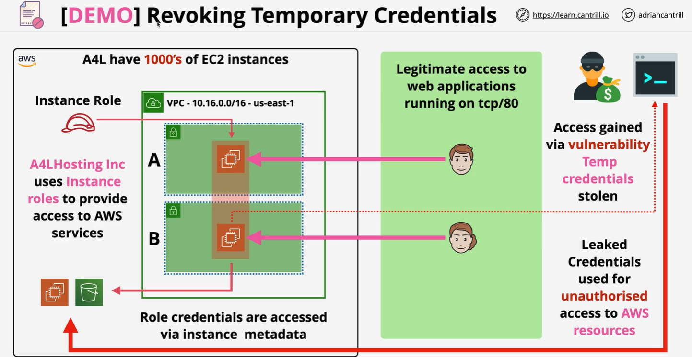

# **Revoking Temporary Credentials in AWS IAM** 🔒

Temporary credentials in AWS IAM provide short-term, limited access to AWS resources for users, roles, or services. These credentials are typically used when assuming a role or using AWS Security Token Service (STS). While they automatically expire after a set duration, you can mitigate their impact or restrict their use by implementing certain techniques.

---



---

## **Key Points About Temporary Credentials**

1. **Roles Can Be Assumed by Multiple Identities**:

   - A single role can be assumed by many users, services, or applications, and all of them share the same permissions defined in the role's permissions policy.

2. **Temporary Credentials Cannot Be Directly Revoked**:

   - AWS does not provide a direct API to revoke temporary credentials once they are issued.

3. **Impact of Policies on Credentials**:

   - **Trust Policy**: Changes to the trust policy prevent new sessions but do not impact existing credentials.
   - **Permissions Policy**: Changes to the permissions policy affect all active and future credentials immediately.

4. **Credential Duration**:

   - Temporary credentials can last from minutes to hours (default: 1 hour, maximum: 12 hours). If leaked, they are valid until they expire, making mitigation urgent.

5. **Revoke Sessions Through Permissions**:
   - You can revoke sessions effectively by implementing a policy that filters sessions based on their creation time.

---

## **How to Revoke or Restrict Temporary Credentials**

### 1. **Use the Session Revocation Mechanism**

AWS allows you to filter actions using a condition that checks the session creation time. By leveraging the `aws:TokenIssueTime` condition key, you can restrict or invalidate sessions issued before a specific time.

**Example:**

To revoke all sessions created before a specified time:

```json
{
  "Version": "2012-10-17",
  "Statement": [
    {
      "Effect": "Deny",
      "Action": "*",
      "Resource": "*",
      "Condition": {
        "DateLessThan": {
          "aws:TokenIssueTime": "2025-01-20T12:00:00Z"
        }
      }
    }
  ]
}
```

- **Effect**: Denies all actions for credentials issued before `2025-01-20T12:00:00Z`.
- **Impact**: This condition revokes older sessions while allowing new sessions created after the specified time.

### 2. **Delete the Role**

As a last resort, deleting the role invalidates all temporary credentials associated with it. However, this removes the role entirely and affects all users or services relying on it.

---

## **Example Scenario: Mitigating Leaked Temporary Credentials**

**Scenario:**

An IAM user named `DevUser` assumes the role `ExampleRole` and obtains temporary credentials. These credentials are leaked and need to be revoked.

**Steps to Mitigate:**

1. **Identify the Session**:

   - Use AWS CloudTrail to find the `AssumeRole` event and identify the user or service responsible.

2. **Revoke Older Sessions**:

   - Add a policy with a condition to deny credentials issued before the time of the leak:

   ```json
   {
     "Version": "2012-10-17",
     "Statement": [
       {
         "Effect": "Deny",
         "Action": "*",
         "Resource": "*",
         "Condition": {
           "DateLessThan": {
             "aws:TokenIssueTime": "2025-01-20T12:00:00Z"
           }
         }
       }
     ]
   }
   ```

---

## **Best Practices for Managing Temporary Credentials**

1. **Use Short Session Durations**:

   - Set the minimum session duration necessary for the task to reduce the exposure window.

2. **Monitor and Audit Regularly**:

   - Use AWS CloudTrail and Config to track the usage of temporary credentials and detect suspicious activities.

3. **Implement Fine-Grained Policies**:

   - Use conditions like `aws:TokenIssueTime` to revoke sessions when needed.

4. **Use Guardrails**:

   - Enforce security best practices using AWS Config rules, such as requiring MFA for role assumption or preventing overly permissive trust policies.

5. **Rotate Roles and Permissions**:
   - Periodically review and update roles and permissions to minimize the risk of misuse.

---

## **Summary**

- Temporary credentials in AWS cannot be directly revoked but can be mitigated by using conditions like `aws:TokenIssueTime`.
- Updating trust policies prevents new sessions, while changes to permissions policies impact all active sessions.
- Monitoring and proactive management are essential to minimize the risks of leaked or compromised credentials.
