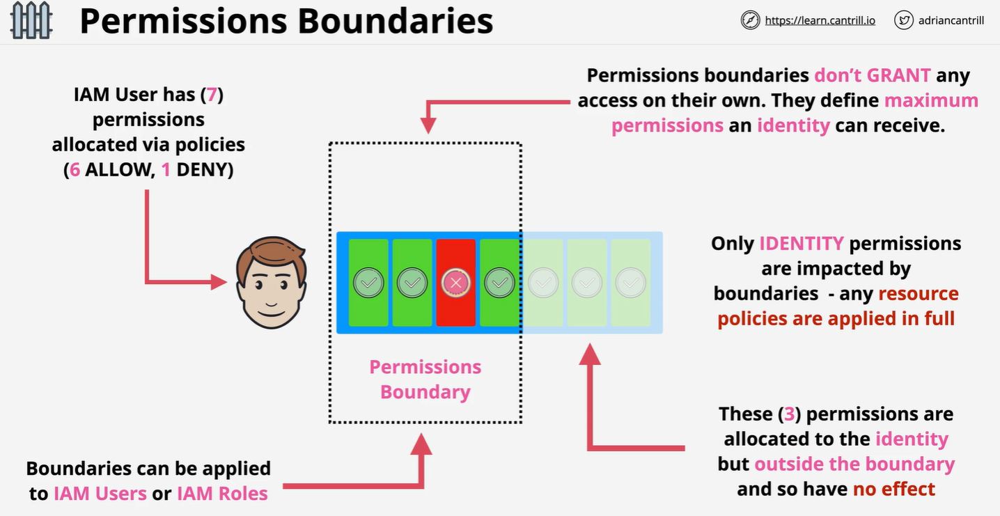

# **IAM Permissions Boundary** ♉

A **Permissions Boundary** is an advanced feature in IAM that defines the maximum permissions that can be granted to a user or a role. It is a policy that sets an upper limit on the permissions a user or role can obtain from their identity-based policies.

- **Doesn't Grant Permissions**: Permissions boundaries **do not grant** permissions themselves. Instead, they limit the permissions that can be granted by the identity-based policy.
- **Intersection of Permissions**: The effective permissions for an IAM entity are determined by the intersection of the identity-based policy and the permissions boundary.

---

<div style="text-align: center; padding: 0 20px">
    
</div>

---

## **Use Cases for Permissions Boundaries**

1. **Delegating Permissions Management**:

   - Delegate the ability to create roles or assign permissions to trusted employees, but restrict the level of permissions they can assign.

2. **Controlling Maximum Permissions**:
   - Prevent users from being granted excessive permissions, especially in production environments.

---

## **Example: Setting a Permissions Boundary for a User**

Let’s create an example where an administrator named **Hady** can only create S3 buckets in a specific region (e.g., `us-east-1`), even if other policies attempt to give broader permissions.

### Step 1: Create a Permissions Boundary Policy

The permissions boundary will restrict **Hady** to only have permission to create S3 buckets in the `us-east-1` region.

```json
{
  "Version": "2012-10-17",
  "Statement": [
    {
      "Effect": "Allow",
      "Action": "s3:CreateBucket",
      "Resource": "*",
      "Condition": {
        "StringEquals": {
          "s3:LocationConstraint": "us-east-1"
        }
      }
    }
  ]
}
```

- **Action**: `s3:CreateBucket` allows creating S3 buckets.
- **Resource**: `*` applies to all S3 buckets.
- **Condition**: Limits the creation of S3 buckets to the `us-east-1` region.

Save this policy with the name **`CreateS3BucketBoundary`**.

---

### Step 2: Attach the Permissions Boundary to the User

When creating or updating the user **Hady**, attach the permissions boundary:

```sh
aws iam put-user-permissions-boundary \
  --user-name Hady \
  --permissions-boundary arn:aws:iam::AccountID:policy/CreateS3BucketBoundary
```

---

### Step 3: Assign an Identity-Based Policy to the User

Even if **Hady** is assigned a policy with broader permissions, such as full S3 access, the permissions boundary will restrict them to only creating S3 buckets in the `us-east-1` region.

**Identity-Based Policy Example:**

```json
{
  "Version": "2012-10-17",
  "Statement": [
    {
      "Effect": "Allow",
      "Action": "s3:*",
      "Resource": "*"
    }
  ]
}
```

- This policy grants all S3 actions (`s3:*`).

**Effective Permissions:**

- The permissions boundary acts as a filter, ensuring **Hady** can only perform `s3:CreateBucket` in `us-east-1`, even though the identity-based policy tries to grant broader access.

---

## **How Permissions Boundaries Work**

1. **Intersection of Policies**:

   - Permissions = Identity Policy ∩ Permissions Boundary.
   - Only actions allowed by both the identity-based policy and the permissions boundary will be granted.

2. **Prevent Over-Privilege**:
   - If a permissions boundary excludes certain actions (e.g., creating buckets in other regions), those actions will not be allowed, even if included in the identity-based policy.

---

## **Summary**

- **Permissions Boundaries** set an upper limit on the permissions a user or role can have.
- They are especially useful for delegating permissions management and controlling access in sensitive environments.
- In the example, the administrator **Hady** was restricted to only creating S3 buckets in the `us-east-1` region by using a permissions boundary, ensuring secure and controlled access.
