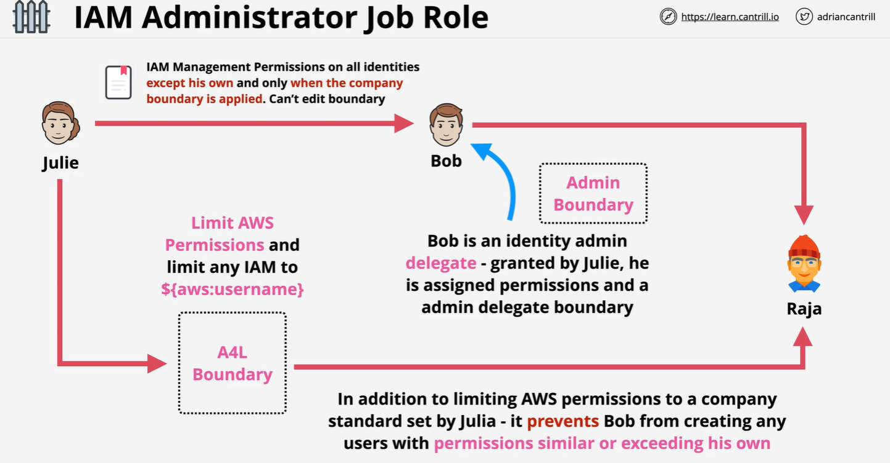

# **IAM Permissions Boundary** ♉

A **Permissions Boundary** is an advanced feature in IAM that defines the maximum permissions that can be granted to a user or a role. It is a policy that sets an upper limit on the permissions a user or role can obtain from their identity-based policies.

- **Doesn't Grant Permissions**: Permissions boundaries **do not grant** permissions themselves. Instead, they limit the permissions that can be granted by the identity-based policy.
- **Intersection of Permissions**: The effective permissions for an IAM entity are determined by the intersection of the identity-based policy and the permissions boundary.

---

<div style="text-align: center; padding: 0 20px">
    
</div>

---

## **Use Cases for Permissions Boundaries**

1. **Delegating Permissions Management**:

   - Delegate the ability to create roles or assign permissions to trusted employees, but restrict the level of permissions they can assign.

2. **Controlling Maximum Permissions**:
   - Prevent users from being granted excessive permissions, especially in production environments.

---

## **How Permissions Boundaries Work**

1. **Intersection of Policies**:

   - Permissions = Identity Policy ∩ Permissions Boundary.
   - Only actions allowed by both the identity-based policy and the permissions boundary will be granted.

2. **Prevent Over-Privilege**:
   - If a permissions boundary excludes certain actions (e.g., creating buckets in other regions), those actions will not be allowed, even if included in the identity-based policy.

---

## **Examples: Setting a Permissions Boundary for a User**

Let’s create an example where an administrator named **Hady** can only create S3 buckets in a specific region (e.g., `us-east-1`), even if other policies attempt to give broader permissions.

**Step 1: Create a Permissions Boundary Policy:**

The permissions boundary will restrict **Hady** to only have permission to create S3 buckets in the `us-east-1` region.

```json
{
  "Version": "2012-10-17",
  "Statement": [
    {
      "Effect": "Allow",
      "Action": "s3:CreateBucket",
      "Resource": "*",
      "Condition": {
        "StringEquals": {
          "s3:LocationConstraint": "us-east-1"
        }
      }
    }
  ]
}
```

- **Action**: `s3:CreateBucket` allows creating S3 buckets.
- **Resource**: `*` applies to all S3 buckets.
- **Condition**: Limits the creation of S3 buckets to the `us-east-1` region.

Save this policy with the name **`CreateS3BucketBoundary`**.

**Step 2: Attach the Permissions Boundary to the User:**

When creating or updating the user **Hady**, attach the permissions boundary:

```sh
aws iam put-user-permissions-boundary \
  --user-name Hady \
  --permissions-boundary arn:aws:iam::AccountID:policy/CreateS3BucketBoundary
```

**Step 3: Assign an Identity-Based Policy to the User:**

Even if **Hady** is assigned a policy with broader permissions, such as full S3 access, the permissions boundary will restrict them to only creating S3 buckets in the `us-east-1` region.

```json
// **Identity-Based Policy Example:**
{
  "Version": "2012-10-17",
  "Statement": [
    {
      "Effect": "Allow",
      "Action": "s3:*",
      "Resource": "*"
    }
  ]
}
```

- This policy grants all S3 actions (`s3:*`).

**Effective Permissions:**

- The permissions boundary acts as a filter, ensuring **Hady** can only perform `s3:CreateBucket` in `us-east-1`, even though the identity-based policy tries to grant broader access.

---

## Use Case: Using Boundary Permissions for Admin and User Creation

This scenario demonstrates how to create an admin user (`bob`) and a regular user (`hady`) while enforcing permissions boundaries to ensure compliance and security. The admin has specific permissions to manage users and resources but cannot exceed defined boundaries. Similarly, the user has limited permissions based on the applied boundary.

---



---

### **Step 1: Create Admin (`bob`)**

#### 1.1 **Create Admin User**

Use the AWS CLI to create the admin user `bob`.

```bash
aws iam create-user --user-name bob
```

#### 1.2 **Attach Admin Policy**

Attach the **admin policy** to `bob` to grant permissions for managing IAM resources and limited CloudWatch actions.

```bash
aws iam put-user-policy --user-name bob \
--policy-name AdminPolicy \
--policy-document '{
  "Version": "2012-10-17",
  "Statement": [
      {
          "Sid": "IAM",
          "Effect": "Allow",
          "Action": "iam:*",
          "Resource": "*"
      },
      {
          "Sid": "CloudWatchLimited",
          "Effect": "Allow",
          "Action": [
              "cloudwatch:GetDashboard",
              "cloudwatch:GetMetricData",
              "cloudwatch:ListDashboards",
              "cloudwatch:GetMetricStatistics",
              "cloudwatch:ListMetrics"
          ],
          "Resource": "*"
      }
  ]
}'
```

#### 1.3 **Attach Admin Boundary**

Attach the **adminboundary** permissions boundary to `bob` to ensure actions are restricted.

```json
// adminboundary
{
  "Version": "2012-10-17",
  "Statement": [
    {
      "Sid": "CreateOrChangeOnlyWithBoundary",
      "Effect": "Allow",
      "Action": [
        "iam:CreateUser",
        "iam:DeleteUserPolicy",
        "iam:AttachUserPolicy",
        "iam:DetachUserPolicy",
        "iam:PutUserPermissionsBoundary",
        "iam:PutUserPolicy"
      ],
      "Resource": "*",
      "Condition": {
        "StringEquals": { "iam:PermissionsBoundary": "arn:aws:iam::MANAGEMENTACCOUNTNUMBER:policy/userboundary" }
      }
    },
    {
      "Sid": "CloudWatchAndOtherIAMTasks",
      "Effect": "Allow",
      "Action": [
        "cloudwatch:*",
        "iam:GetUser",
        "iam:ListUsers",
        "iam:DeleteUser",
        "iam:UpdateUser",
        "iam:CreateAccessKey",
        "iam:CreateLoginProfile",
        "iam:GetAccountPasswordPolicy",
        "iam:GetLoginProfile",
        "iam:ListGroups",
        "iam:ListGroupsForUser",
        "iam:CreateGroup",
        "iam:GetGroup",
        "iam:DeleteGroup",
        "iam:UpdateGroup",
        "iam:CreatePolicy",
        "iam:DeletePolicy",
        "iam:DeletePolicyVersion",
        "iam:GetPolicy",
        "iam:GetPolicyVersion",
        "iam:GetUserPolicy",
        "iam:GetRolePolicy",
        "iam:ListPolicies",
        "iam:ListPolicyVersions",
        "iam:ListEntitiesForPolicy",
        "iam:ListUserPolicies",
        "iam:ListAttachedUserPolicies",
        "iam:ListRolePolicies",
        "iam:ListAttachedRolePolicies",
        "iam:SetDefaultPolicyVersion",
        "iam:SimulatePrincipalPolicy",
        "iam:SimulateCustomPolicy"
      ],
      "NotResource": "arn:aws:iam::MANAGEMENTACCOUNTNUMBER:user/bob"
    },
    {
      "Sid": "NoBoundaryPolicyEdit",
      "Effect": "Deny",
      "Action": [
        "iam:CreatePolicyVersion",
        "iam:DeletePolicy",
        "iam:DeletePolicyVersion",
        "iam:SetDefaultPolicyVersion"
      ],
      "Resource": [
        "arn:aws:iam::MANAGEMENTACCOUNTNUMBER:policy/userboundary",
        "arn:aws:iam::MANAGEMENTACCOUNTNUMBER:policy/userboundary"
      ]
    },
    {
      "Sid": "NoBoundaryUserDelete",
      "Effect": "Deny",
      "Action": "iam:DeleteUserPermissionsBoundary",
      "Resource": "*"
    }
  ]
}
```

```bash
aws iam put-user-permissions-boundary --user-name bob \
--permissions-boundary arn:aws:iam::MANAGEMENTACCOUNTNUMBER:policy/adminboundary
```

---

### **Step 2: Admin (`bob`) Creates User (`hady`)**

#### 2.1 **Log In as Admin (`bob`)**

Switch to the `bob` account for the next operations.

#### 2.2 **Create User (`hady`)**

Use the AWS CLI to create the user `hady`.

```bash
aws iam create-user --user-name hady
```

#### 2.3 **Attach User Policy**

Attach the **user policy** to `hady` to grant permissions for managing EC2 resources in the `us-west-2` region.

```bash
aws iam put-user-policy --user-name hady \
--policy-name ManageEC2Policy \
--policy-document '{
  "Version": "2012-10-17",
  "Statement": [
      {
          "Sid": "ManageEC2",
          "Effect": "Allow",
          "Action": "ec2:*",
          "Resource": "*",
          "Condition": {
              "StringEquals": {
                  "aws:RequestedRegion": "us-west-2"
              }
          }
      }
  ]
}'
```

#### 2.4 **Attach User Boundary**

Attach the **userboundary** to `hady` to restrict their actions to specific services.

```json
// userboundary
{
  "Version": "2012-10-17",
  "Statement": [
    {
      "Sid": "ServicesLimitViaBoundaries",
      "Effect": "Allow",
      "Action": ["s3:*", "cloudwatch:*", "ec2:*"],
      "Resource": "*"
    },
    {
      "Sid": "AllowIAMConsoleForCredentials",
      "Effect": "Allow",
      "Action": ["iam:ListUsers", "iam:GetAccountPasswordPolicy"],
      "Resource": "*"
    },
    {
      "Sid": "AllowManageOwnPasswordAndAccessKeys",
      "Effect": "Allow",
      "Action": [
        "iam:*AccessKey*",
        "iam:ChangePassword",
        "iam:GetUser",
        "iam:*ServiceSpecificCredential*",
        "iam:*SigningCertificate*"
      ],
      "Resource": ["arn:aws:iam::*:user/${aws:username}"]
    }
  ]
}
```

```bash
aws iam put-user-permissions-boundary --user-name hady \
--permissions-boundary arn:aws:iam::MANAGEMENTACCOUNTNUMBER:policy/userboundary
```

---

### **Summary**

#### **Admin (`bob`)**

- **Permissions**: Full IAM management and limited CloudWatch capabilities.
- **Boundary**: Restricted by `adminboundary`, ensuring compliance with organizational policies.

#### **User (`hady`)**

- **Permissions**: Manage EC2 resources in the `us-west-2` region.
- **Boundary**: Restricted by `userboundary`, ensuring actions are limited to defined services and regions.

---

### **Verification**

1. **Check Boundaries for `bob`:**

   ```bash
   aws iam get-user --user-name bob
   aws iam get-user-permissions-boundary --user-name bob
   ```

2. **Check Boundaries and Policies for `hady`:**

   ```bash
   aws iam get-user --user-name hady
   aws iam get-user-policy --user-name hady --policy-name ManageEC2Policy
   aws iam get-user-permissions-boundary --user-name hady
   ```

## **Summary**

- **Permissions Boundaries** set an upper limit on the permissions a user or role can have.
- They are especially useful for delegating permissions management and controlling access in sensitive environments.
- In the example, the administrator **Hady** was restricted to only creating S3 buckets in the `us-east-1` region by using a permissions boundary, ensuring secure and controlled access.
