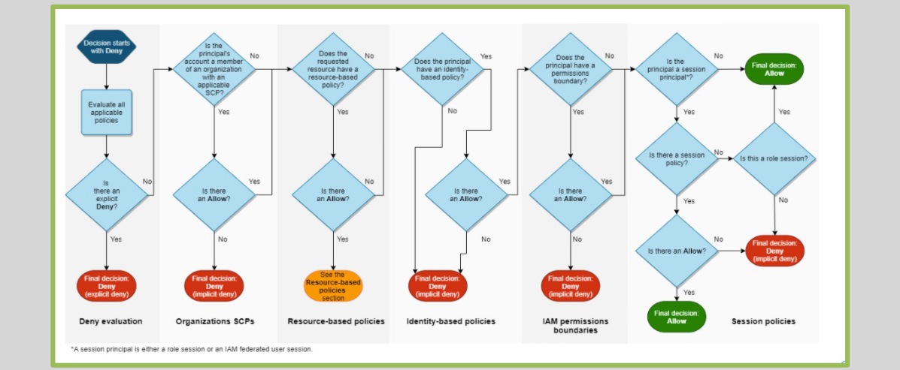

# **IAM Policy Evaluation Logic (Within an AWS Account)** 🔍

The IAM policy evaluation logic helps AWS determine whether a specific action is allowed or denied based on the policies attached to the user, group, or role. Here’s a simple breakdown of the evaluation process:

1. **All policies are evaluated**: Both identity-based policies (attached to the user) and resource-based policies (attached to the resource).
2. **Explicit Deny overrides Allow**: If there is an explicit deny in any of the policies, it takes precedence over any allow statement.
3. **Implicit Deny by Default**: If there is no matching allow, access is implicitly denied.

## **IAM Policy Evaluation Process** 🔄

The IAM policy evaluation process determines whether a request is allowed or denied based on the attached policies. Here's how AWS evaluates policies:

1. **Check all policies**: AWS checks all policies attached to the identity (user, role, etc.) and to the resource.

2. **Default Deny**: All requests are **denied by default** unless explicitly allowed.

3. **Allow or Deny Evaluation**: AWS applies the **explicit allow** first, and if there’s any conflict, it checks for **explicit deny**.

4. **Final Decision**: The final decision is made based on the evaluation of all policies.
