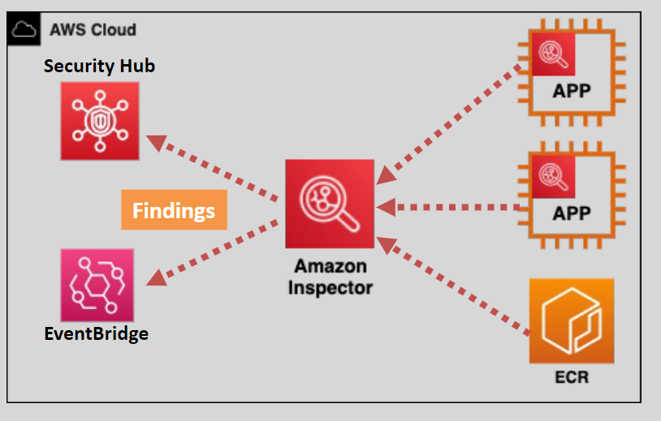

# Amazon Inspector 🔍

Amazon Inspector is a **vulnerability management service** that continuously monitors and assesses your AWS workloads for **security risks**. It helps you identify potential weaknesses in your infrastructure and applications, allowing you to address them proactively and maintain a strong security posture.

  

---

## 🌟 **What is Vulnerability Assessment?**

A **vulnerability assessment** is the process of identifying, quantifying, and analyzing security weaknesses in your IT systems.

### Why is it important?

- Prevents attackers from exploiting vulnerabilities.
- Minimizes risks by identifying and addressing security gaps before they cause damage.
- A recommended **best practice** for all deployed resources and applications.

---

## 🔒 **What is Amazon Inspector?**

Amazon Inspector is a **cloud-native security assessment service** designed to enhance the security of your applications and workloads in AWS.

### **Key Capabilities:**

- **Continuous Scanning**: Automatically discovers and scans EC2 instances and container images in **Amazon Elastic Container Registry (ECR)** for vulnerabilities.
- **Security Insights**: Provides a detailed list of findings, prioritized by severity.
- **Integration with AWS Services**:
  - Sends findings to **EventBridge** for automation.
  - Shares findings with **Security Hub** for centralized visibility.

### **How it Works:**

- **SSM Agent**: The service relies on the **AWS Systems Manager (SSM) agent** installed in EC2 instances to collect data for analysis.
- **Application-by-Application Scans**: Scans can be configured to run for specific applications or environments.
- **Actionable Insights**: Outputs clear and actionable reports, making it easier for teams to address vulnerabilities.

---

## 🛠 **Amazon Inspector Assessments**

### **Security Assessments:**

Amazon Inspector uses **predefined rules** created by AWS security experts to assess your environment. Assessments are categorized into two main types:

1. **Host Assessment** 🖥️

   - Requires the Inspector agent to be installed.
   - Scans for vulnerabilities within the operating system and software on EC2 instances.
   - Data is transmitted securely over **TLS** in near real-time.

2. **Network Assessment** 🌐
   - Does not require an agent.
   - Analyzes network configurations to identify misconfigurations or potential exposure.

### **Scheduling Assessments:**

- Assessments can be run **once** or scheduled **weekly** for ongoing monitoring (recommended).

---

## 🤔 **Why Use Amazon Inspector?**

1. **Proactive Risk Management**:  
   Identifies vulnerabilities before they can be exploited.

2. **Prioritized Findings**:  
   Focus on critical issues with severity-based prioritization.

3. **Seamless Integration**:  
   Works with **AWS EventBridge** for automated responses and **Security Hub** for centralized management.

4. **Development-Friendly**:  
   Integrates security assessments into **CI/CD pipelines**, making vulnerability checks a routine part of development and deployment.

---

## 🛡 **Amazon Inspector vs. Amazon GuardDuty**

| **Service**    | **GuardDuty**                                                                                                                | **Inspector**                                                                                                         |
| -------------- | ---------------------------------------------------------------------------------------------------------------------------- | --------------------------------------------------------------------------------------------------------------------- |
| **Purpose**    | Detects attacks or threats by analyzing logs (e.g., unusual activities). It is like an **Intrusion Detection System (IDS)**. | Identifies vulnerabilities, ensuring no risks exist even if an attack occurs. Focuses on **detecting security gaps**. |
| **Scope**      | Analyzes account-wide activities and logs.                                                                                   | Performs host-level and network-level vulnerability assessments.                                                      |
| **Use Case**   | Best for detecting active threats and malicious activities.                                                                  | Ideal for identifying weaknesses in your environment that could be exploited.                                         |
| **Activation** | Can be enabled for a single AWS account or across multiple accounts in **AWS Organizations**.                                | Can also be enabled for a single account or across **AWS Organizations**.                                             |

---

## ✅ **Conclusion**

Amazon Inspector simplifies **vulnerability management** for your AWS workloads by providing continuous, automated scanning and actionable insights. By proactively identifying security gaps, you can strengthen your applications and infrastructure while maintaining compliance with security best practices. For enhanced visibility and control, integrate Amazon Inspector with other AWS security services like **EventBridge** and **Security Hub**.
