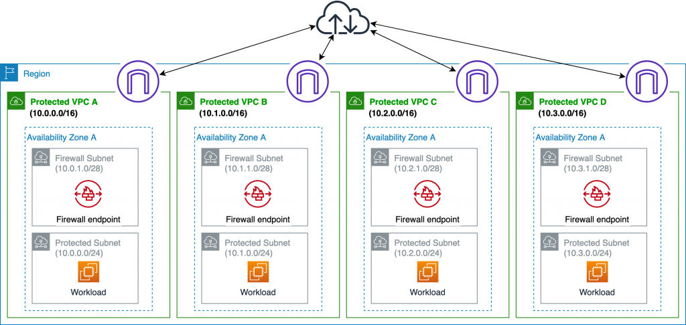

# AWS Network Firewall 🛡️

`Advanced Network Protection for Your VPCs`

AWS Network Firewall is a **stateful**, **highly available**, and **scalable network firewall** service designed to protect your **Virtual Private Cloud (VPC)**. It provides robust security with **intrusion detection and prevention (IDS/IPS)** capabilities, helping secure your network perimeter and internal traffic.

---

  

---

## 🌟 **What is AWS Network Firewall?**

AWS Network Firewall is built to:

- **Filter Traffic**: Control inbound, outbound, and east-west (between VPCs) traffic.
- **Prevent Threats**: Detect and block malicious traffic using custom rules and **Suricata**, an open-source intrusion detection and prevention engine.
- **Inspect Packets**: Perform **deep packet inspection** to analyze and block unwanted protocols or payloads.

---

## 🔑 **Key Features**

1. **Traffic Filtering**

   - Apply rules to filter traffic at the **VPC perimeter**, including:
     - Traffic to/from **Internet Gateway** or **NAT Gateway**.
     - Traffic between VPCs using **Transit Gateway**.

2. **Stateful Protocol Filtering**

   - Detect and filter protocols (e.g., HTTPS) based on stateful analysis, independent of the port used.

3. **Custom and Predefined Rules**

   - Use custom rules or predefined **Suricata rules** for IDS/IPS.
   - Restrict traffic to/from **known domains** or **IP address endpoints**.

4. **Domain Filtering**

   - Allow or block traffic based on domain names, limiting access to specific applications or services.

5. **Integration with Firewall Manager**

   - Centrally manage and apply Network Firewall rules across accounts using **AWS Firewall Manager**.

6. **High Availability and Scalability**
   - Automatically scales to handle fluctuating traffic loads.
   - Redundant endpoints across Availability Zones ensure high availability.

---

## 🛠 **How to Use AWS Network Firewall**

1. **VPC Setup**:

   - Create a subnet in each Availability Zone specifically for the firewall endpoints.
   - Firewalls cannot protect workloads within the same subnet.

2. **Deploying Rules**:

   - Configure rule groups for inbound, outbound, or east-west traffic.
   - Combine custom rules and predefined Suricata rules for advanced protection.

3. **Traffic Inspection**:

   - Apply **deep packet inspection** for traffic entering or leaving the VPC.
   - Detect and filter protocols like HTTPS or SSH, regardless of the port.

4. **Integration**:
   - Use **Transit Gateway** to route traffic through Network Firewall between multiple VPCs.

---

## 💰 **Pricing**

- **Firewall Endpoint**: \$0.0395/hour.
- **Traffic Processing**: \$0.065/GB.

---

## 🤔 **AWS Network Firewall vs AWS WAF**

| **Feature**               | **AWS Network Firewall**                                                     | **AWS WAF**                                                                                    |
| ------------------------- | ---------------------------------------------------------------------------- | ---------------------------------------------------------------------------------------------- |
| **Purpose**               | Protects **network traffic** at the VPC level (perimeter or between VPCs).   | Protects **web applications** and APIs against common web exploits like SQL injection and XSS. |
| **Traffic Scope**         | Filters **VPC traffic** (inbound, outbound, and east-west).                  | Filters **HTTP/S traffic** for applications served via CloudFront, ALB, or API Gateway.        |
| **Use Case**              | Designed for network-level security and intrusion prevention (IDS/IPS).      | Focused on application-layer attacks, such as OWASP Top 10 vulnerabilities.                    |
| **Inspection Capability** | Deep packet inspection with Suricata rules for detecting malicious patterns. | Monitors HTTP/S requests based on Web ACLs (e.g., IP-based, geo-location, request patterns).   |
| **Rule Customization**    | Highly customizable, supports stateful and stateless rules.                  | Includes managed rule sets for OWASP Top 10 and supports custom Web ACL rules.                 |
| **Integration**           | Integrated with **Firewall Manager** for centralized rule management.        | Integrates with **CloudFront**, **ALB**, **API Gateway**, and **AppSync**.                     |
| **Pricing Model**         | Based on the number of firewall endpoints and volume of processed traffic.   | Pay-as-you-go pricing based on the number of rules and web requests evaluated.                 |

---

## ✅ **Conclusion**

AWS Network Firewall is ideal for securing your **network traffic** at the VPC level, offering advanced protection with IDS/IPS capabilities and deep packet inspection. While **AWS WAF** focuses on safeguarding **web applications and APIs**, **AWS Network Firewall** addresses broader network security requirements, making them complementary solutions for securing your AWS environment. Together, they provide comprehensive protection across both network and application layers.

## Reference

[https://aws.amazon.com/blogs/networking-and-content-delivery/deployment-models-for-aws-network-firewall/](https://aws.amazon.com/blogs/networking-and-content-delivery/deployment-models-for-aws-network-firewall/)

  
  
  

