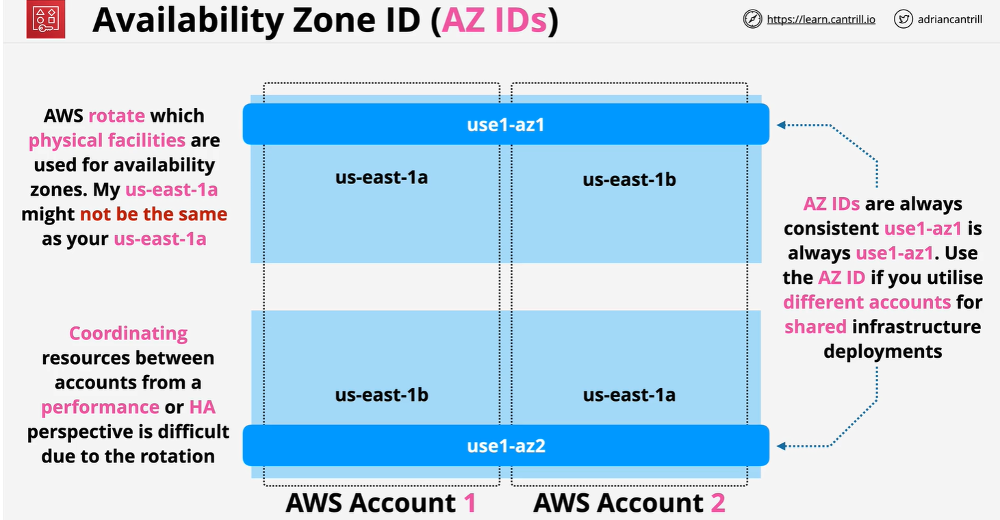

# Availability Zone ID

An **Availability Zone ID** is a **unique, immutable identifier** for an AWS **Availability Zone (AZ)** within a region. Each AZ ID is consistent across accounts, ensuring that you can refer to the same physical infrastructure irrespective of account or region mapping differences.

For example:

- **Region**: `us-east-1`
- **Availability Zone Names**: `us-east-1a`, `us-east-1b`
- **Availability Zone IDs**: `use1-az1`, `use1-az2`

---



---

## **Key Differences Between AZ Names and AZ IDs**

1. **AZ Name (e.g., `us-east-1a`)**:

   - Account-specific.
   - The AZ named `us-east-1a` in one account might correspond to `us-east-1b` in another account.
   - Naming differences help balance workloads across AWS customers.

2. **AZ ID (e.g., `use1-az1`)**:
   - Globally consistent.
   - The same AZ ID (`use1-az1`) refers to the same physical infrastructure across all accounts.

---

## **Why Availability Zone IDs Are Important**

1. **Cross-Account Consistency**:

   - When deploying resources across multiple AWS accounts, using AZ IDs ensures all resources are deployed in the **same physical AZ**, regardless of the AZ name in each account.

   Example:

   - In Account A, `us-east-1a` maps to `use1-az1`.
   - In Account B, `us-east-1b` also maps to `use1-az1`.
   - Using `use1-az1` guarantees that both accounts use the same physical location.

2. **Reliable Disaster Recovery**:

   - AZ IDs help design disaster recovery solutions where specific physical zones must match across accounts.

3. **Load Balancing and Resilience**:

   - Ensures even distribution of workloads across physically distinct zones by explicitly identifying zones through AZ IDs.

4. **Networking and VPC Peering**:
   - When peering VPCs across accounts, AZ IDs allow you to accurately map subnets in the same physical AZ for optimized inter-AZ data transfer.

---

## **Practical Use Case Example**

**Scenario**: Multi-Account Deployment
You have two accounts (Account A and Account B) and want to deploy EC2 instances in the same physical AZ.

1. **Get AZ IDs in Each Account**:

   ```bash
   aws ec2 describe-availability-zones --query 'AvailabilityZones[*].[ZoneName, ZoneId]' --output table
   ```

   Example Output for Account A:

   ```ini
   -----------------------
   | ZoneName   | ZoneId |
   -----------------------
   | us-east-1a | use1-az1 |
   | us-east-1b | use1-az2 |
   ```

   Example Output for Account B:

   ```ini
   -----------------------
   | ZoneName   | ZoneId |
   -----------------------
   | us-east-1b | use1-az1 |
   | us-east-1c | use1-az2 |
   ```

2. **Deploy Resources Using AZ IDs**:
   - Use `use1-az1` in both accounts to ensure the resources are deployed in the same physical AZ.

---

## **Best Practices with AZ IDs**

- Use AZ IDs instead of AZ names for multi-account setups to ensure consistency.
- When designing fault-tolerant applications, deploy resources in different AZ IDs (e.g., `use1-az1` and `use1-az2`) for resilience.
- Always retrieve AZ IDs dynamically in scripts to avoid hardcoding and ensure compatibility across regions.
