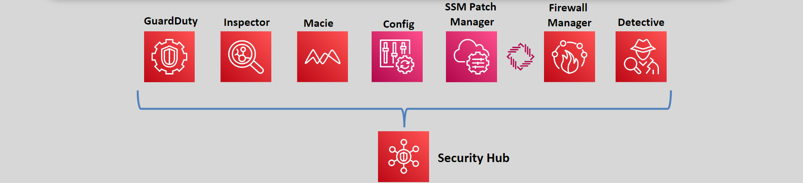

# AWS Security Hub 🛡️

AWS Security Hub is a **cloud-native security and compliance service** that provides a `comprehensive view` of your AWS environment's security posture. By aggregating security findings from multiple AWS services, third-party solutions, and custom tools, it simplifies threat detection, compliance checks, and response automation.

---

  

---

## 🌟 **What is AWS Security Hub?**

AWS Security Hub is designed to:

- **Centralize Security Findings**: Collects and displays security data from multiple sources in a `single dashboard`.
- **Automate Compliance Checks**: Continuously evaluates resources against security frameworks like:
  - **CIS AWS Foundations Benchmark**
  - **AWS Foundational Security Best Practices**
- **Enable Proactive Security**: Integrates with **EventBridge** to automate remediation actions and streamline security operations.

---

## 🔑 **Key Benefits**

1. **Centralized Security Management**

   - Consolidates findings from AWS services, **AWS Partner Network (APN) solutions**, and custom tools.
   - Ensures all security insights are available in one place.

2. **Automated Compliance Checks**

   - Continuously evaluates your environment for compliance with security standards.
   - Flags non-compliant resources for corrective action.

3. **Proactive Threat Response**

   - Integrates with **Amazon EventBridge** to trigger automated responses to security issues.
   - Enables faster remediation, reducing potential risks.

4. **Actionable Insights**
   - Groups related findings into **Security Hub Insights**, highlighting areas that need attention.
   - Helps prioritize risks by severity, focusing on critical threats.

---

## 🔗 **Integration with AWS Services**

AWS Security Hub integrates seamlessly with:

- **Amazon GuardDuty**: Detects and monitors active threats like unauthorized access.
- **Amazon Inspector**: Identifies vulnerabilities in EC2 instances and container images.
- **Amazon Macie**: Monitors and protects sensitive data in S3 buckets.
- **AWS Config**: Tracks and evaluates resource configurations for compliance.

It also supports third-party security tools and custom integrations via APIs.

---

## 🛠 **How AWS Security Hub Works**

1. **Aggregate Security Findings**

   - Collects data from integrated AWS services, third-party tools, and custom sources.
   - Encrypts findings at rest for secure storage.

2. **Evaluate Compliance**

   - Runs automatic security checks against industry standards and best practices.
   - Highlights non-compliant resources for immediate attention.

3. **Automate Responses**

   - Uses **EventBridge** to trigger notifications or automated remediation actions.

4. **Gain Insights**
   - Consolidates findings into actionable insights, making it easier to address vulnerabilities.

---

## 💰 **Pricing**

- **30-Day Free Trial**: Evaluate Security Hub without incurring charges.
- **Post-Trial Costs**: Based on:
  - Number of **security checks performed**.
  - Volume of **findings ingested**.

---

## 🤔 **Why Use AWS Security Hub?**

1. **Centralized Management**

   - Provides a unified dashboard to monitor and manage security across multiple accounts and regions.

2. **Improved Compliance**

   - Continuously checks for adherence to security standards, reducing the risk of non-compliance.

3. **Proactive Security**

   - Automates remediation, enabling faster responses to potential threats.

4. **Scalability**
   - Works seamlessly across multiple accounts using **AWS Organizations**.

---

## ✅ **Conclusion**

AWS Security Hub is an essential service for modern cloud environments, offering a centralized view of security findings, automated compliance checks, and integration with other AWS and third-party tools. By simplifying security management and enabling proactive threat responses, Security Hub helps organizations enhance their security posture and reduce risks effectively. Whether you’re managing a single AWS account or multiple accounts, Security Hub ensures robust, scalable security operations.
