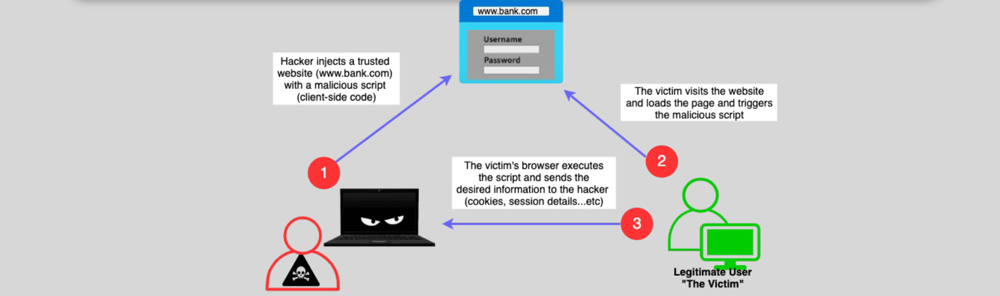

# AWS WAF

## Perquisite

### What is Web Application Firewall (WAF)

A Web application firewall can be used to protect web (HTTP and HTTPS) applications or APIs against common web exploits and attack patterns that may affect availability, compromise security, or consume excessive resources.

- It can be configured with policies to block common web exploits and attack patterns.
- It monitors HTTP/S traffic between the internet (clients) and the applications

### What is Cross-Site Scripting (XSS) Attack ?

A hacker injects a script into a website that runs when a legitimate website user loads a page.

- The script runs in the user’s browser (client-side code) and sends sensitive information to the attacker.

### What is SQL Injection Attack

A hacker injects or inserts an SQL query in the input data to an application.

- The SQL query executes and provides the hacker access to the data or the database itself.

## What is AWS WAF

AWS WAF is a web application firewall that allows for protecting HTTP/s applications or APIs against common web exploits and attack patterns that may affect availability, compromise security, or consume excessive resources.

- It can be used with `CloudFront`, `API Gateway`, `ALB`, `Cognito user pools`, or `AppSync`, When enabled, AWS WAF monitors HTTP/s requests **forwarded** to these services.

---

- AWS WAF can be used to control access to apps based on conditions we specify.
- It can also be used or protect external websites (off-AWS) when used with CloudFront.
- AWS WAF includes a full-featured API that can be used to fully automated the WAF rules.

---

- Using WAF, we can control how the supported services respond to requests with an HTTP 403 (forbidden) when the requests are not allowed.
- We can configure CloudFront to return a custom error page if the decision made is to block the request.

## AWS WAF Features

- AWS WAF supports IPv6.
- AWS WAF Integrates with CloudTrail.
- Using CloudWatch metrics, we can monitor web requests and web ACLs and rules.
- We can send WAF Web ACL traffic logs to S3, Kinesis Data Firehose, or CloudWatch Logs.
- WAF protects against `Cross-Site Scripting (XSS)` and `SQL Injection attacks`.
- Pay for what you use pricing (How many rules and how many web requests)

## AWS WAF Web ACLs

AWS WAF web ACLs are required to filter web traffic and make allow/block decisions.

- Web ACLs consist of rules (filters).
- Rules can perform allow, deny, `CAPTCHA`, or just count actions.
- A default action is used if no match occurs.

**We can filter based on:**

- `Source IP address`,
- `Geo-location` (Country of the origin of the request),
- Values in the HTTP/S request headers,
- Query strings,
- Request length,
- Presence of scripts or SQL code.
- We can also configure `rate-based limit` rules from a given IP address(es)

### Web ACLs – How Do They Work

- The supported service forwards the received HTTP/s requests to WAF for an allow/block decision.
- Geographic match rule statements allow, or block requests based on the country of origin.
- WAF bot control can be used to gain visibility into Bot activity on your resources and control (allow/block) it.

### Web ACLs – Cognito User Pools

- WAF can be used to protect Cognito user pools from web-based attacks and unwanted bots.
- We can also use WAF to enforce rate limits and allow or block traffic to Cognito user pools.

## Route 53 Geo Location vs. CloudFront Geo Location vs. WAF Geo Filtering

When you use CloudFront geo restriction feature to block a country from accessing your content;

- Any request from that country is blocked and is not forwarded to AWS WAF.
- If you need to allow or block requests based on a geography plus other AWS WAF criteria, then do not use the CloudFront geo restriction feature, Instead, you should use an AWS WAF geo match statement.

| Service                    | CloudFront                                                    | Route 53                                                                                                  | WAF                                                           |
| -------------------------- | ------------------------------------------------------------- | --------------------------------------------------------------------------------------------------------- | ------------------------------------------------------------- |
| Meaning of the Geo feature | Filter out (block) traffic from certain regions or countries. | Confine access to the traffic to a certain region. It is not meant to be a filtering or blocking service. | Filter out (block) traffic from certain regions or countries. |
