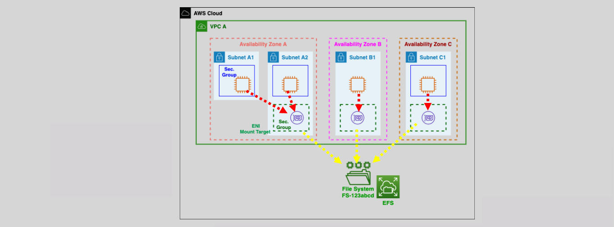
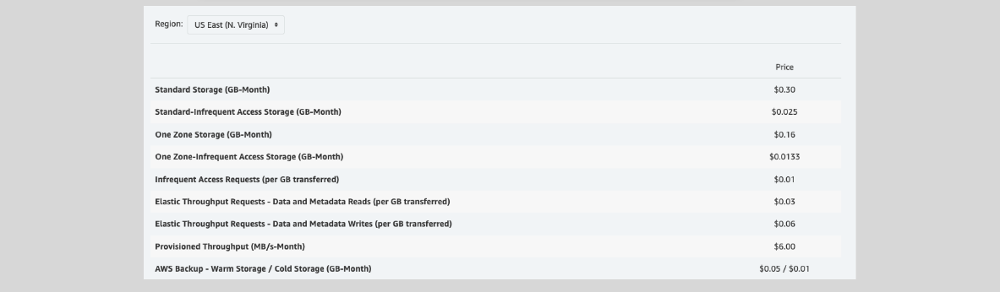

# 📁 **Amazon EFS Storage Classes**

Optimize your Amazon Elastic File System (EFS) usage with various **Storage Classes** tailored to different access patterns and cost requirements. Understanding these classes helps you balance performance, durability, and cost-efficiency for your workloads.

  

---

## 🌟 **1. Standard Class (Multi-AZ)**

### 🟢 **EFS Standard**

- **Description:** Default storage class for EFS.
- **Usage:** Ideal for **frequently accessed** files.
- **Features:**
  - High durability and availability across multiple Availability Zones (AZs).
  - Suitable for active workloads requiring consistent performance.

### 🟠 **EFS Standard-IA (Infrequent Access)**

- **Description:** Optimized for **infrequently accessed** data.
- **Usage:** Perfect for **audit data**, **historical analysis**, and **backup & recovery**.
- **Benefits:**
  - **Lower Storage Cost:** More cost-effective for data that doesn't need to be accessed daily.
  - **Per GB Retrieval Fee:** Charges apply when accessing data stored in IA.

---

## 🟡 **2. One Zone Class (Single AZ)**

### 🔵 **EFS One Zone**

- **Description:** Storage class for data accessed frequently within a single AZ.
- **Usage:** Best for applications that require **high performance** within one AZ.
- **Features:**
  - Cost-effective for workloads confined to a single AZ.
  - Maintains high availability within the chosen AZ.

### 🟣 **EFS One Zone-IA (Infrequent Access)**

- **Description:** Combines single AZ storage with infrequent access.
- **Usage:** Suitable for **audit data**, **historical analysis**, and **backup & recovery** within one AZ.
- **Benefits:**
  - **Lower Storage Cost:** More affordable for rarely accessed data.
  - **Per GB Retrieval Fee:** Applicable when accessing IA data.

#### 📝 **One Zone Class Notes**

- **Automatic Backups:** AWS automatically backs up One Zone storage using AWS Backup.
- **Replication:** Backups are replicated to three AZs, enabling restoration in different AZs or regions.

---

## 💡 **3. EFS Intelligent-Tiering**

### ⚖️ **Intelligent-Tiering**

- **Description:** Automatically manages data between **Standard** and **Standard-IA** based on access patterns.
- **Usage:** Ideal for workloads with **variable access patterns**.
- **Features:**
  - **Lifecycle Management:** Moves files to IA after **30 days** of no access.
  - **Automatic Recovery:** Moves files back to Standard upon first access after being in IA.

---

## 🔄 **EFS Lifecycle Management**

Automate data movement between storage classes to optimize costs and performance.

### 🔑 **Lifecycle Policies:**

1. **Transition into IA:**
   - Move files to IA after a specified period of inactivity (e.g., 30 days).
2. **Transition out of IA:**
   - Restore files to Standard upon first access.

### 🛠️ **Configuration:**

- **Enable/Disable:** Lifecycle policies can be enabled, modified, or stopped on existing EFS file systems.
- **Scope:** Apply policies to all objects or specific subsets based on tags or prefixes.

---

## 💸 **Pricing Overview**

- **Free Tier:** 5 GB/month in EFS Standard for the first 12 months.
- **Storage Costs:** Vary based on the chosen storage class (Standard, Standard-IA, One Zone, etc.).
- **Retrieval Fees:** Applicable for IA storage classes upon data access.

  

---

## 🌟 **Benefits of Choosing the Right EFS Storage Class**

### 🚀 **Performance Optimization**

- **High Throughput:** Achieve up to **10 GB/s** and **500,000 IOPS** for demanding applications.
- **Low Latency:** Sub-millisecond latency ensures quick file operations.

### 💰 **Cost Efficiency**

- **Flexible Pricing:** Pay only for the storage you use, with options to reduce costs for infrequently accessed data.
- **Automatic Scaling:** Storage capacity adjusts automatically with your data needs, eliminating overprovisioning.

### 🔒 **Durability and Availability**

- **Multi-AZ Resilience:** Standard classes offer high durability by storing data across multiple AZs.
- **Single AZ Options:** One Zone classes provide cost-effective solutions for workloads confined to a single AZ.

### 📈 **Scalability**

- **Petabyte-Scale:** Seamlessly scale your storage from gigabytes to petabytes without disruption.
- **Elastic Storage:** Automatically grows and shrinks as you add or remove files.
