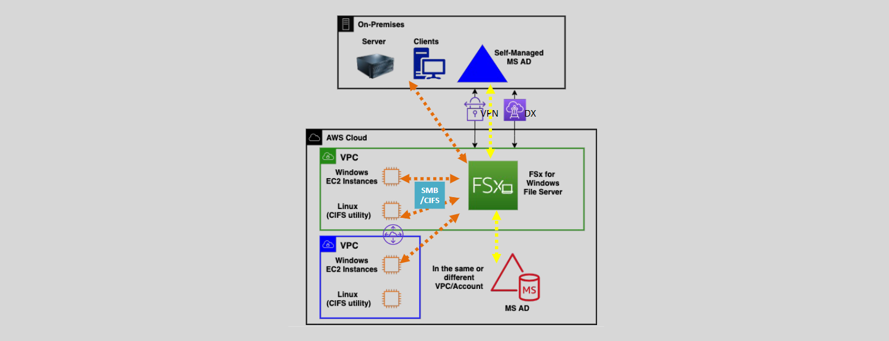

# FSx for windows server

## What is Windows File Server

A Windows file server provides a location for shared disk access to store objects such as text files, documents, images, or videos

- Windows file servers require a MS Active Directory domain to function (authentication, authorization, file permissions..etc).
- `Server Message Block (SMB)` is a network communication protocol used in Windows environments.
- `Common Internet File System (CIFS)` is a version of SMB used on Linux machines to mount the file server.

## Amazon FSx for Windows File Server

FSx for Windows File Server is a fully managed, highly available, highly durable, native Microsoft Windows file system.

- FSx for Windows file server provides shared file storage with full SMB and NTFS support.
- FSx for windows file server is used for Windows-based applications that require file storage in AWS (IIS, .NET, MS SQL, and Sharepoint).
- FSx supports SSD and HDD storage.

---

- It requires a MS AD which can be an AWS managed (AWS Directory Service), on-premises, in a peered VPC, or customer (self) managed in a VPC.
- Amazon FSx file system can scale up to 64 TBs (manually)

---

- It can be accessed from 1000s of clients (from on-premises, same VPC, or peered VPCs) using SMB.
- It can be used from EC2, ECS, Amazon Workspaces, AppStream 2.0, and EKS instances (same VPC, across VPC peering, or on premises servers).
- Provides 100s of thousands of IOPS and consistent sub-millisecond latency.
- The file system (one or more file servers) and backups are the resources in FSx.
- FSx for Windows file server integrates with S3, KMS, AD Services, IAM and CloudWatch.

## Backups and Security

- A file share is a specific folder and its sub-folders.
- FSx for Windows backups are file-system-consistent, highly durable, and incremental

---

- FSx servers encrypt data (file system and backups) at rest using KMS keys.
- FSx servers encrypt data in transit.
- Access to the Files and folders can be controlled using Windows ACLs.
- Security groups can be used to control who can have access to the windows file server resources.

## Use Cases

- Business applications,
- Home directories,
- Web serving,
- Content management,
- Data analytics,
- Software build setups, and
- Media processing workloads.

## Single and Multi AZ Deployments

- FSx for Windows File Server can be deployed in a single AZ or in a Multi-AZ.
- In single AZ deployments, FSx automatically replicates the data within the AZ.
- In either case, an ENI with a security group is deployed in the respective AZ.
  - Configure the security group to allow access as required.
- In Multi-AZ, the second file system is standby.
- Replication from primary is synchronous.
  - Failover is automatic.
- To migrate from on -premises Windows file system, use AWS DataSync

---
