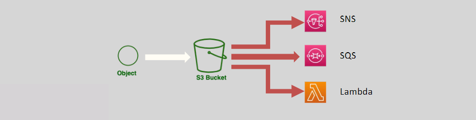

# 📢 **Amazon S3 Event Notifications**

Amazon S3 **Event Notifications** enable your applications to respond automatically to specific events that occur within your S3 buckets. By configuring event notifications, you can streamline workflows, enhance automation, and integrate seamlessly with other AWS services.

  

---

## 🔍 **What are S3 Event Notifications?**

**S3 Event Notifications** allow you to receive notifications when certain actions happen in your S3 bucket. These events can trigger workflows, alert systems, or initiate automated processes, enhancing the interactivity and responsiveness of your applications.

### **📌 Key Features:**

- **📂 Event Types:**

  - **Object Operations:** Create, delete, and restore objects.
  - **Management Events:** Replications, lifecycle transitions, and intelligent tiering changes.

- **🔗 Notification Destinations:**
  - **📧 SNS Topics:** Send notifications to Amazon Simple Notification Service for broadcasting messages.
  - **📥 SQS Queues:** Queue messages in Amazon Simple Queue Service for asynchronous processing.
  - **⚙️ Lambda Functions:** Trigger AWS Lambda functions to execute custom code in response to events.

---

## 🛠️ **How S3 Event Notifications Work**

Configuring S3 Event Notifications involves specifying the events you want to monitor and selecting the destination where notifications will be sent. This setup allows your applications to react promptly to changes within your S3 buckets.

### **🔧 Configuration Steps:**

1. **📂 Select Your Bucket:**

   - Navigate to the **S3 console** and choose the bucket you want to monitor.

2. **⚙️ Configure Event Notifications:**

   - Go to the **Properties** tab.
   - Scroll down to the **Event notifications** section.
   - Click **Create event notification**.

3. **📝 Define Event Criteria:**

   - **Event Types:** Select the specific events (e.g., Object Created, Object Deleted) you want to trigger notifications.
   - **Prefix/Suffix Filters:** Optionally filter events based on object key names.

4. **🔗 Choose Notification Destination:**

   - Select **SNS Topic**, **SQS Queue**, or **Lambda Function** as the destination for your notifications.

5. **💾 Save Configuration:**
   - Review your settings and save the event notification configuration.

---

## 🌟 **Benefits of S3 Event Notifications**

### **1. 🚀 Enhanced Automation**

- **Automatic Responses:** Trigger workflows or processes automatically in response to specific S3 events.
- **Seamless Integration:** Connect S3 with other AWS services like Lambda, SNS, and SQS for streamlined operations.

### **2. 🔔 Real-Time Alerts**

- **Instant Notifications:** Receive immediate alerts for critical events, enabling swift action and monitoring.
- **Custom Alerts:** Tailor notifications to specific events and destinations based on your application needs.

### **3. 💡 Improved Workflow Efficiency**

- **Reduced Manual Intervention:** Automate repetitive tasks, minimizing the need for manual oversight.
- **Scalable Processing:** Handle large volumes of events efficiently by leveraging AWS’s scalable infrastructure.

---

## 📝 **Important Notes**

- **🔒 Security Considerations:**

  - Ensure that the destinations (SNS, SQS, Lambda) have the necessary permissions to receive notifications from your S3 bucket.

- **📈 Monitoring and Logging:**

  - Utilize AWS CloudWatch to monitor the performance and reliability of your event notifications.

- **⚠️ Cost Implications:**
  - Be aware of potential costs associated with the volume of events and the chosen notification destinations.
